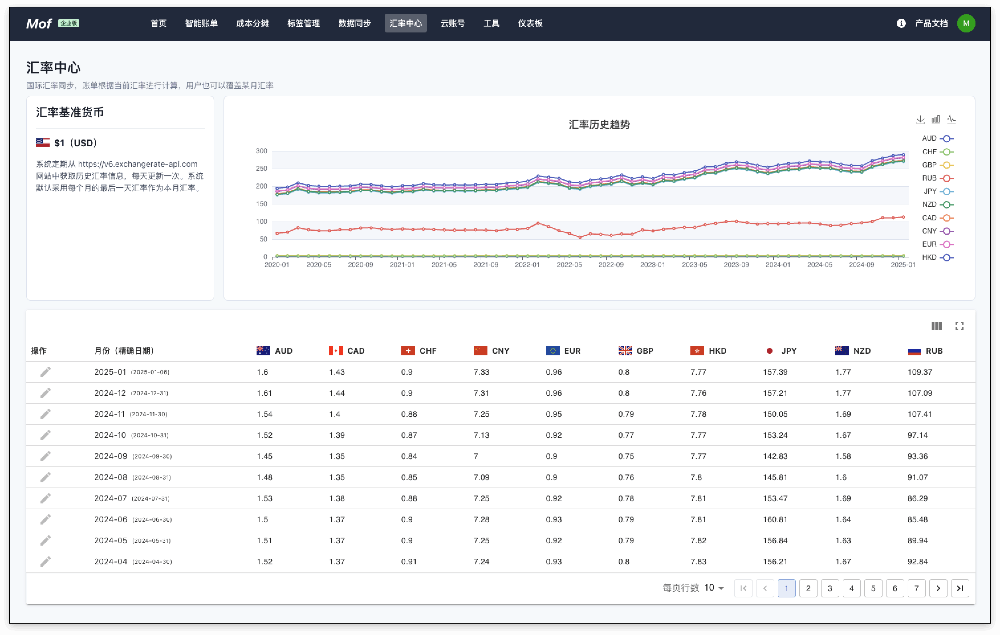
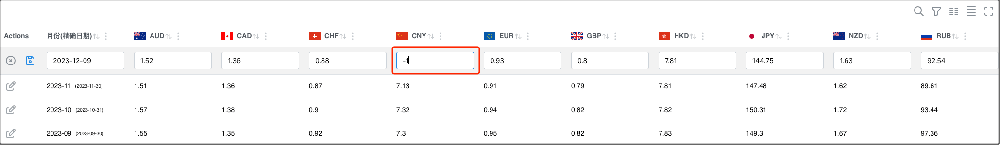
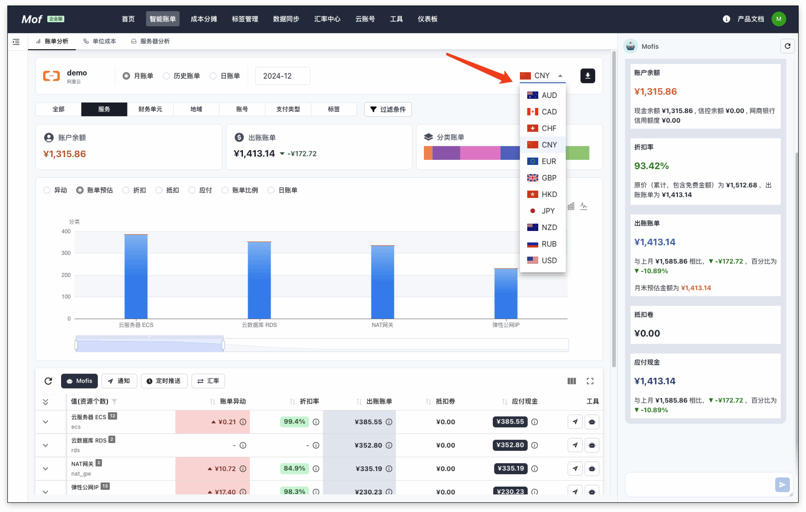

在多云环境中，会遇到货币结算的问题，系统提供了一套实时汇率服务，账单会根据**实时汇率**，自动结算成用户设置的结算货币。

查看汇率，请点击**汇率中心**，系统默认使用**美元**作为基准货币。

## 实时汇率
系统系统每天更新当前的实时汇率，历史汇率，Mof 默认使用当月最后一天的汇率。

## 覆盖汇率
### 1.点击修改按钮

### 2.输入需要修改的值

### 3.查看系统汇率 & 自定义汇率
覆盖的汇率会高亮显示，同时显示系统汇率。

## 恢复系统汇率
恢复汇率，只需要在相应的汇率框里输入 **-1** 即可。

## 选择汇率

