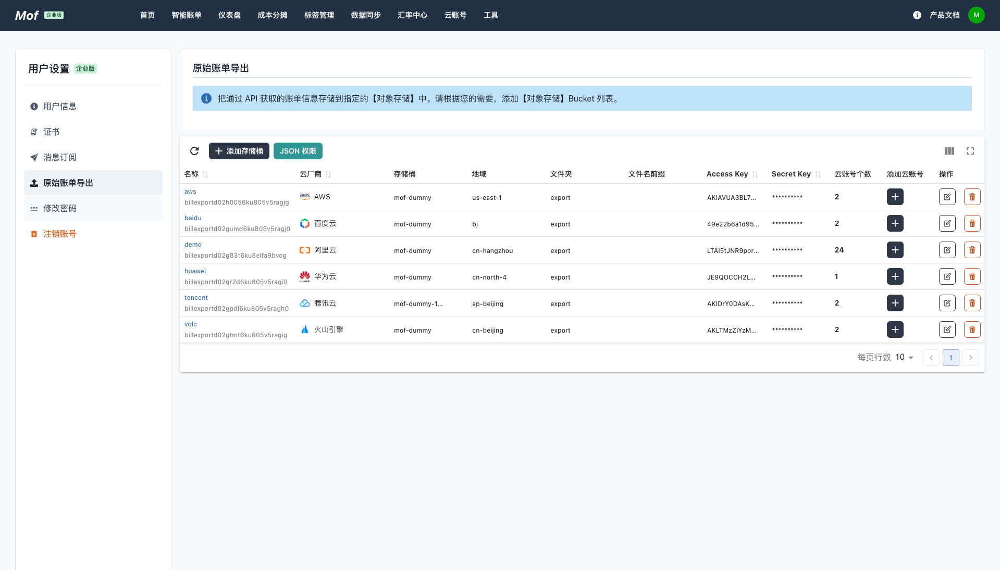
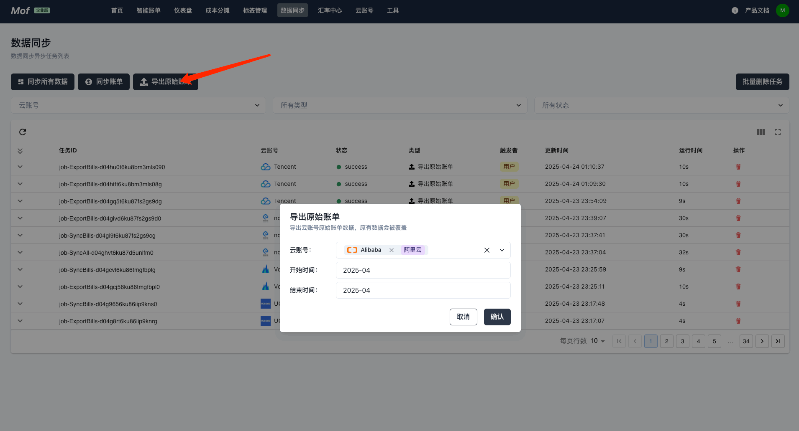
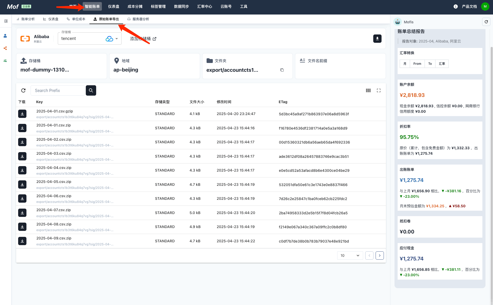

## 原始账单导出
添加 & 设置原始账单数据的导出目标（对象存储）。每次同步账单的时候，系统会把原始数据同步到指定的对象存储。

### 支持的目标对象存储
- AWS S3
- 阿里云 OSS
- 腾讯云 COS
- 百度云 BOS
- 华为云 OBS
- 火山引擎 TOS

### 原始账单同步
用户可以通过【同步账单】上传原始账单，也可以通过【同步原始账单】上传。

### 原始账单下载
用户可以通过【智能账单】->【原始账单导出】页面，下载文件。文件通常为 CSV。

对于 AWS，Oracle，我们保持原有文件格式。

