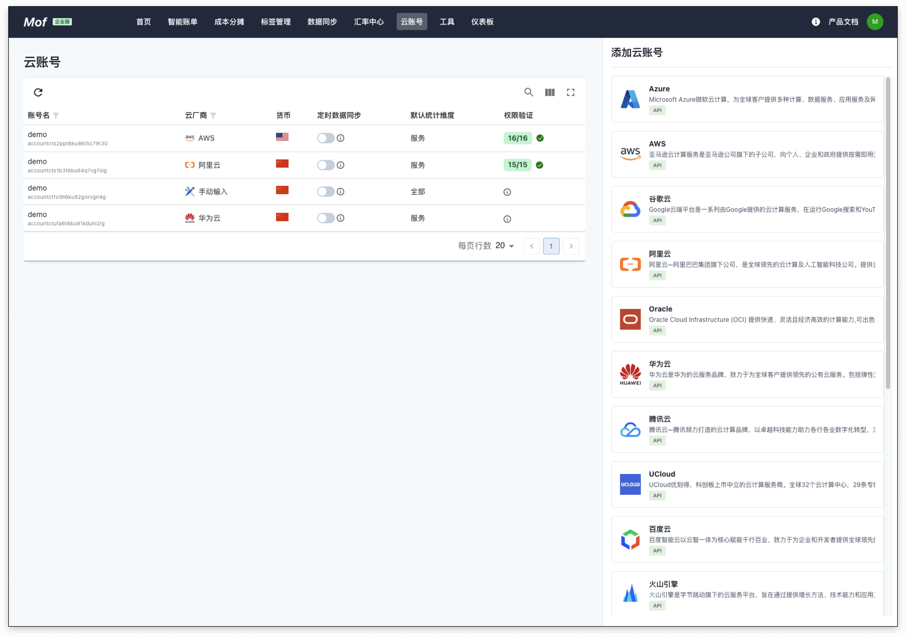
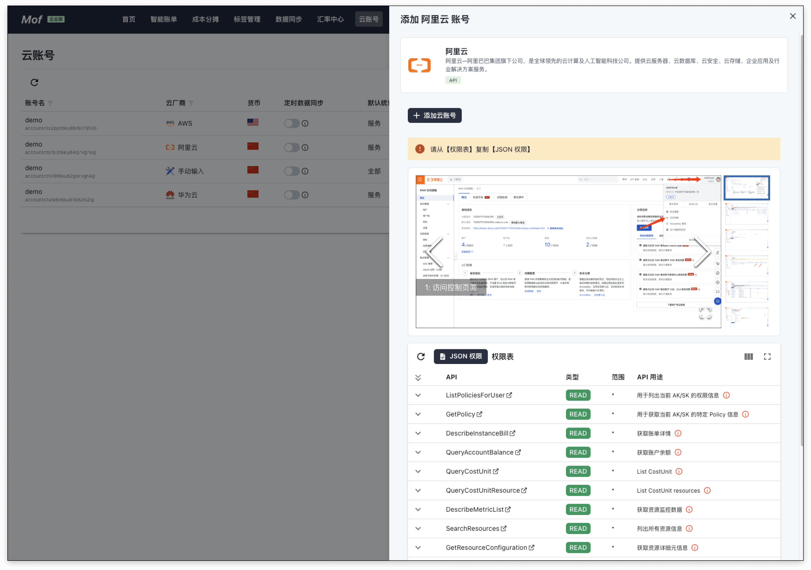
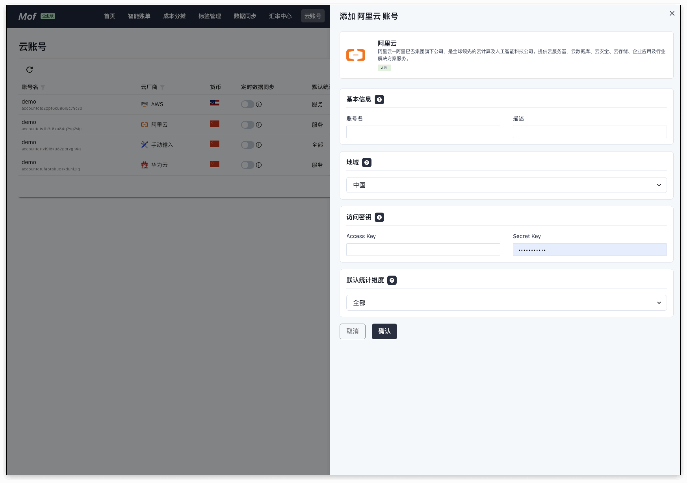
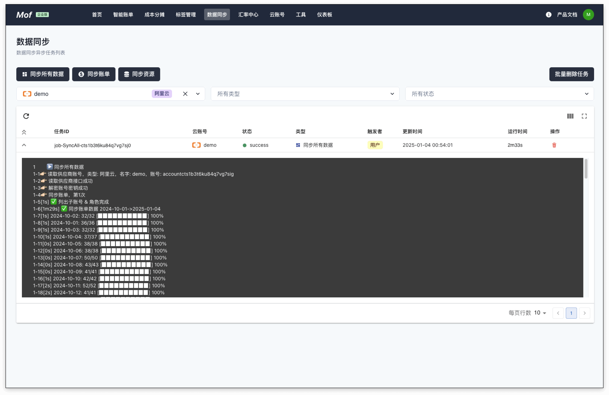

系统目前支持 10+ 流行的海内外云厂商，后续会持续添加新的云厂商，包括 IAAS，PAAS，SAAS。你可以联系我们添加您需要的云厂商。

## 选择云厂商
选择 **云账号** -> **添加云账号** -> **<您的云厂商类型>**

## 设置账号权限
请根据**图文指引**完成对云账号的授权。**权限表**列出了系统所需要的权限信息，以及权限格式。

## 填写账号信息
每一个云厂商有不同的信息需要填写，请参考云厂商。

!!! info "基本选项"
    - **基本信息**：账号名称用于展示，可以重名，建议使用不同的名称
    - **地域**：如果云的结算货币未知，系统会使用地域确定货币种类，目前支持全球（美元），中国（人民币）
    - **默认统计维度**：系统收集所有纬度的数据，默认纬度用于统计所有云厂商的成本，不影响数据准确性

## 开始同步数据
云账号添加成功之后，系统会自动开始收集数据，可以在**数据同步**中查看。

系统默认同步前**3个月**的数据，用户可以自行同步其他时间段的数据。

