## Cloud account
=== "1: Choose cloud"
    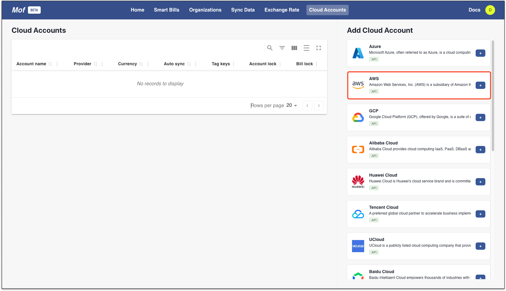

=== "2: Fill account info"

    !!! info "Steps"
        - Choose **Cloud Accounts** -> **Add Cloud Accounts** -> **AWS**

        - Fill info
            - **Basic info**：Account name can be changed after creation
            - **Locale**：Currency would be determined if missing from AWS bill, global (USD)，China (CNY) is suppoted
            - **AK/SK**：Please refer to official docs at [AK/SK](https://support.huaweicloud.com/intl/en-us/usermanual-iam/iam_02_0003.html), permission as bellow:
            ``` json
            {
                "Version": "1.1",
                "Statement": [
                    {
                        "Action": [
                            "rms:*:list",
                            "rms:*:get",
                            "rms:*:getStatus",
                            "bss:bill:view",
                            "vpc:vpcs:list",
                            "vpc:subnets:get",
                            "evs:volumes:list",
                            "rds:instance:list",
                            "ecs:cloudServers:list",
                            "ces:metricData:list"
                        ],
                        "Effect": "Allow"
                    }
                ]
            }
            ```
            - **Defualt group by**：System will collect all available groups, it is used for default representation on dashboard

    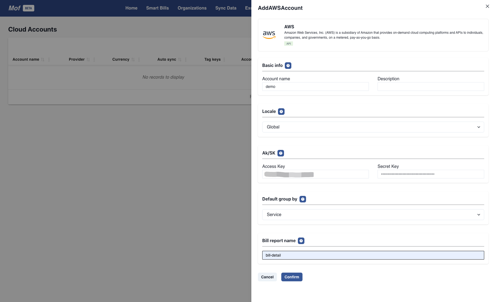


=== "2: Sync data automatically"
    !!! info "Check data sync status"
        Data will be collected automatically, user can check status at **Sync Data**.

        System will collect **3 months** historically data. User can sync historical data by their own on this page. 
    
    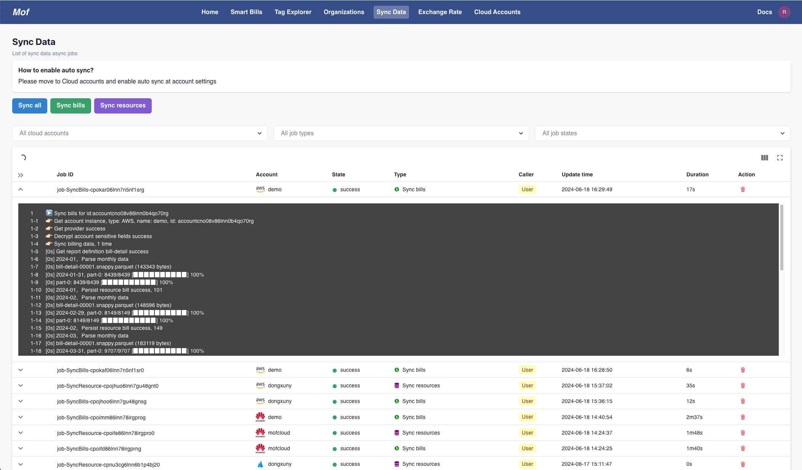

## Smart Bills
As soon as data finished syncing, bill analysis can be viewed on **Smart Bills**.

!!! info "Functionality"
    **Bill group**，**Filter**，**Bill downloads** are common to all tabs.

    - **Smart**
        - Abnormal chart, Group bills, Resource bills, Mofis report
    - **Monthly**
        - Monthly bill, Bill estimation
    - **History**
        - Historical bills，Mofis analysis
    - **Server Analysis**
        - Utilization, Server bills, Configuration, Monitoring data, Mofis report

### Smart
!!! example "Check abnormal bill and root case"
    1. Abnormal **Unit** by **Abnormal chart** & **Mofis report**
    2. Resource level abnormal by **Resource bills**
    3. Root cause by **Resource usage**

=== "Abnormal bills"

    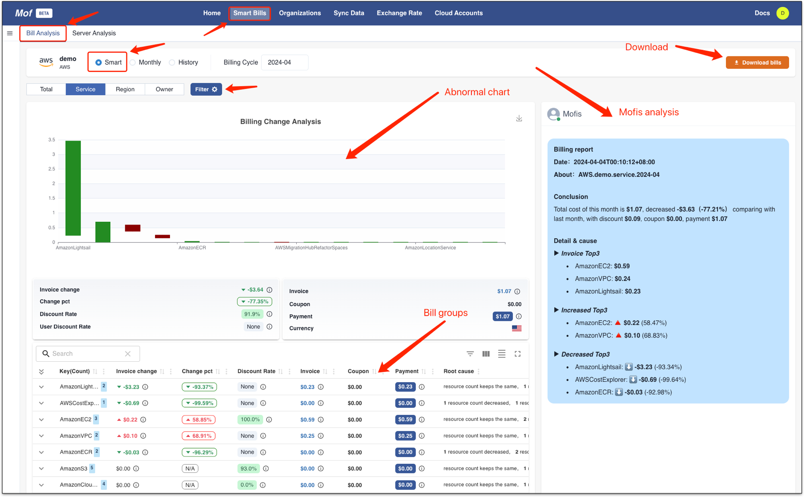

=== "Resource bills"

    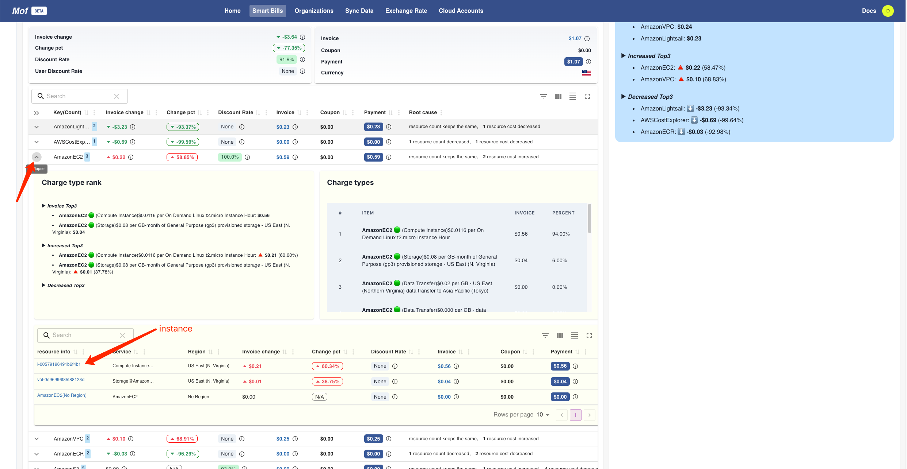

=== "Resource usage"

    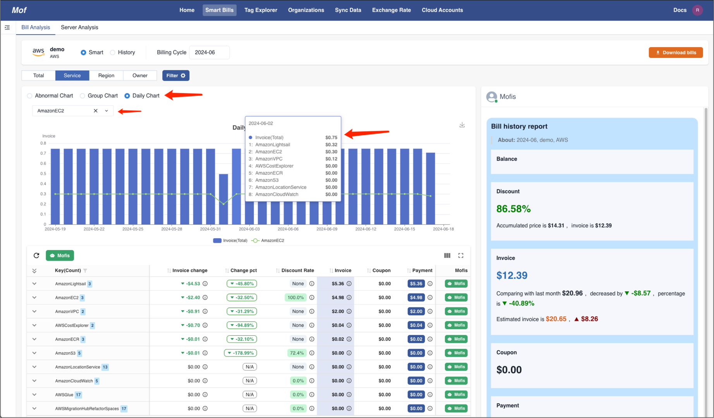

### Monthly
Monthly group bills and estimation

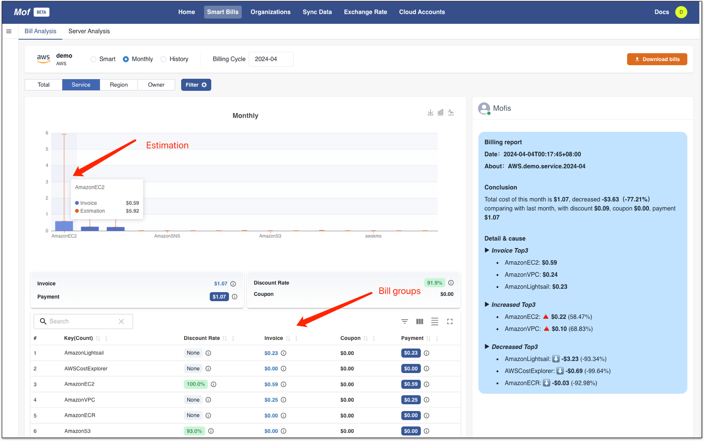

### History
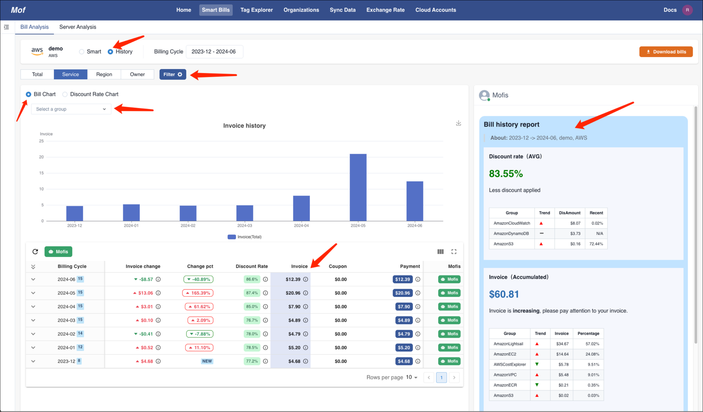

## Download bills
Download bills as Excel format by clicking **Download bills**

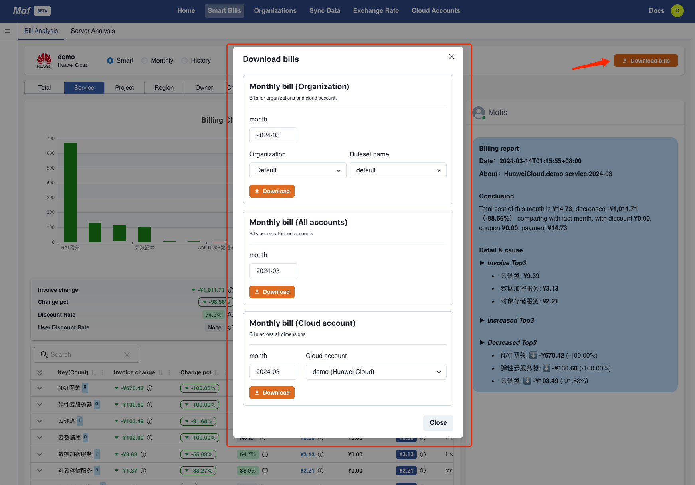

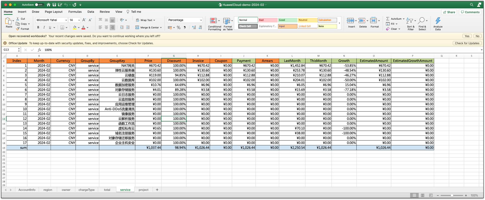

## Server analysis
!!! example "Find out【Unused】&【Low utilized】"
    1. 【Unused】&【Low utilized】by server groups status and utilization from **Overview**
    2. Related util metrics(bill item) from **Monitor**
    3. Check historical reason via **Resource Bills**
    4. Check resource details via **Resource Config**

=== "Overview"

    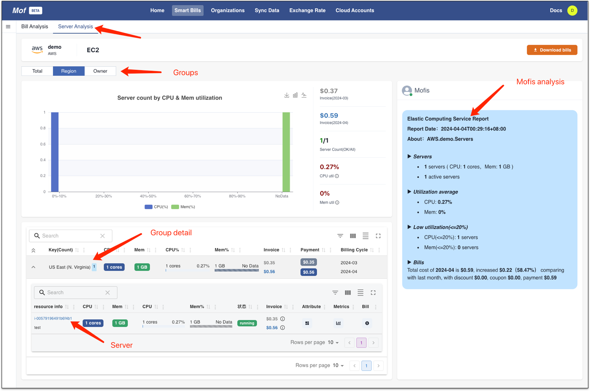

=== "Monitor（Bill item）"

    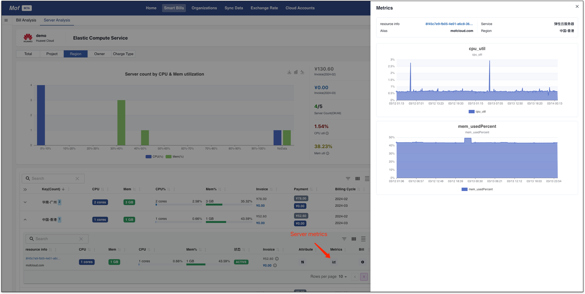

=== "Bills"

    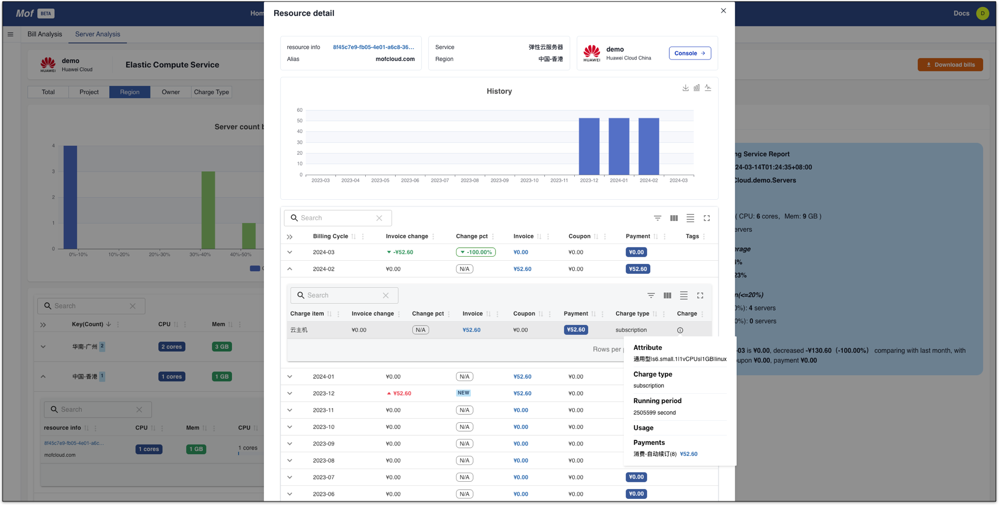

=== "Config"

    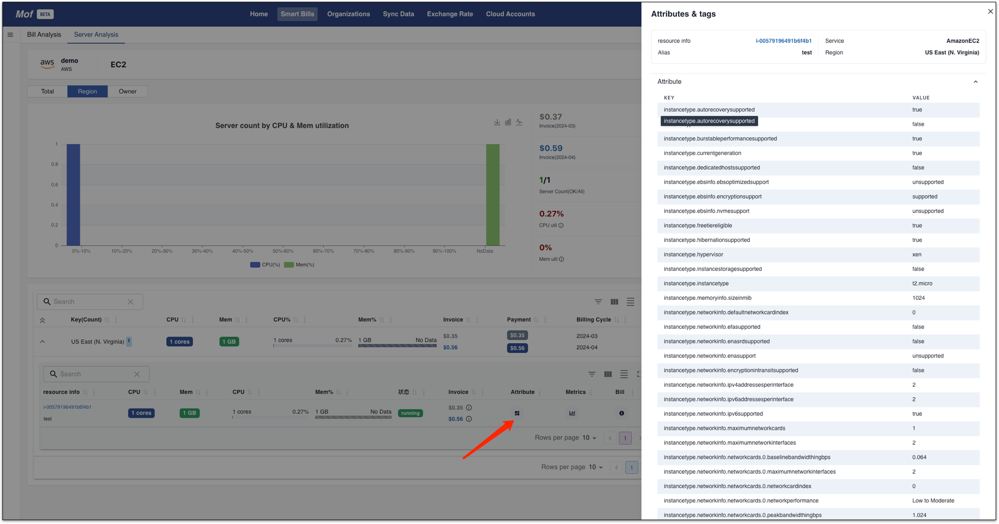


