## 添加云账号
=== "1: 选择云"
    

=== "2: 账号信息"

    !!! info "步骤"
        - 选择 **云账号** -> **添加云账号** -> **华为云**

        - 填写相关信息
            - **基本信息**：账号名称用于展示，可以重名，建议使用不同的名称
            - **地域**：如果华为云的结算货币未知，系统会使用地域确定货币种类，目前支持全球（美元），中国（人民币）
            - **访问密钥**：请参考官方文档获取[访问密钥](https://support.huaweicloud.com/usermanual-iam/iam_02_0003.html)，权限如下:
            ``` json
            {
                "Version": "1.1",
                "Statement": [
                    {
                        "Action": [
                            "bss:bill:view",
                            "ces:*:list*",
                            "ces:*:get*"
                            "rms:*:list*",
                            "rms:*:get*",
                            "ce:*:list",
                            "tms:*:update",
                            "tms:*:delete",
                            "tms:*:create",
                        ],
                        "Effect": "Allow"
                    }
                ]
            }
            ```
            - **默认统计维度**：系统收集所有纬度的数据，默认纬度用于统计所有云厂商的成本，不影响数据准确性

    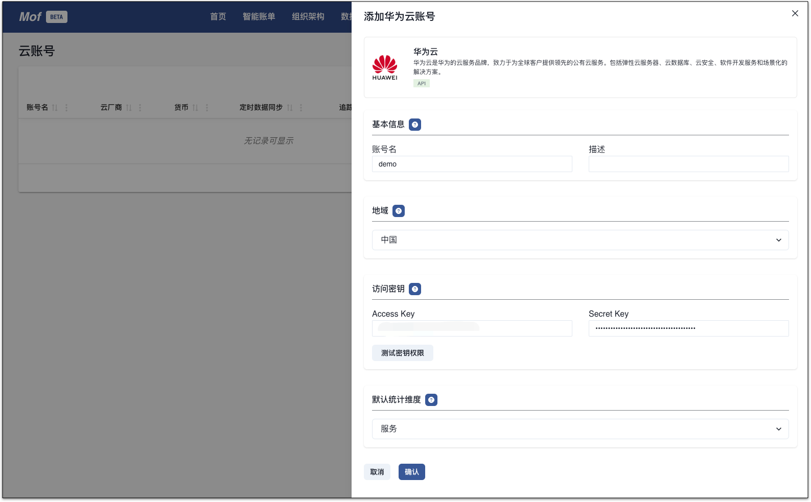

=== "3: 自动收集数据"
    !!! info "查看数据同步过程"
        账号添加完成之后，系统会立刻开始收集数据，可以在**数据同步**中查看。
    
        系统默认同步前**3个月**的数据，用户可以自行同步其他时间段的数据。
    
    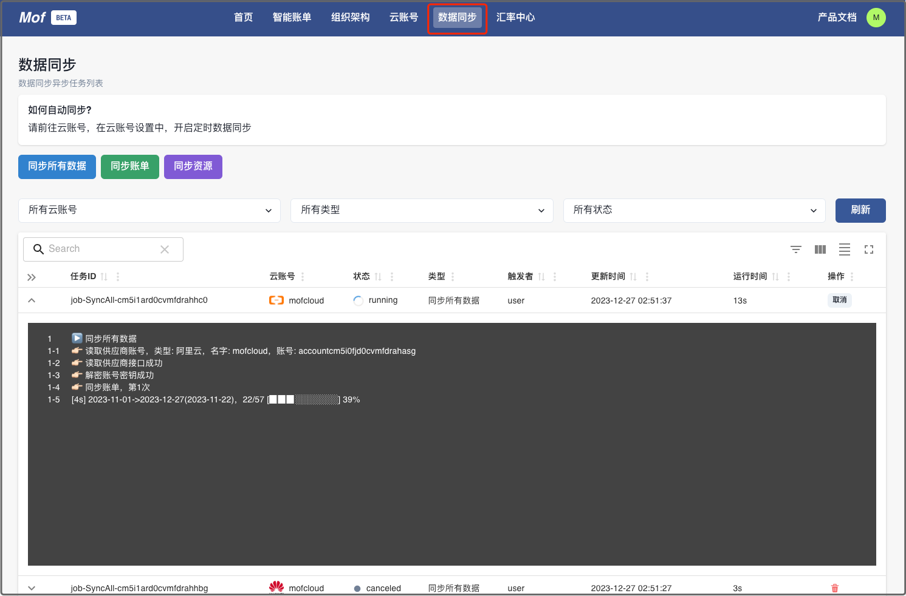

## 智能账单
等数据同步完成之后，可以在**智能账单**中查看分析报告。

!!! info "功能"
    **账单分类**，**账单条件过滤**，**下载账单为**通用功能。

    - **智能月账单**
        - 异动图，分类图，日线图，分类账单详情，资源账单详情，Mofis 智能分析
    - **历史账单**
        - 账单趋势图，Mofis 智能分析
    - **服务器分析**
        - 利用率，月账单&历史账单，配置信息，监控数据，Mofis 智能分析

### 智能月账单
!!! example "快速定位账单异动 & 异动原因"
    1. 通过**异动图** & **Mofis 分析报告**定位账单异动**单元**
    2. 通过**分类图** 定位分类账单月末预估
    3. 通过**日线图** 定位分类账单按日趋势
    4. 通过**资源账单**定位异动**资源**
    5. 通过**资源用量**定位异动**原因**

=== "异动图"

    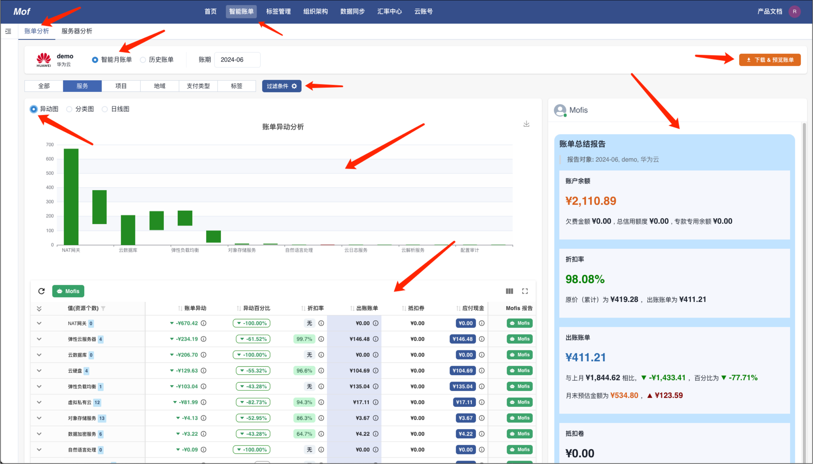

=== "分类图"

    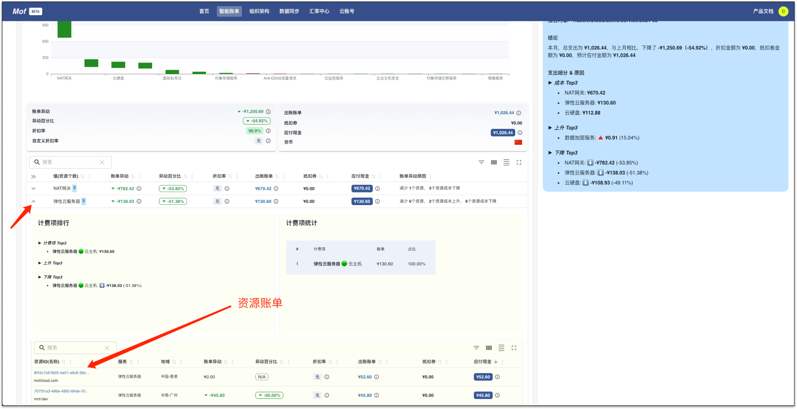

=== "日线图"

    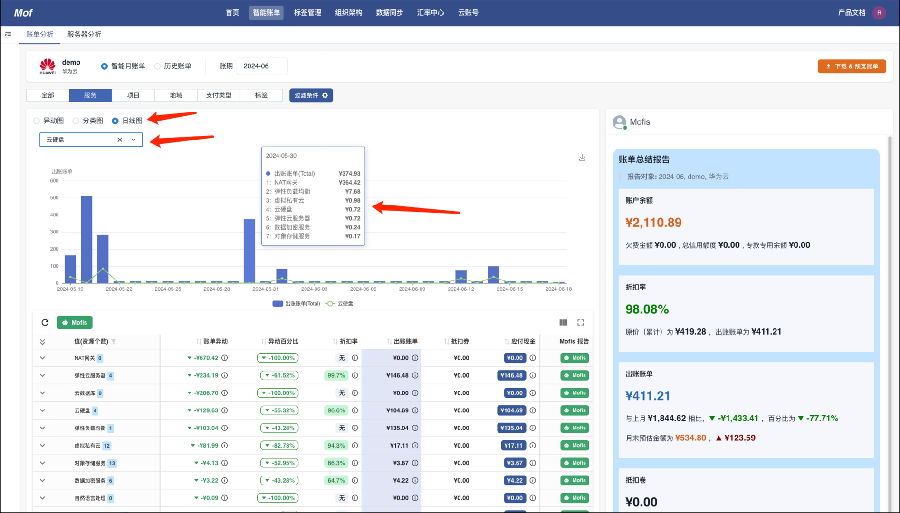

=== "资源账单"

    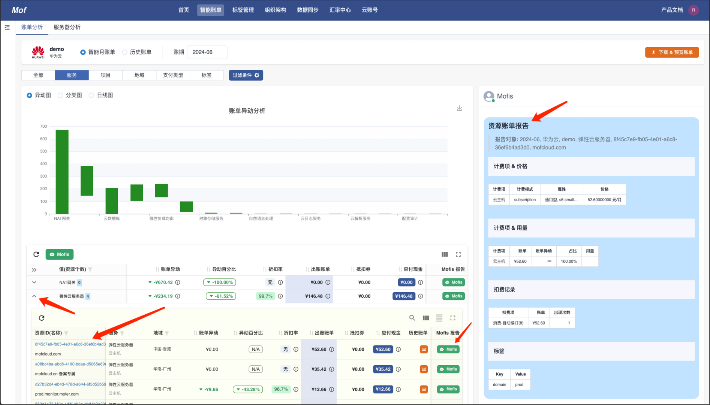

=== "资源用量"

    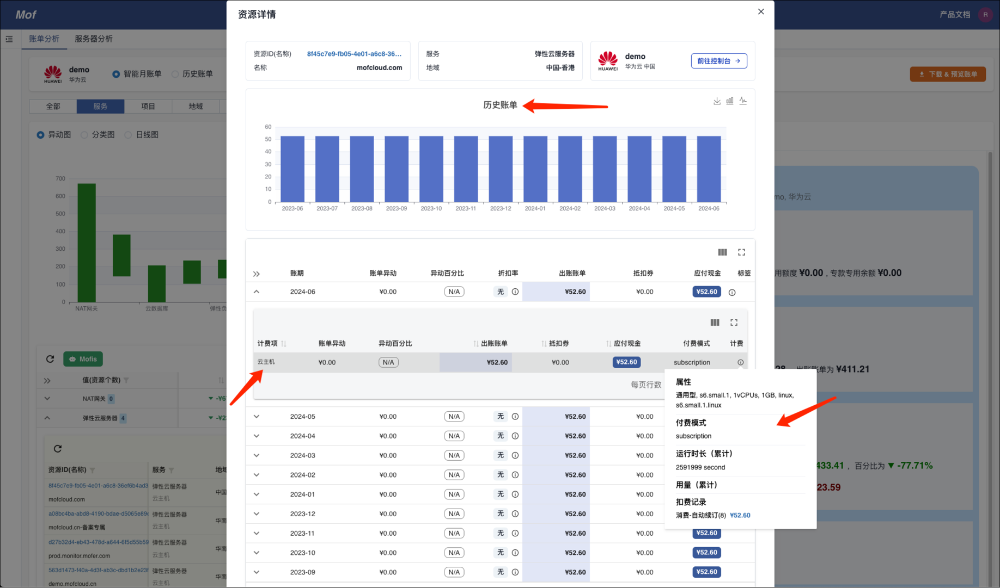


### 历史账单
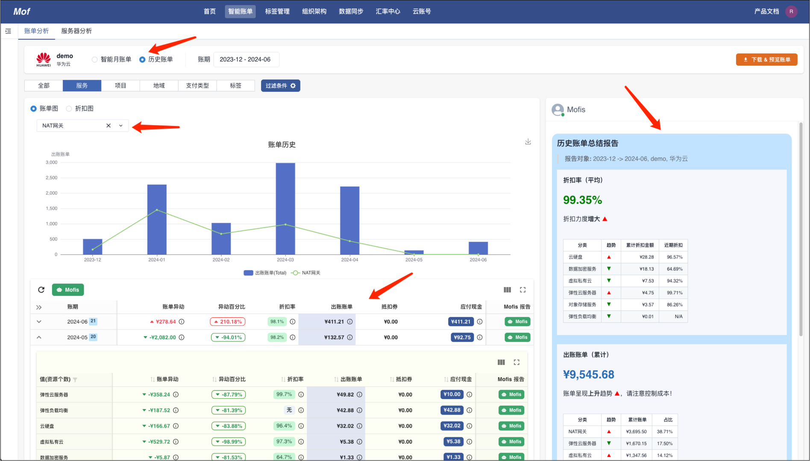

## 下载账单
如需下载账单，点击**下载 & 预览账单**

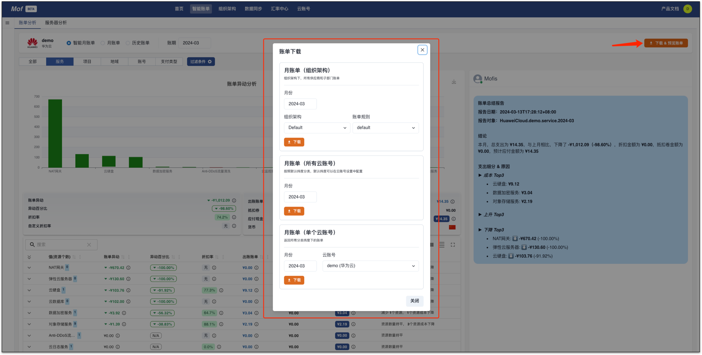

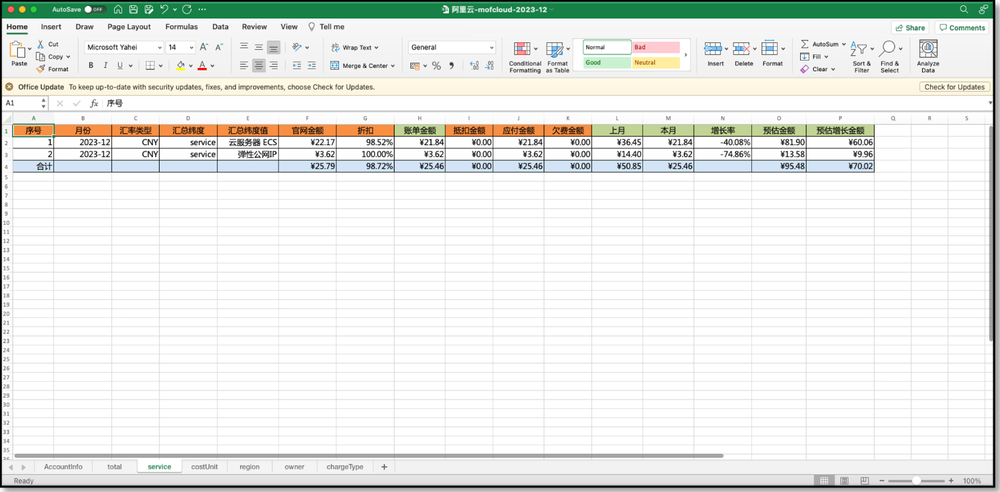

## 服务器分析
!!! example "快速决策【未使用】&【低利用率】"
    1. 通过**分析概览**定位服务器集群状态 & 【未使用】&【低利用率】服务器
    2. 通过**监控（计费项相关）**定位低利用率**相关监控**
    3. 通过**账单**查看是否**是否历史遗留问题**
    4. 通过**属性**查看资源**详情**

=== "分析概览"

    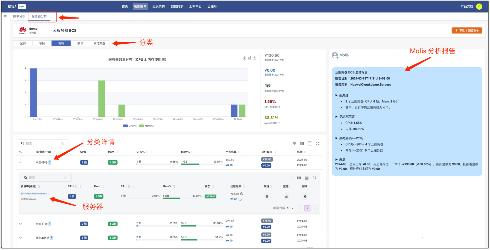

=== "监控（计费项相关）"

    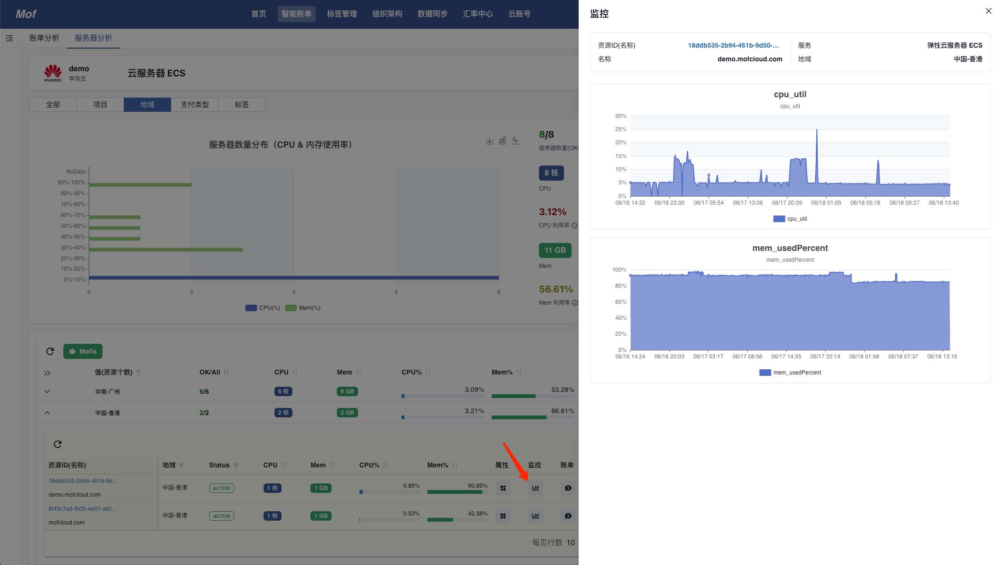

=== "账单"

    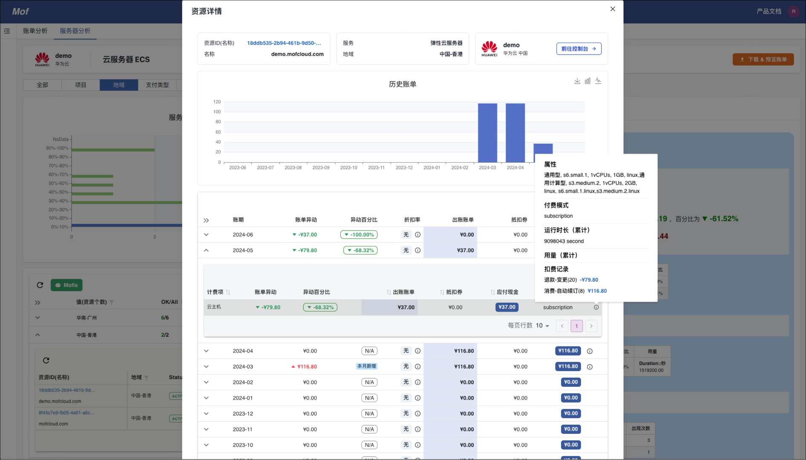

=== "属性"

    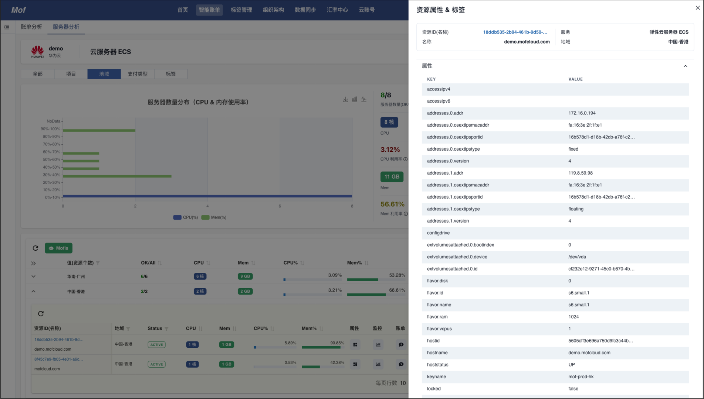


