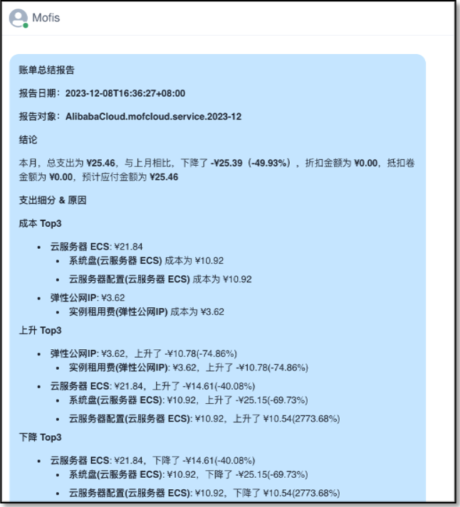
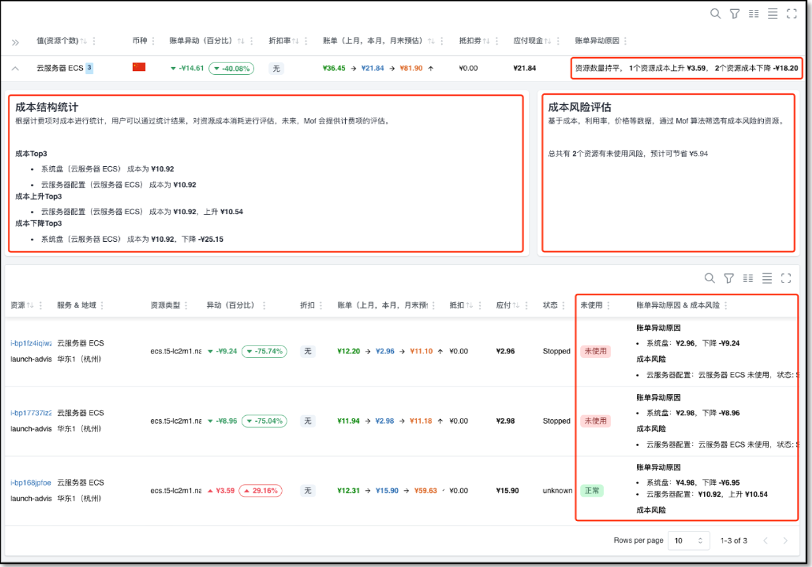
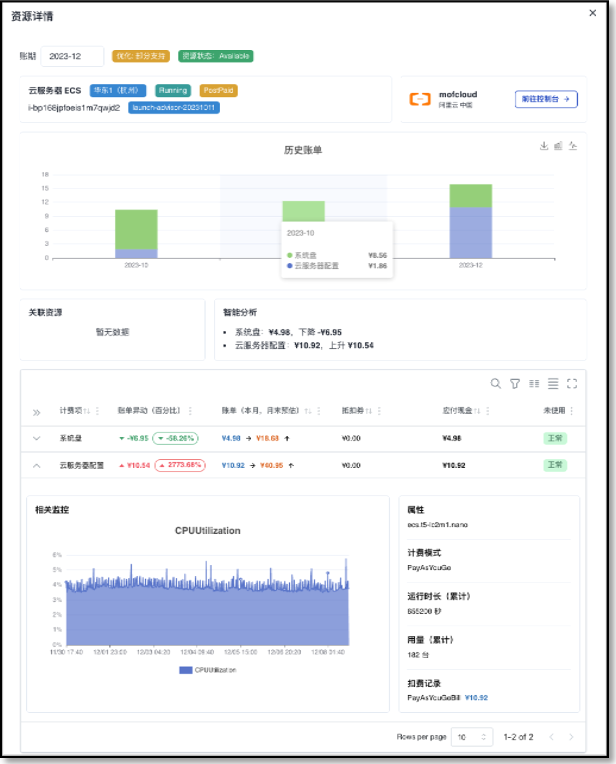
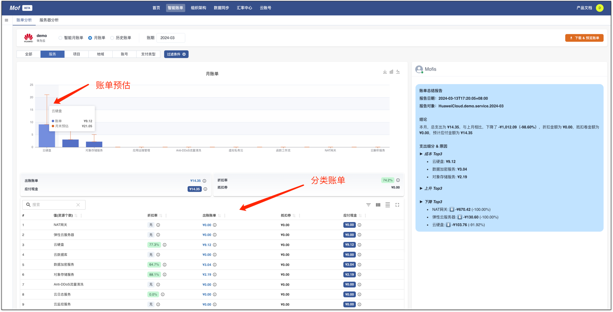
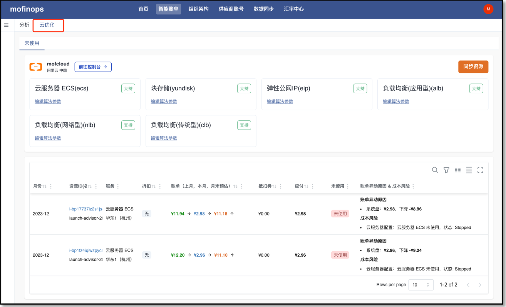

## 添加云账号

- 选择 **云账号** -> **添加供应商** -> **阿里云**

- 填写相关信息
    - **基本信息**：账号名称用于展示，可以重名，建议使用不同的名称
    - **地域**：如果阿里云的结算货币未知，系统会使用地域确定货币种类，目前支持全球（美元），中国（人民币）
    - **访问密钥**：请参考官方文档获取[访问密钥](https://help.aliyun.com/document_detail/268244.html)，权限请点击 
    - **默认统计维度**：系统收集所有纬度的数据，默认纬度用于统计所有云厂商的成本，不影响数据准确性

## 收集数据
账号添加完成之后，系统会立刻开始收集数据，可以在**数据同步**中查看。

系统默认同步前**3个月**的数据，用户可以自行同步其他时间段的数据。

## 智能账单
等数据同步完成之后，可以在**智能账单**中查看分析报告。

!!! info "功能"
    **账单分类**与**账单条件过滤**为通用功能。
    
    - **智能月账单**
        - 异动图，月账单异动分析，账单详情，资源账单，Mofis 智能分析
    - **月账单**
        - 账单预估，月账单分类图
    - **历史账单**
        - 分类账单，账单条件过滤，账单趋势图，Mofis 智能分析
    - **服务器分析**
        - 利用率，月账单&历史账单，配置信息，监控数据，Mofis 智能分析

### 智能月账单
从账单异动的角度，分析月账单趋势。

#### 账单报告
Mofis 总结分析给出本月账单的总结

#### 异动原因
系统从大到小给出异动原因.

- 资源个数变化
- 用量统计
- 资源账单
- 成本风险
- 资源计费项，利用率，历史账单

点击资源ID，可以查看**资源详情**

### 月账单
月账单提供传统视图 & 月末预估金额

### 历史账单

## 下载账单
如需下载账单，点击**下载 & 预览账单**

## 查看优化报告
点击**云优化**，进入优化分析页面。

