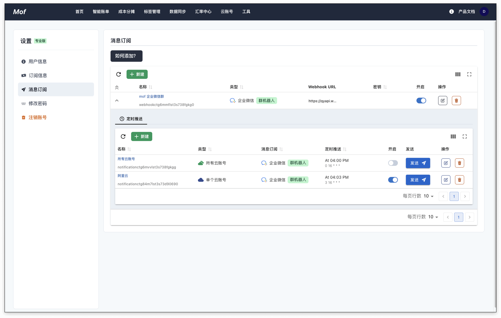

## 消息订阅
添加消息订阅 webhook 和定时推送。

### 消息订阅 webhook
支持**企业微信群机器人**、**钉钉群机器人**、**飞书群机器人**。为了安全考虑，系统支持群机器人的签名算法。

### 定时推送
用户可以定时推送如下数据到群机器人。

- 所有云账号（当日、当月）
- 单个云账号（当日、当月）
- 共享云账号（当日、当月）
- 集合（当日、当月）
- 共享集合（当日、当月）
