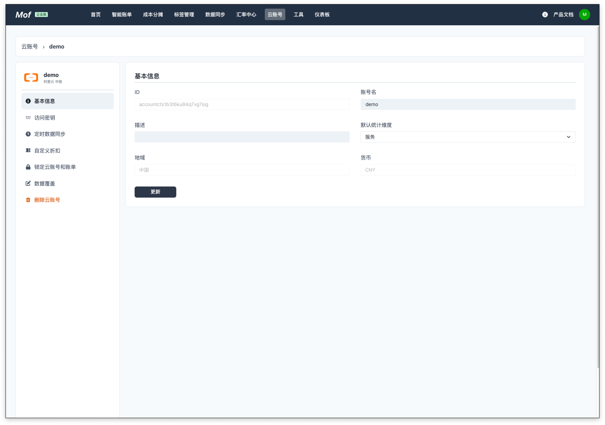
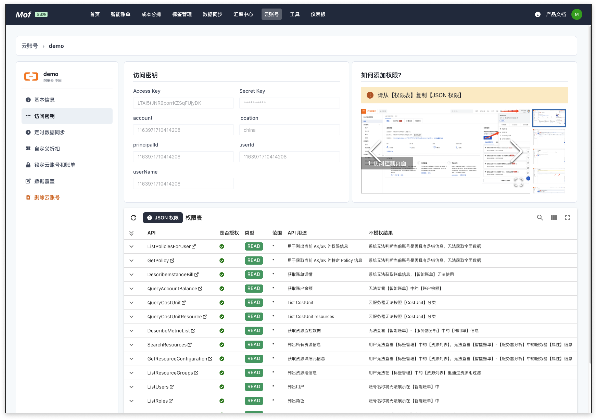
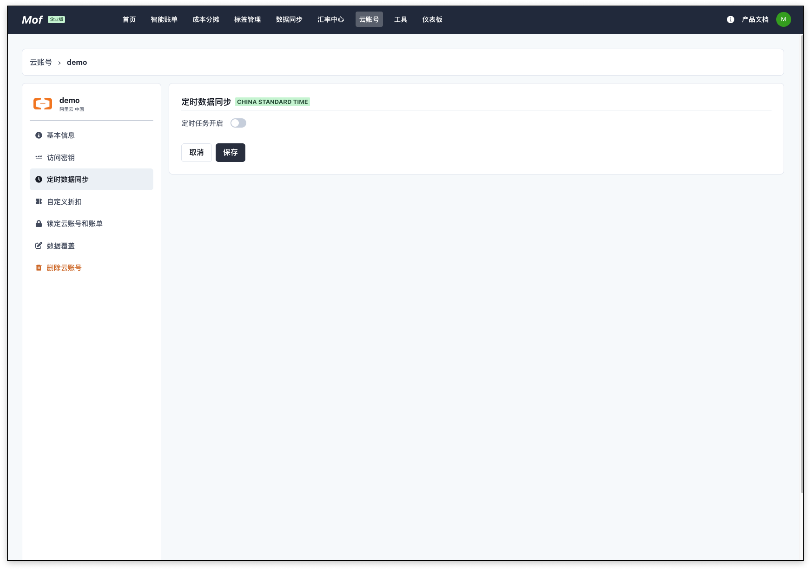
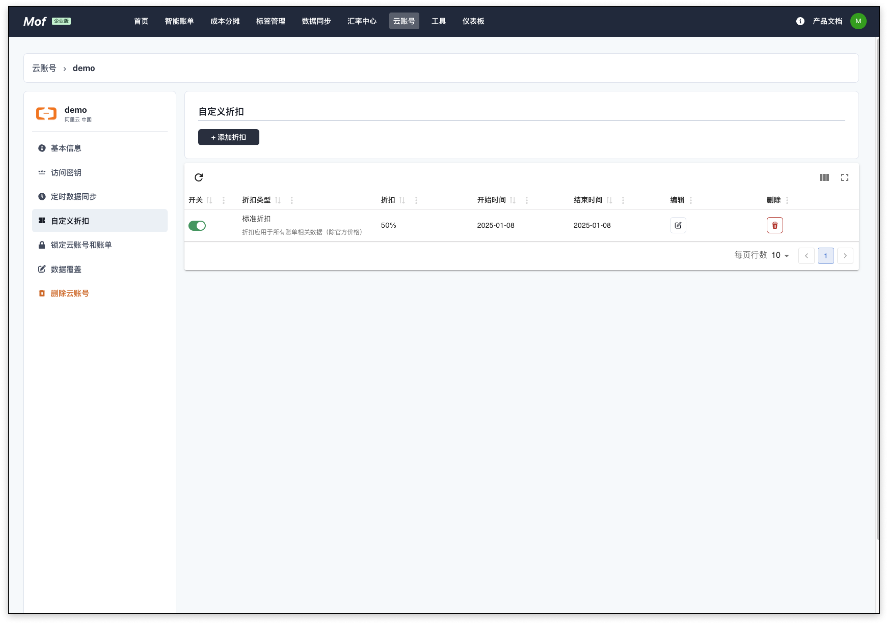
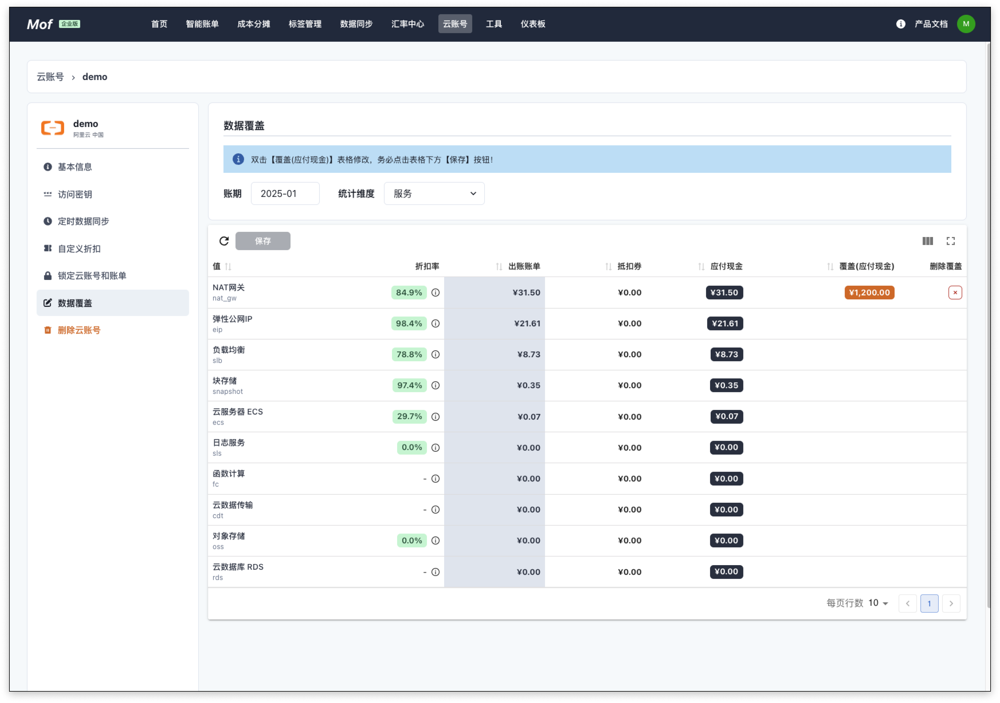

## 添加账号

### **权限**
系统的权限可能根据功能的扩展需要补充。用户可以在**控制台**中选择相应的云厂商，查看目前需要的权限。

### **1.基本信息**
账号名称用于展示，可以重名，建议使用不同的名称。 **可修改**

### **2.地域**
请跟据账号归属，选择相应的地域。**可修改**

- [x] 中国站
- [x] 全球站

### **3.统计维度**
系统收集所有纬度的数据，默认纬度用于统计所有云厂商的成本，不影响数据准确性

---

## 更新账号
### **1.基本信息**
可修改。

### **2.访问密钥**
不可修改

### **3.定时数据同步**
如果开启，系统会按照配置，自动同步数据。需要订阅**专业版**。

### **4.自定义折扣**
如果用户有线下的折扣合约，并且不展示在账单数据中时，用户可以在此配置，折扣会影响到**智能账单**中的数据中。

### **5.锁定云账号和账单**
为了防止重复拉取账单数据时，因为某些因素的改变，如标签等，导致账单过往账单可能会被更新，引入了两个锁。

- **账号锁**：不再拉取新的数据
- **账单锁**：不更新指定月份的账单

### **6.数据覆盖**
用于覆盖某月，某个 Group 下的【应付金额】。

### **7.删除云账号**
删除云账号时，会删除所有成本 & 资源数据。

