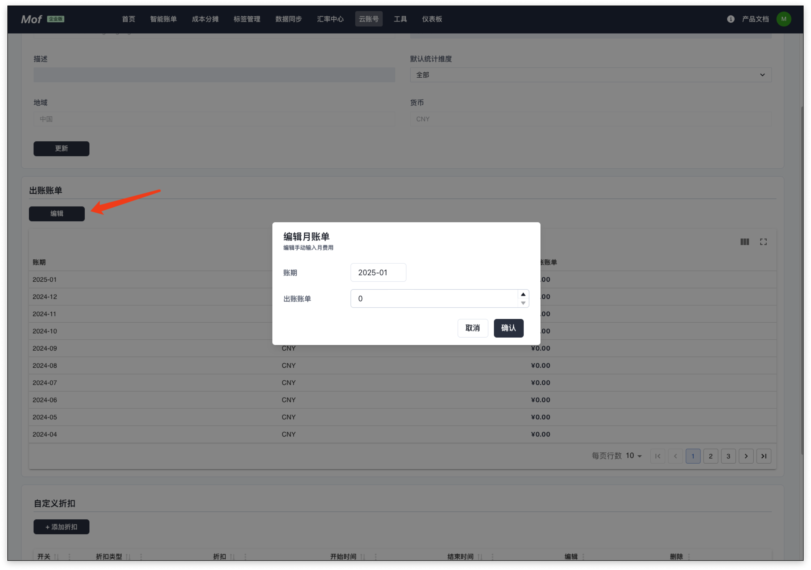

手动输入，当用户使用系统不支持的云厂商时，可以使用手动输入每月账单数据。

账单数据可以在创建成功之后，在云账号页面中进行编辑。

## 添加账号
### **基本信息**
请参考 [基本信息](basic.md)配置。

### 地域
确认货币属性。

- 中国（CNY）
- 全球（USD）

## 更新账号
请参考 [基本信息](basic.md)更新。

## 编辑账单数据
编辑月账单数据。

