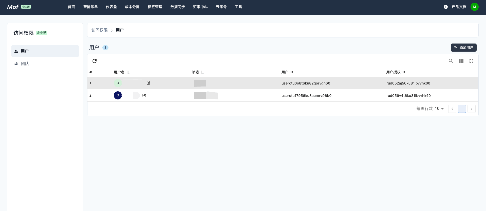
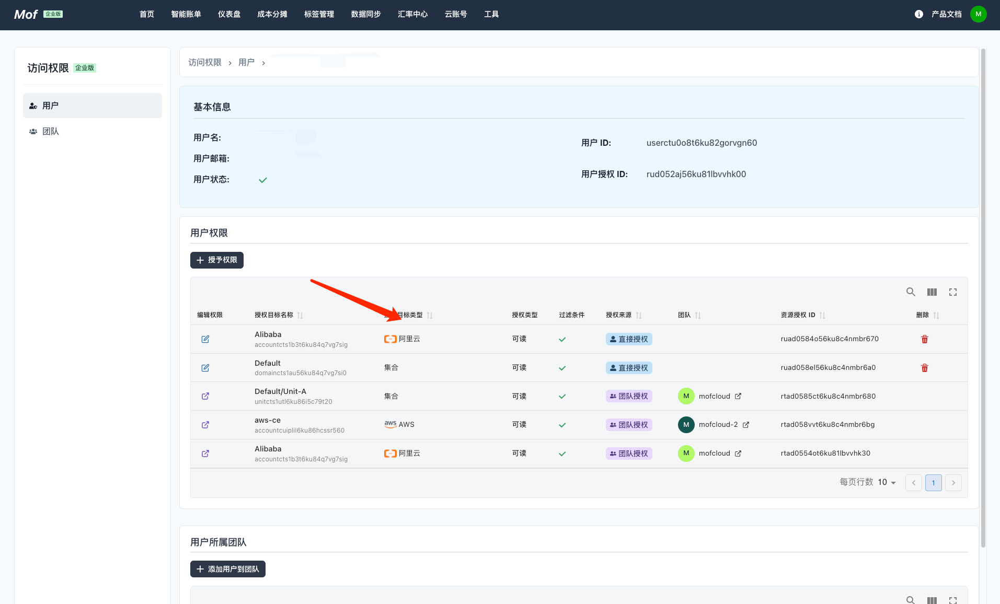
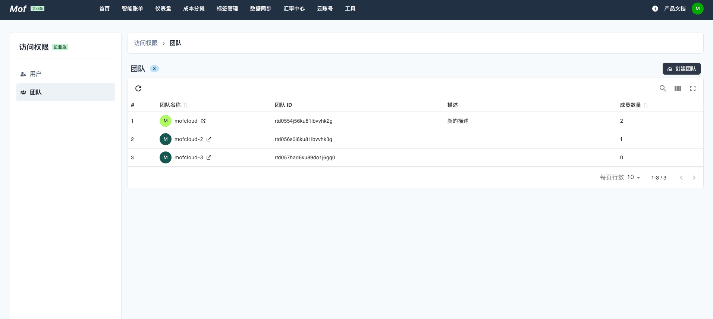
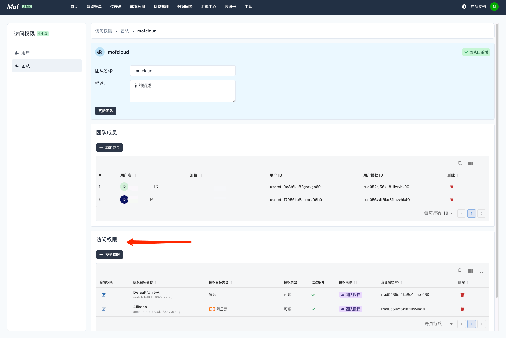
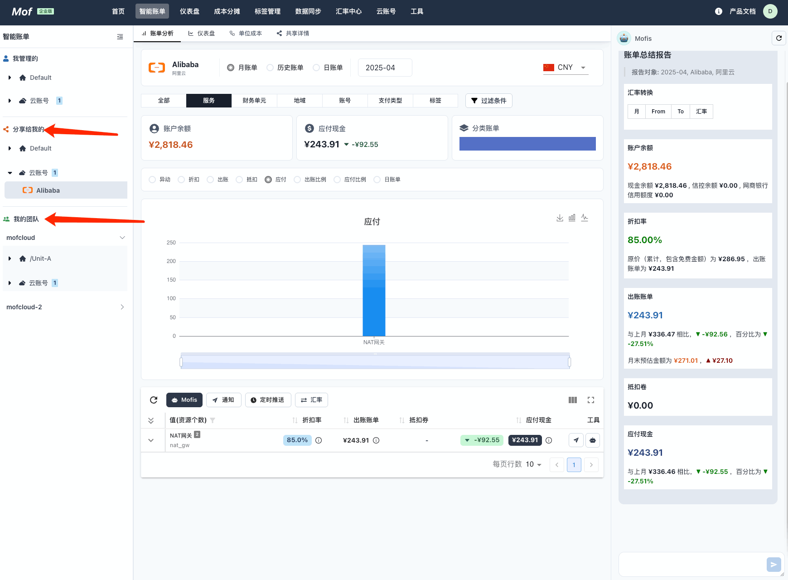

## 访问权限
用户可以把账单数据【共享】给系统注册的用户。可以通过【直接共享】&【通过团队共享】

### 通过用户共享
1. 通过【邮箱】添加用户，必须是已经注册到系统里的【邮箱】。
2. 把【我的】账单数据，共享给【新用户】

### 通过团队共享
1. 创建【团队】
2. 通过【邮箱】把用户添加到团队，必须是已经注册到系统里的【邮箱】。
2. 把【我的】账单数据，共享给【团队】

## 查看共享数据
可以通过【智能账单】查看共享数据。

