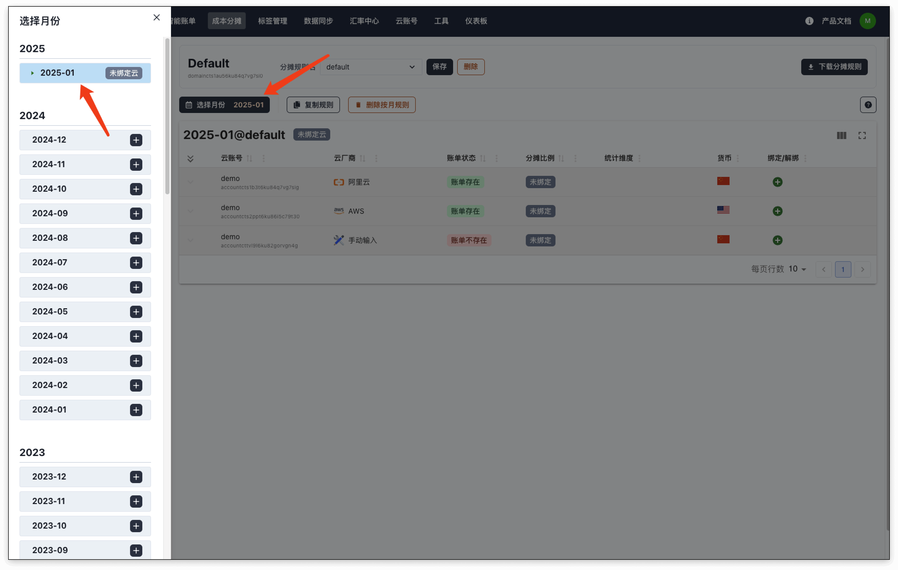
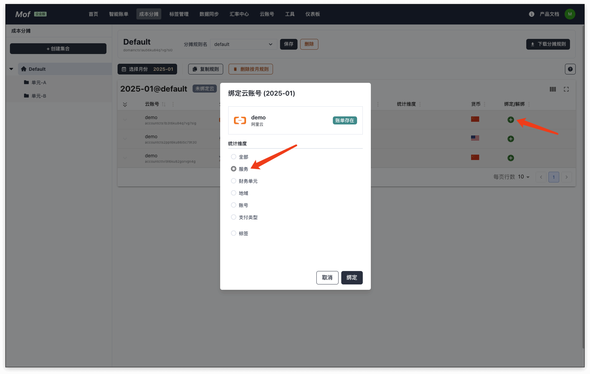
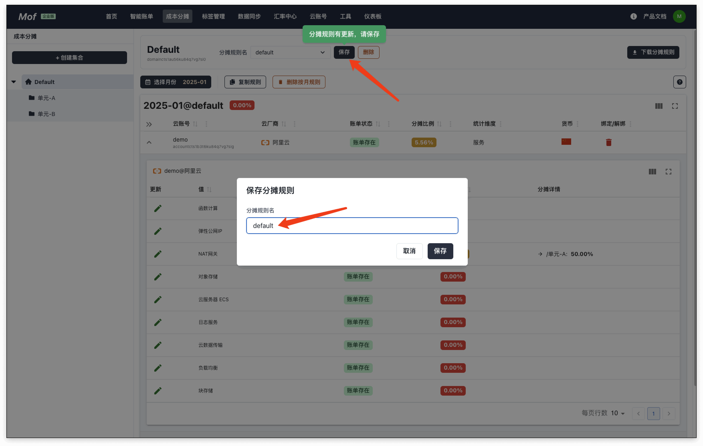

在多云环境中，成本分摊一直是难题，用户可以通过 **成本分摊**功能，便捷地把云账号成本分摊到自定义集合中。

## 1.创建集合 & 单元
集合是类似文件系统的结构，用户可以创建树状单元，然后把云账号账单分配到单元中。

单元可以重名，但是不推荐。

## 2.选择月份
每个月的分摊规则都不一样，因为，共享资源类型（比如 K8s）的分摊比例会不一样。

## 3.绑定云账号
选择云账号，并选择分类维度，用户需要把不同的分类分摊到集合/单元中。

## 4.添加分摊规则
选择云账号下的分类，并分摊到创建的单元中。

## 5.保存规则
一定要保存分摊规则。

## 5.查看成本分摊

