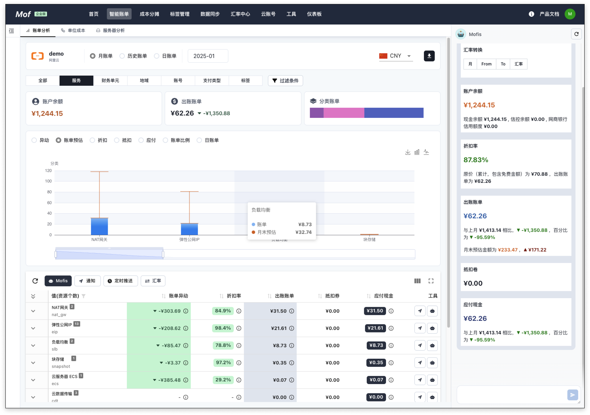
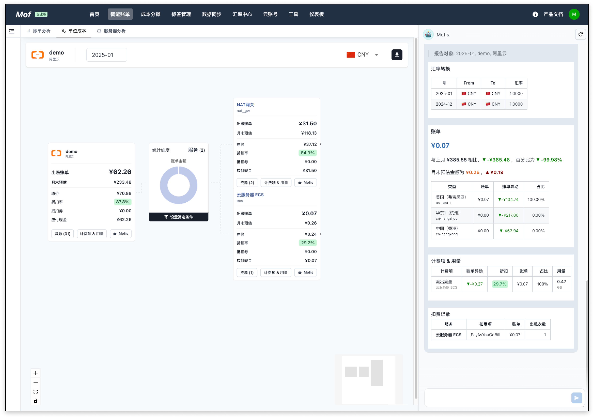

## 账单浏览器
用户可以在统一页面中，查看不同维度的账单数据，同时也可以使用过滤器对数据进行自定义。

### **时间维度**
- 月账单
- 历史账单
- 日账单

### **数据**
- 原价
- 折扣
- 出账账单
- 抵扣卷
- 应付现金

### **账单异动**
查看本月与上月的账单异动。

### **账单过滤**
选择多种过滤条件，比如，服务、地域、标签等等。

### **账单下载**
下载 Excel 格式的账单。

### **账单推送**
把数据推送给企业微信、钉钉、飞书等工具。

### **Mofis 报告**
系统生成的账单报告，总结时间段内，某个类别的账单情况。

### **汇率转换**
自动转换汇率。

### **计费项 & 用量**
查看计费项和用量数据 & 变化。

## 单位成本
单位成本浏览器，通过易用的用户界面，快速实现单位成本监控。

## 服务器分析 
查看服务器状态、成本、优化空间。

