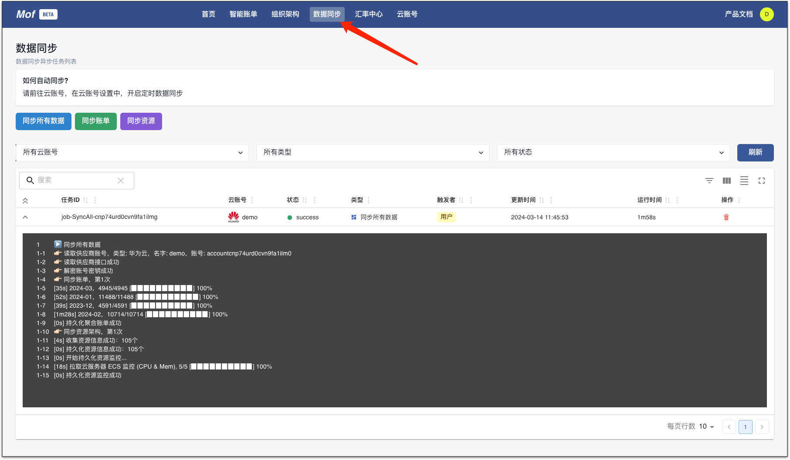
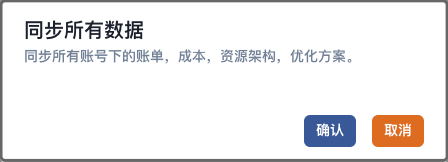
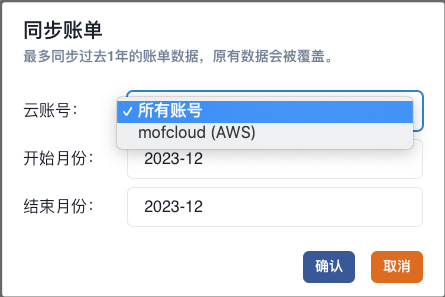
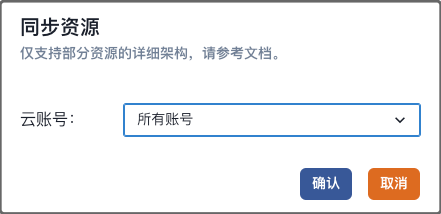

## 同步类型

| 类型     | 参数     | 描述                        |
|--------|--------|---------------------------|
| 同步所有数据 | 无      | 同步所有云账号的账单和资源（当前月） |
| 同步账单   | 云账号，时间 | 同步某个云账号的账单，用户选择的时间段       |
| 同步资源   | 云账号    | 同步某个云账号的资源（当前月）           |

## 自动同步
如果用户需要开启自动同步，请前往**云账号** -> **定时数据同步** 设置。

当开启自动同步时，与**同步所有数据**功能一样。

## 手动同步
### **同步所有数据**
同步账单，资源，优化方案。 同步当前月账单，当前月的资源和优化方案。

### **同步账单**
同步所选云账号的账单，用户自定义时间段，创建账号的时候，系统会默认同步前3个月的数据，用户可以通过此功能同步更久的账单。

### **同步资源**
同步资源数据。

