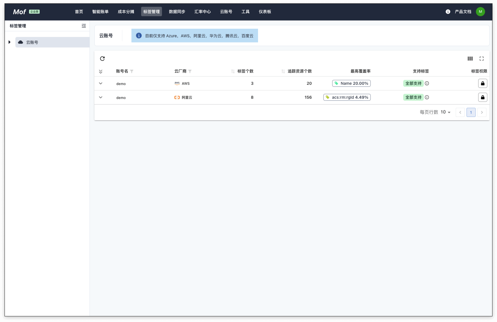
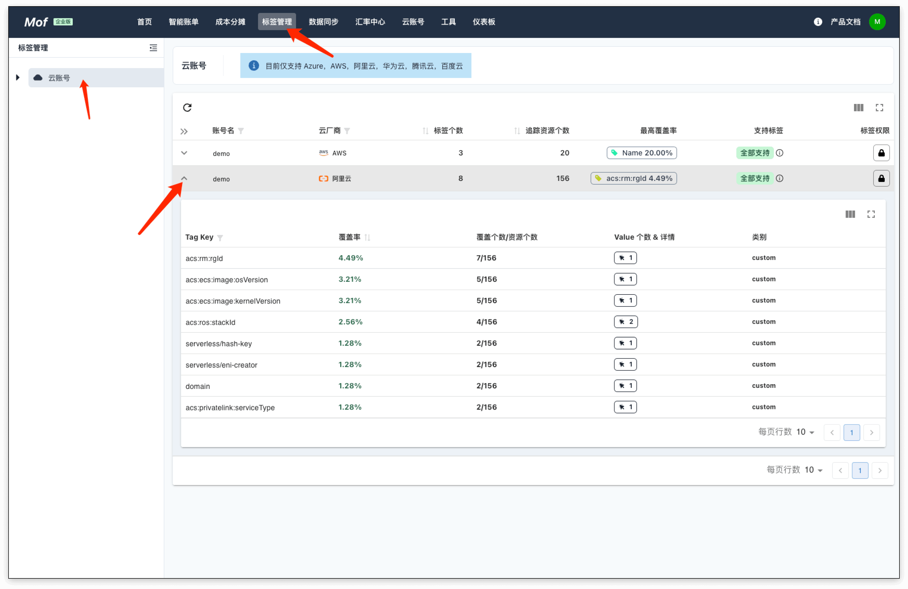
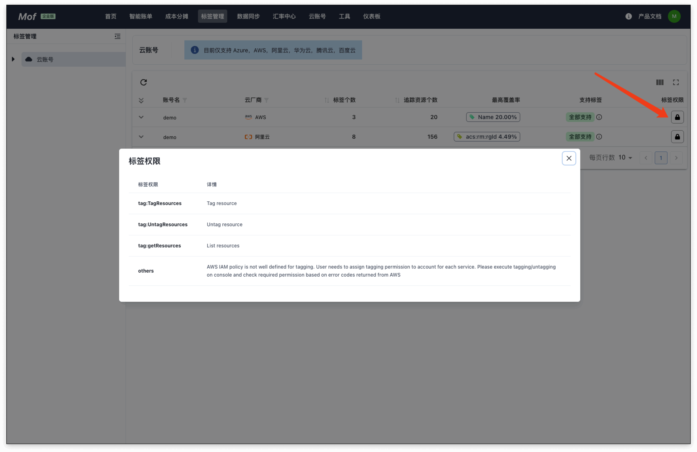
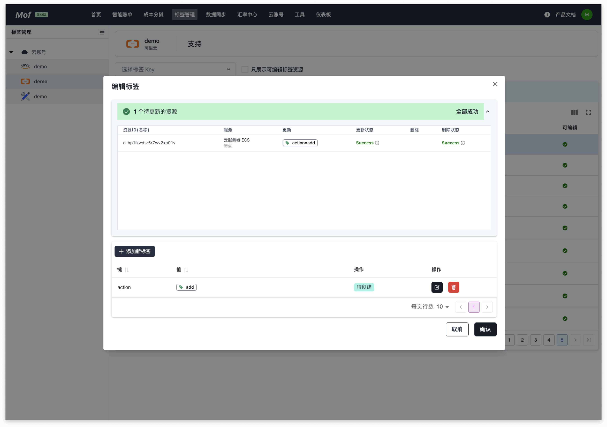
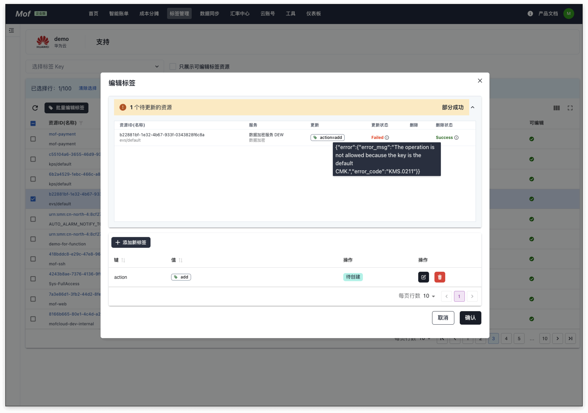
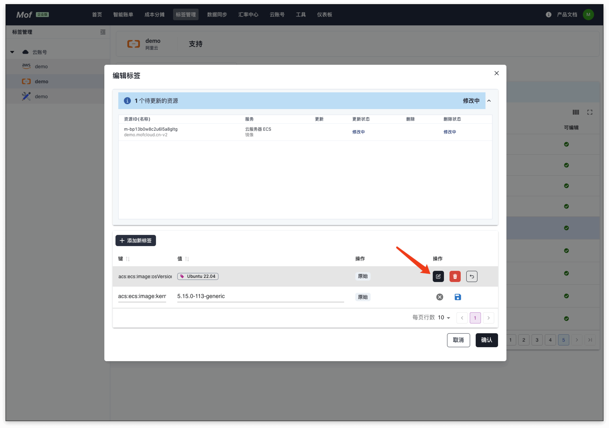
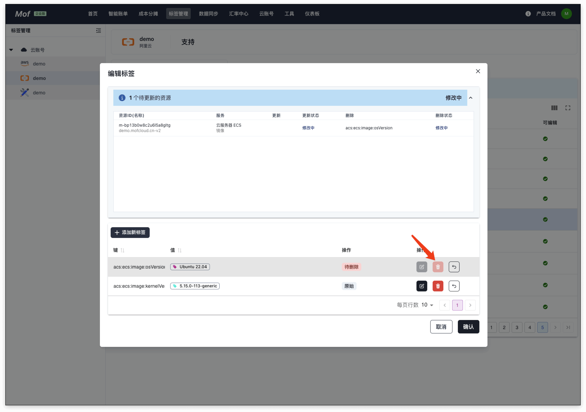

## 标签管理

## 查看
### 1.基本信息
标签个数，覆盖率，资源个数。

### 2.权限
编辑标签，需要云账号的特定权限。

!!! tip "注意"
    有些云厂商，需要对不同的云服务，授予标签写权限。

### 3.详细覆盖率
用户可以查看 Tag Key 的详细覆盖率

## 编辑
统一的**编辑**页面。

### 1.添加标签

**添加成功**
    

    
**添加失败**

如果失败，可查询错误信息，是否因为没有授权！
    

### 2.修改标签

### 3.删除标签
