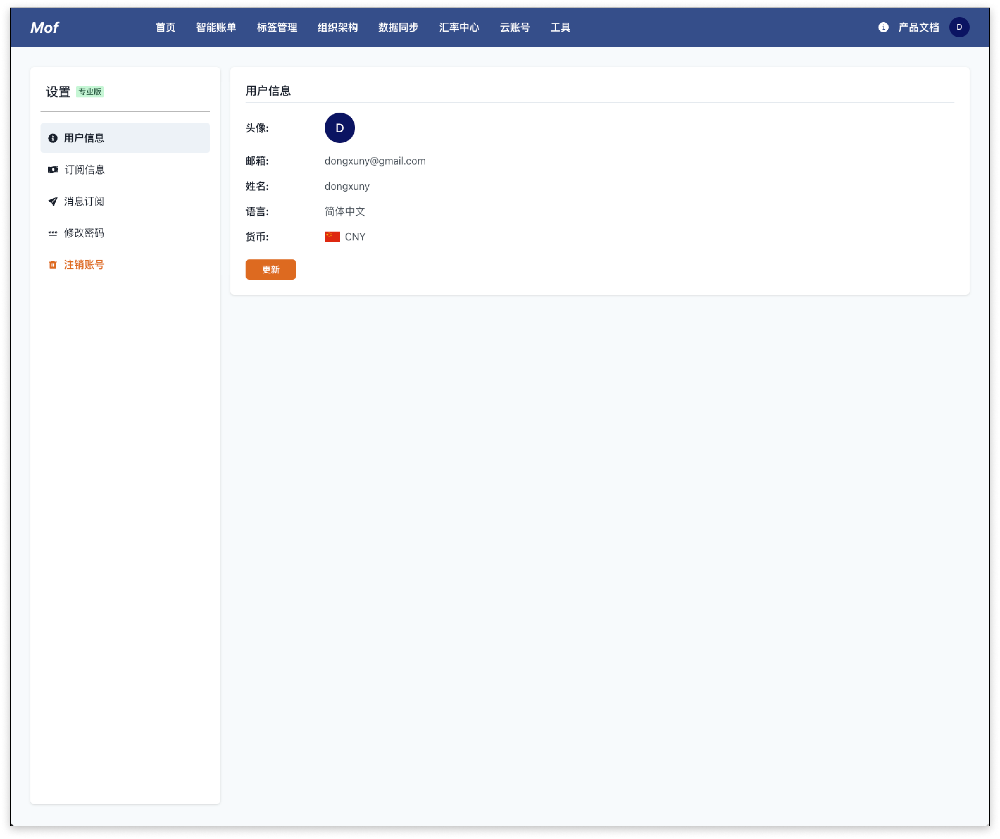
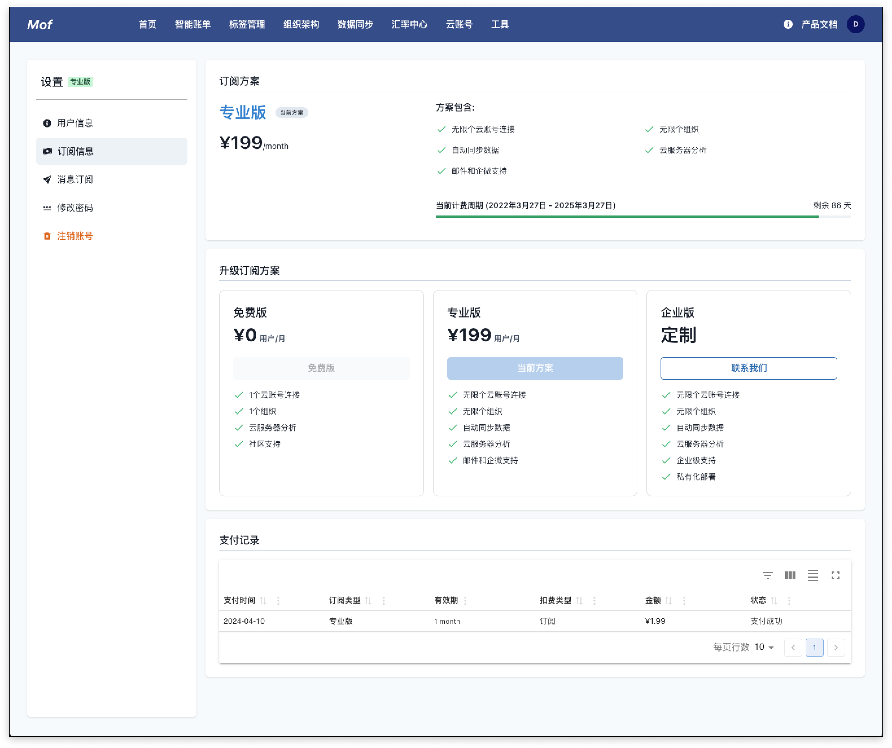
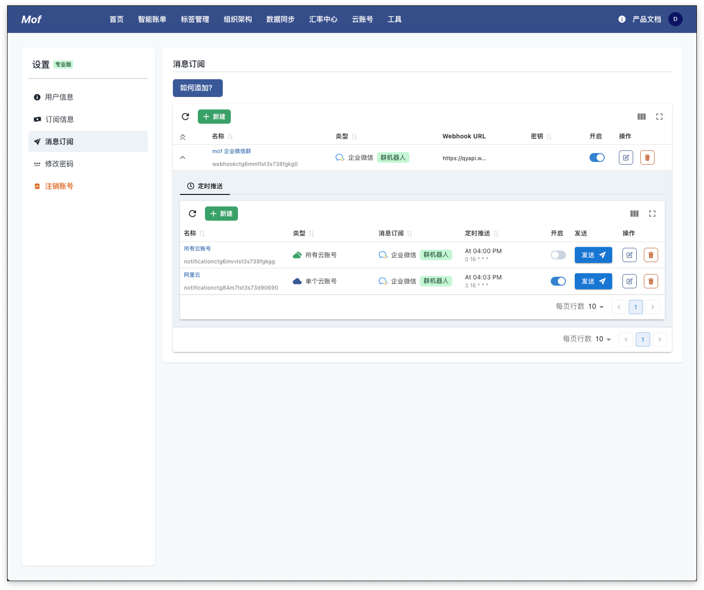
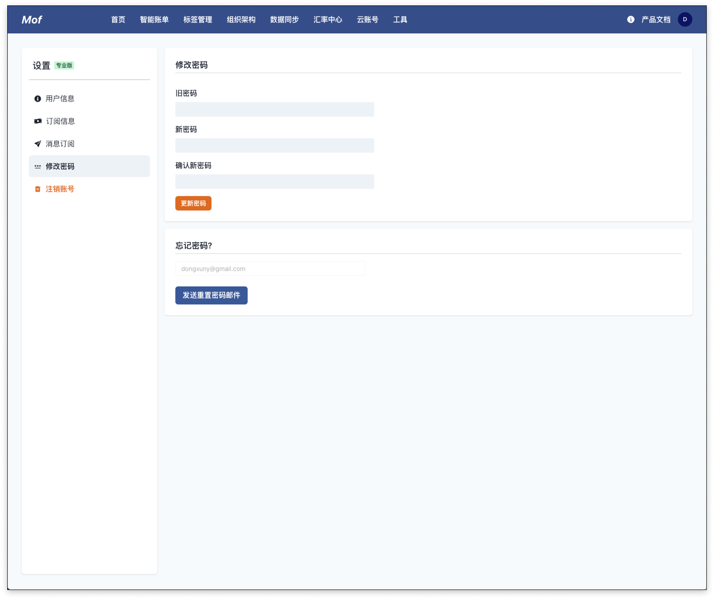
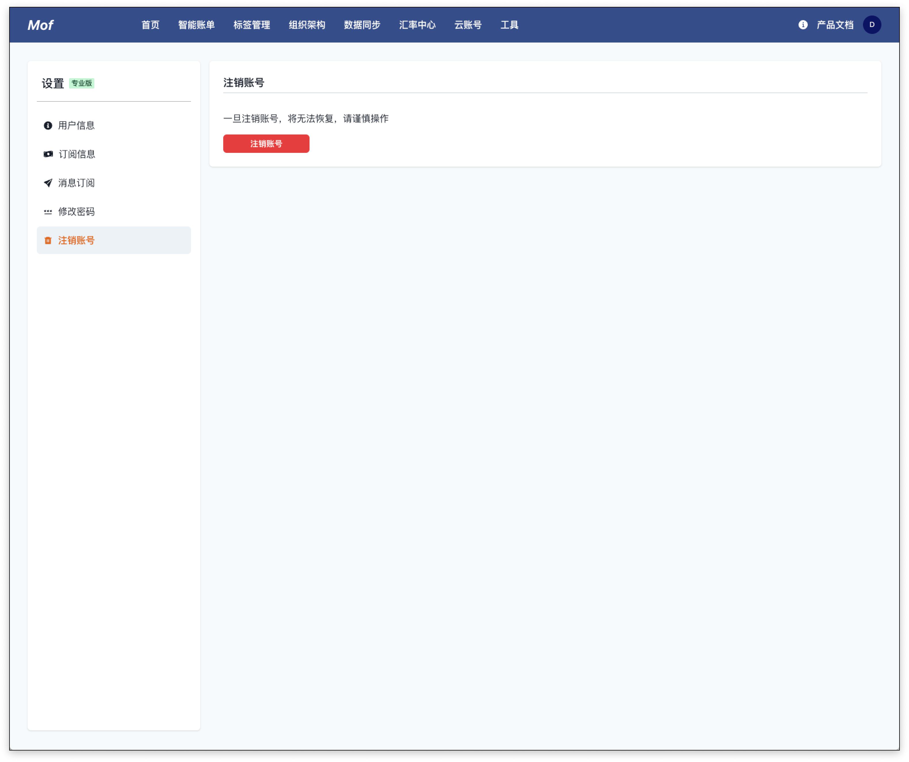

## 基本信息
如下信息可以更新

- 用户名
- 默认货币
- 使用界面语言

## 订阅信息

## 消息订阅
添加消息订阅 webhook 和定时推送。

### 消息订阅 webhook
支持**企业微信群机器人**、**钉钉群机器人**、**飞书群机器人**。为了安全考虑，系统支持群机器人的签名算法。

### 定时推送
用户可以定时推送如下数据到群机器人。

- 所有云账号（当日、当月）
- 单个云账号（当日、当月）
- 组织架构（当日、当月）

## 修改密码
如果用户记得现有密码，可以直接修改。如果用户不记得现有密码，可以通过邮件的方式重置密码。

## 注销账号
一旦账号被注销，系统会立刻删除所有用户相关数据。包括如下：

- 账单数据
- 资源相关数据
- 账号相关数据
- 消息订阅相关数据

