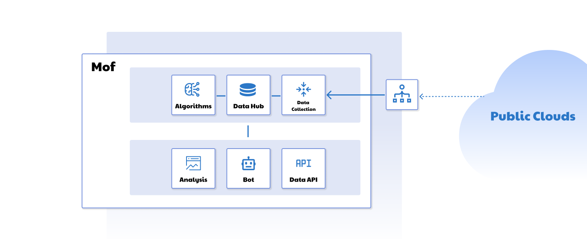

Mof is a **FinOps Cloud Cost Analyser** to help cloud users analyse, manage and optimize cloud cost and cloud architecture.
The system will collect data like cost, utilization, usage, tags and resource detail from multiple cloud providers and evaluating your cloud costs with suggestions.

Mof integrates cost, utilization and usage data which are isolated with each other to figure out **root cause** of cloud cost changes.

In order to cover cloud users scenario, Mof support IAAS cloud providers like AWS, GCP, AlibabaCloud, HuaweiCloud and TencentCloud, but also PAAS providers like Agora, NetEaseYiDun, NetEaseYunxin and etc.
In the future, Mof will keep on covering more cloud providers.

There is no complex configuration and human touch for system. The only action user need to do is providing **READ_ONLY** credentials to Mof.
Data syncing and analysis will be done by Mof automatically.

-   :material-clock-fast:{ .lg .middle } __1 minute configuration__

    ---

    **READ_ONLY** credentials with full automation

-   :fontawesome-solid-comments-dollar:{ .lg .middle } __Smart bill__

    ---

    Resource level bills, cost abnormal, usage and utilization analysis, cost risk report

-   :fontawesome-solid-file-export:{ .lg .middle } __Download__

    ---

    Download bill report as Excel with multiple dimensions

-   :fontawesome-solid-server:{ .lg .middle } __Server Analysis__

    ---

    Based on metrics and bill data, check【Unused】&【Right Sizing】servers

-   :fontawesome-solid-sitemap:{ .lg .middle } __Organization__

    ---

    Create organizations and split bills to your org as needed

-   :fontawesome-solid-cloud:{ .lg .middle } __Multi clouds__

    ---

    Support multiple cloud providers including IAAS，PAAS，SAAS

-   :fontawesome-solid-arrow-right-arrow-left:{ .lg .middle } __Exchange rate__

    ---

    Automatically exchange cloud cost with your own currency

