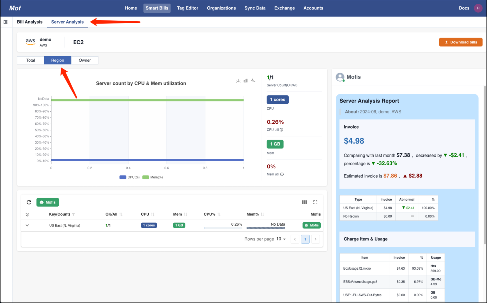
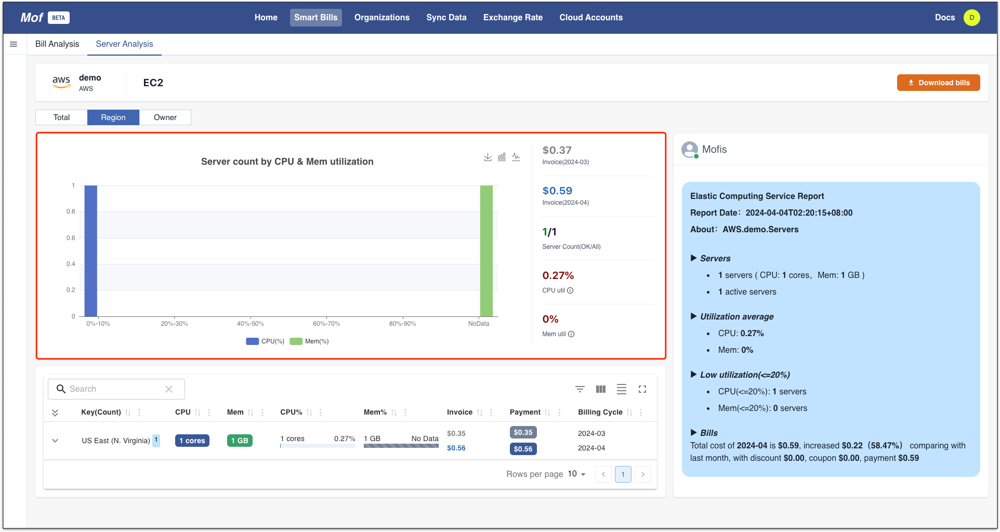
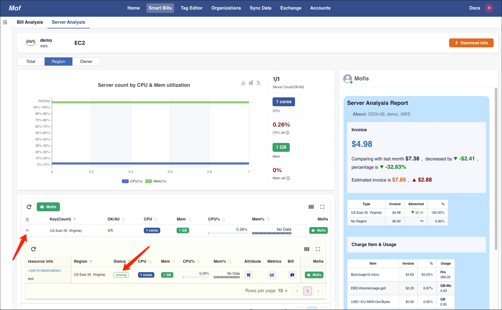
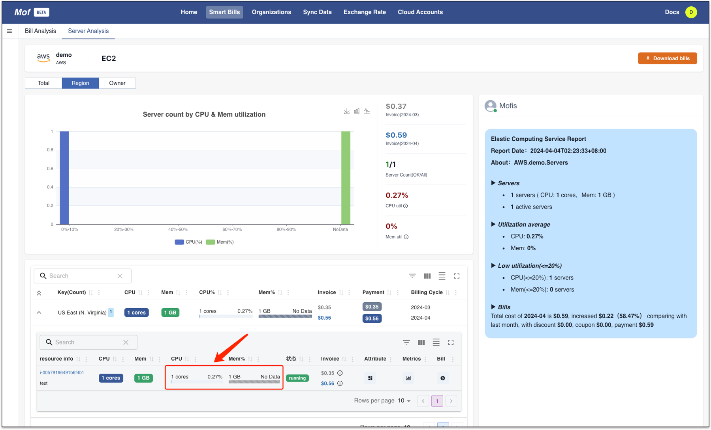
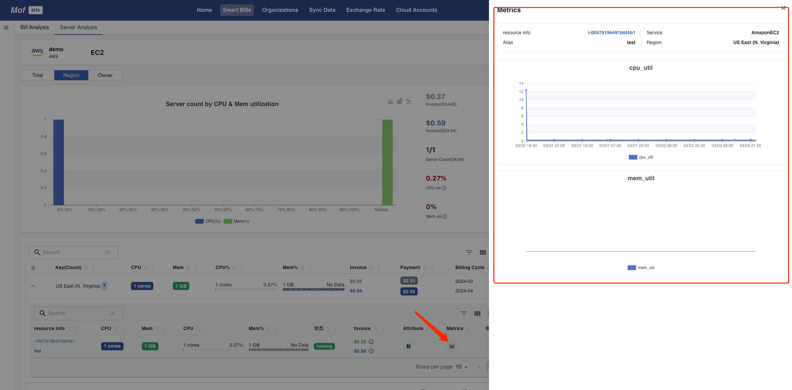
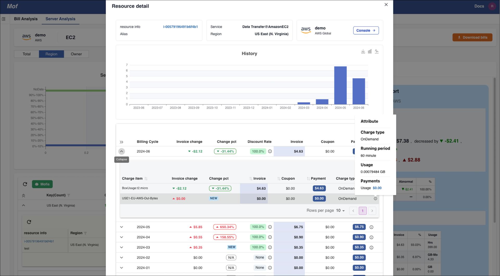
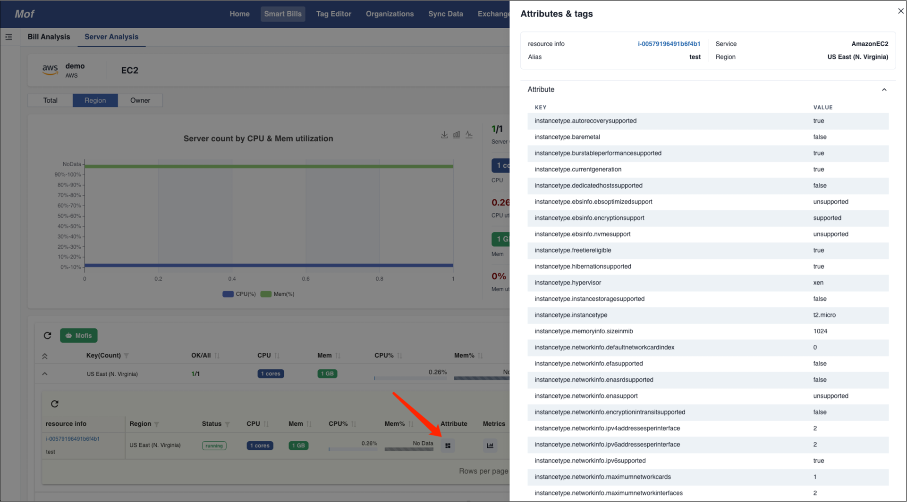

!!! tip "How to analyse?"
    Analyse **Unused** & **Low util** server based on bellow data:
    
    - Bill
    - Charge item
    - Utililzation
    - Status
    - More...

## Cluster
=== "Mofis analysis"

    

=== "Util distribution"

    !!! example "How to read？"
        How many servers at different range of util for CPU & Mem.

    

## Groups
!!! example "Group based on bills"
    Server can be grouped based region, project and etc.

## Instance
=== "Unused"

    !!! example "Status"
        Check status to figure out **Unused**

    

=== "Low util"

    !!! example "Utilization"
        Check **Low util** based on metrics

    

=== "Monitor"

    !!! example "Check correct instance type"

        User can decide correct instance types based on monitoring data

    

=== "Bills"

    !!! example "Check historical problem"

        There can be historical problem abount instance

    

=== "Attribute"

    !!! example "Check attributes"

        Check specitial configurations for instance

    