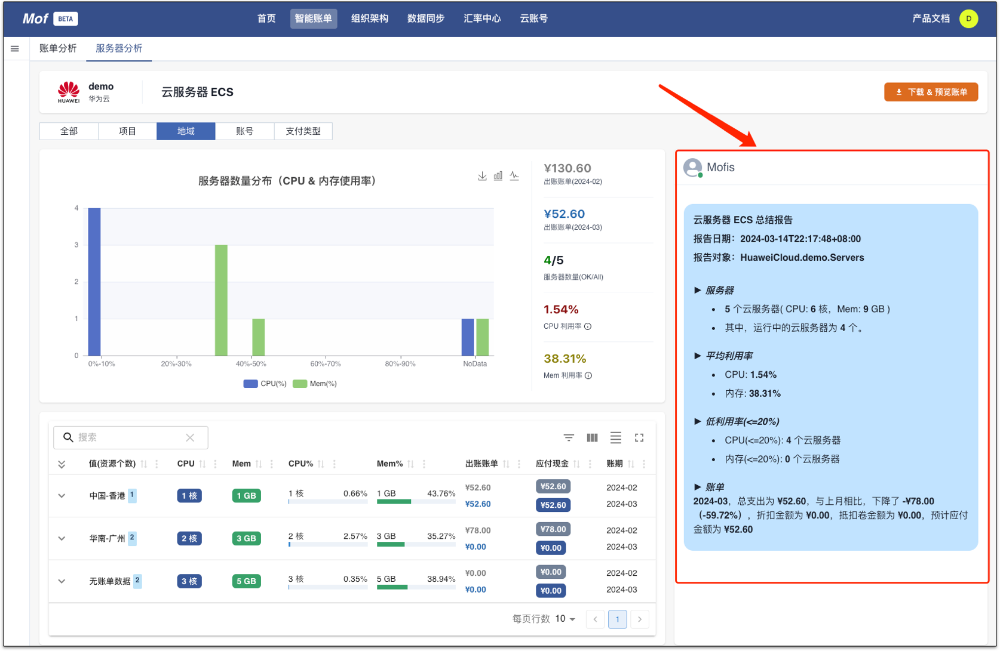
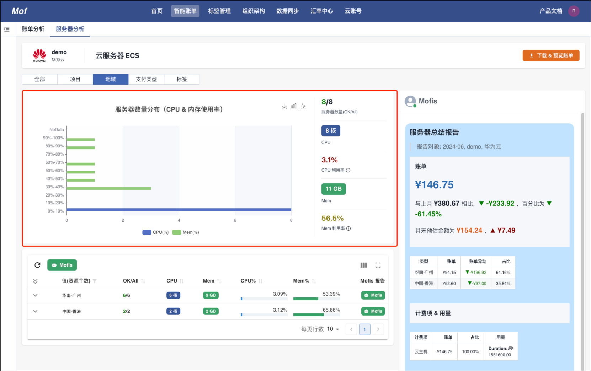
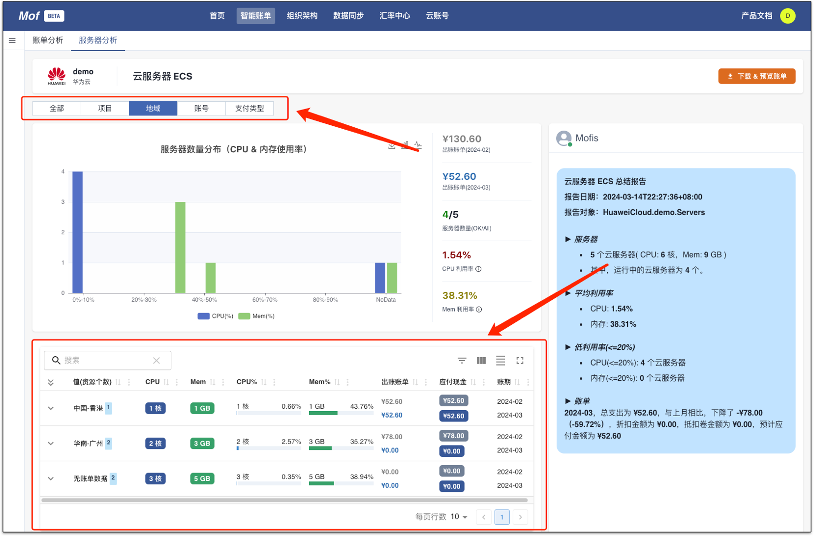
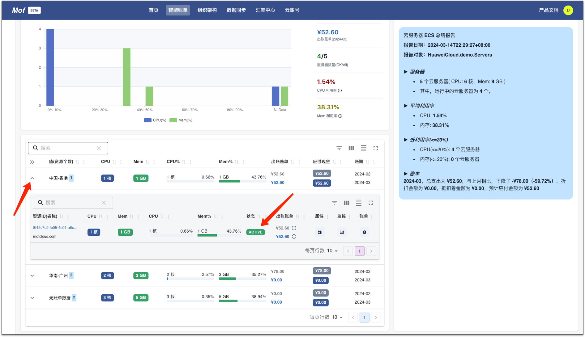
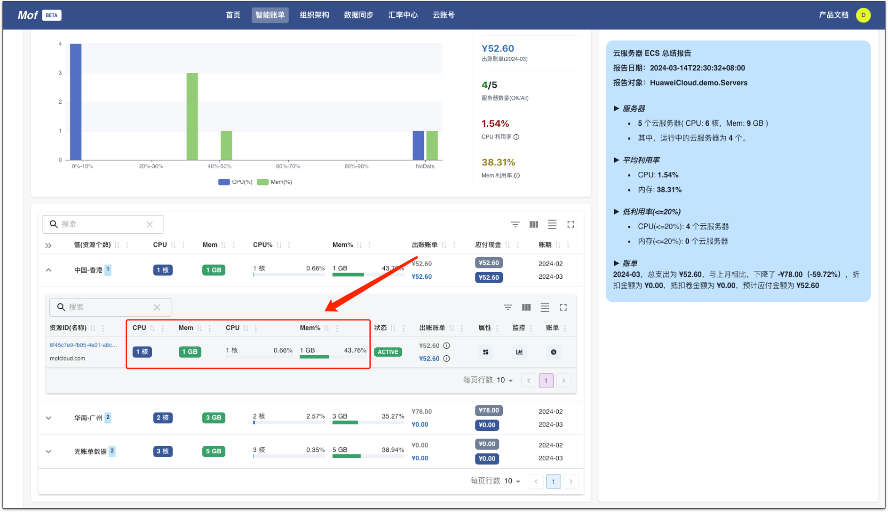
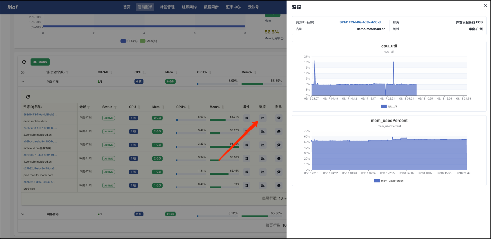
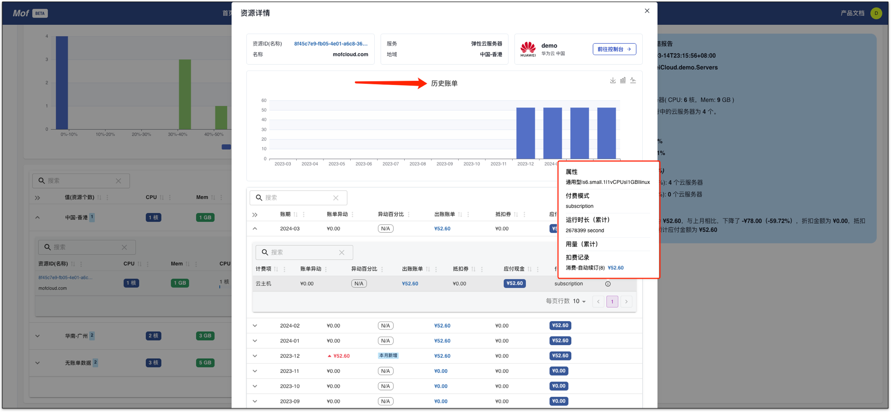
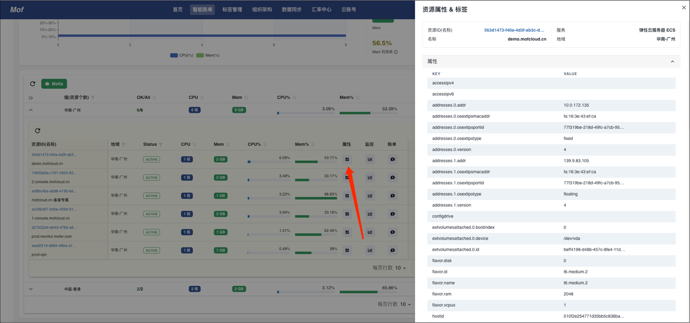

!!! tip "分析逻辑"
    根据不同云厂商的计费项，结合计费项相关利用率数据，对服务器进行【未使用】&【低利用率】进行决策。

    - 账单数据
    - 计费项
    - 利用率
    - 状态
    - More...

## 集群
=== "Mofis 报告"

    !!! example "Mofis 成熟度"
        初级，后续，Mofis 引入更智能的 AI 算法

    

=== "利用率分布"

    !!! example "怎么理解分布图？"
        CPU & 内存平均利用率区间里的服务器个数。

    

## 分类
!!! example "结合账单分类"
    结合账单数据，可以把服务器分类到类似【财务单元】，【项目】中。

## 实例
=== "未使用"

    !!! example "状态"
        可以通过实例状态，判断【未使用】

    

=== "低利用率"

    !!! example "利用率"

        可以通过实例利用率，判断【低利用率】

    

=== "监控"

    !!! example "判断实例类型"

        可以通过实例监控数据，判断【利用率】时序，判断是否趋势，Pattern，为正确的服务器类型提供依据。

    

=== "账单"

    !!! example "判断历史遗留问题"

        查看历史账单，计费项，使用量，判断是否有历史遗留问题。

    

=== "参数"

    !!! example "判断特殊参数"

        查看完整服务器参数，判读是否有特殊参数需求。

    