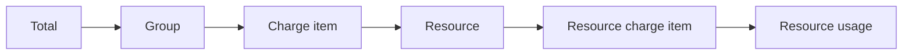
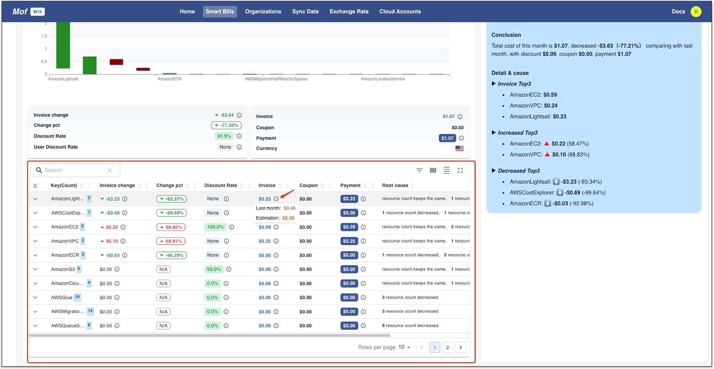

!!! tip "Let mof answer bellow questions for you："
    - Total Cost？
        - Mofis analysis
        - Cost explorer
    - Any abnormal？
        - Abnormal chart
        - Group bills
    - Why？
        - Bill detail
    - What to do？
        - Resource bills

Bill unit：

## Total Cost？
=== "Mofis analysis"

    !!! example "Mofis?"
        Mofis is still at entry level intellegence, we will keeps to improve mofis.

    

=== "Cost explorer"
    

## Any abnormal?
=== "Abnormal chart"

    !!! example "How to read the chart？"
        Similar to candle chart in stock market.

    

=== "Group bills"

    

## Why?
=== "Bill detail"

    !!! example "How to read bill detail？"
        1. Any abnormal on **resource count**？
        1. Any abnormal on **charge item**？
        2. Any abnormal on **resource**？

    

## What to do?
=== "Resource bills"

    !!! example "How to read resource bills？"

        - History：Is there any historical billing problem？
        - Charge item：Any abnormal？
        - Usage：Any abnormal？

    
