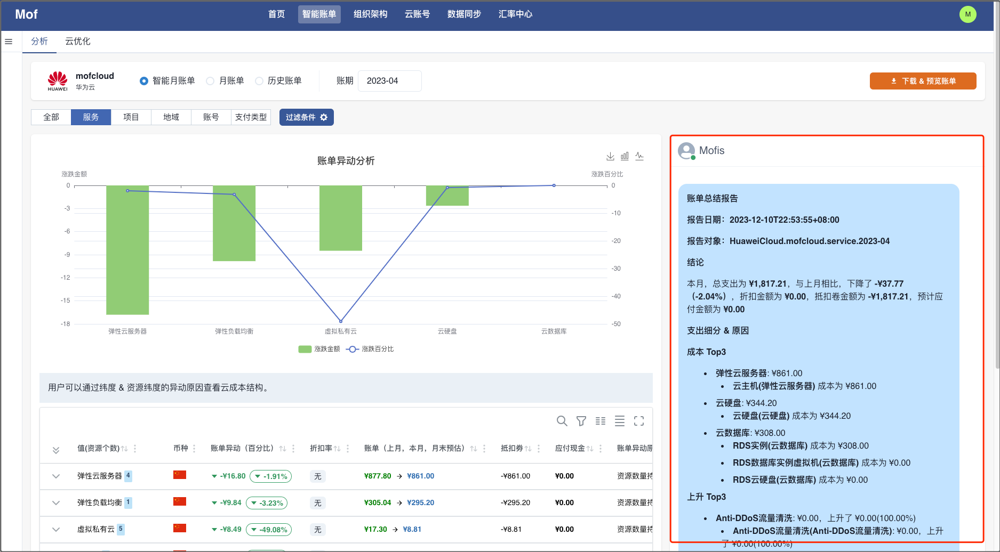
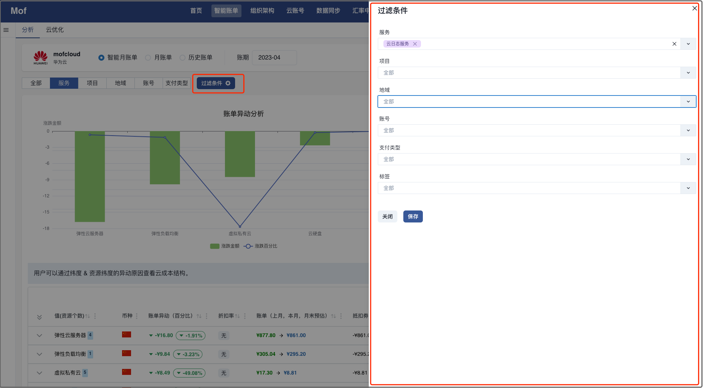
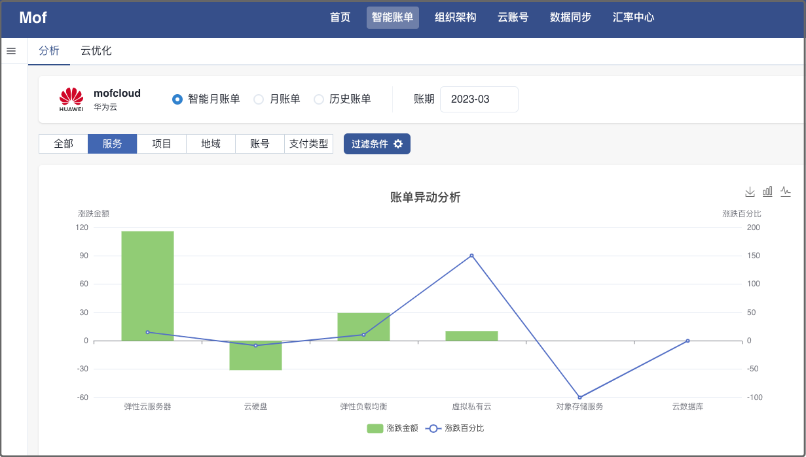
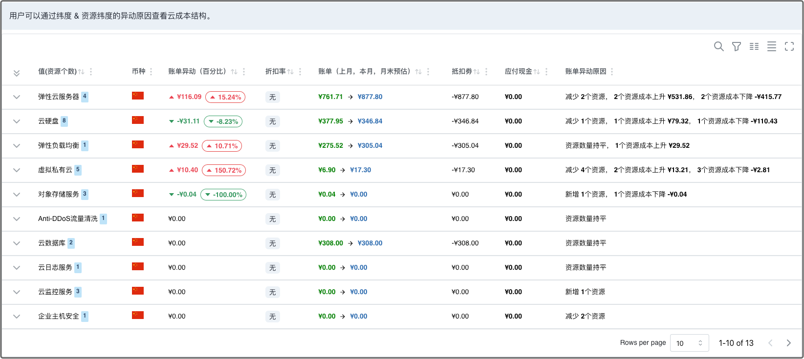
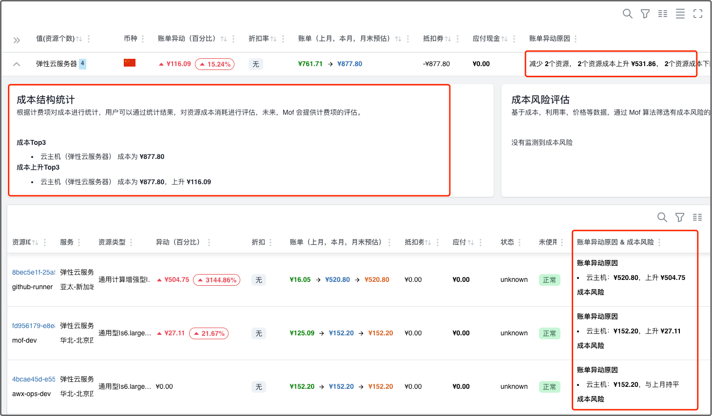
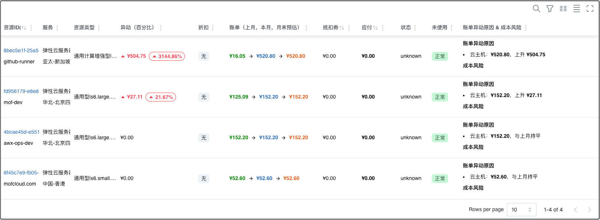
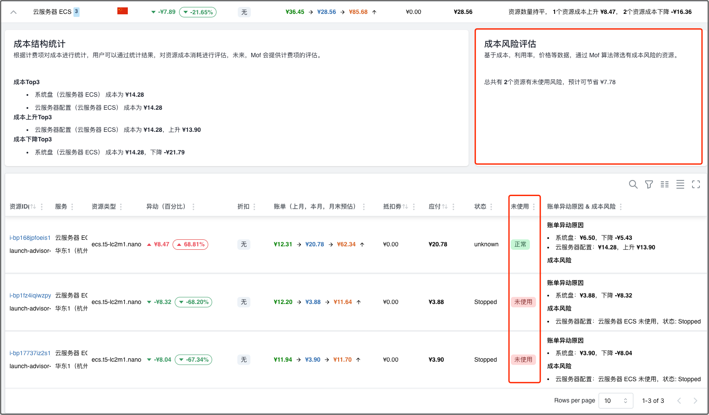
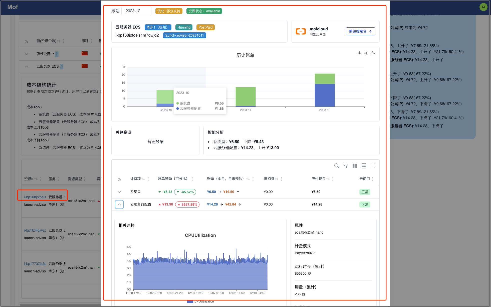
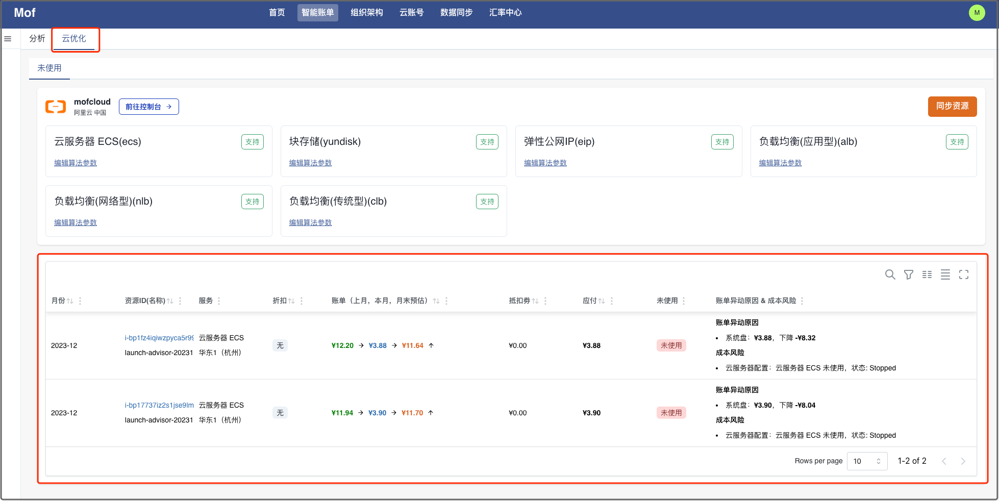
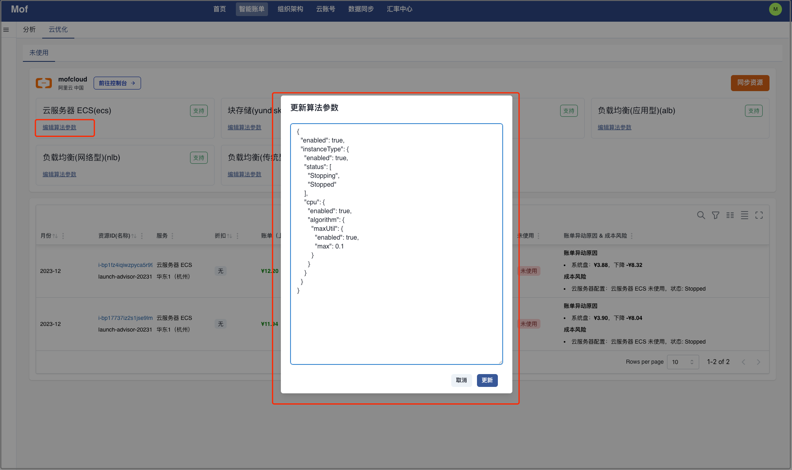

!!! tip "通过智能月账单，Mof 可以回答用户如下的问题："
    - 情况怎么样？
    - 有什么异动？
    - 为什么？
    - 该怎么做？

为此，Mof 对应实现了如下功能：

| 情况怎么样? | 有什么异动?                  | 为什么?                   | 该怎么做?                      |
|------|-------------------------|------------------------|----------------------------|
| 账单总结 成本浏览器 | 异动报表 异动详情 | 异动原因 资源成本  | 成本风险评估 资源计费项评估 未使用 |

!!! tip "视图"

    用户可以在**云账号**，**所有云账号**，**组织架构**视图下查看。
    本文中，使用**云账号**视图进行解释。

## 情况怎么样？
### 账单总结
!!! example "Mofis 成熟度"
    初级，后续，Mofis 引入大模型，对账单进行更专业的总结

用户可以在 Mofis 中查看账单的整体情况。

### 成本浏览器
用户可以通过过滤条件，查询自定义数据。

## 有什么异动?
### 异动报表
异动报表展示**上月 -> 本月**的异动金额和异动百分比。

### 异动详情
用户可以通过异动表，获取 Group 级别异动，折扣率，账单预估，折扣卷，应付现金。

## 为什么?
### 异动原因
可以从如下几个方面获取异动原因。

- Group 纬度：资源个数对异动的影响
- 用量纬度：Group 级别计费项对异动的影响
- 资源纬度：资源级别计费项对异动的影响

### 资源成本
列出当前Group下所有资源成本情况，包括异动原因。

## 该怎么做? 
### 成本风险评估
如果有资源处于**未使用**状态，Mof 会进行评估。

### 资源计费项评估
!!! info "资源支持情况"
    Mof 会持续添加对于不同服务资源计费项的评估，支持情况[请参考](../opt/unused.md)

### 未使用
列出所有未使用的资源。

!!! info "如何自定义未使用逻辑？"
    可以通过编辑算法参数，自定义未使用逻辑。

