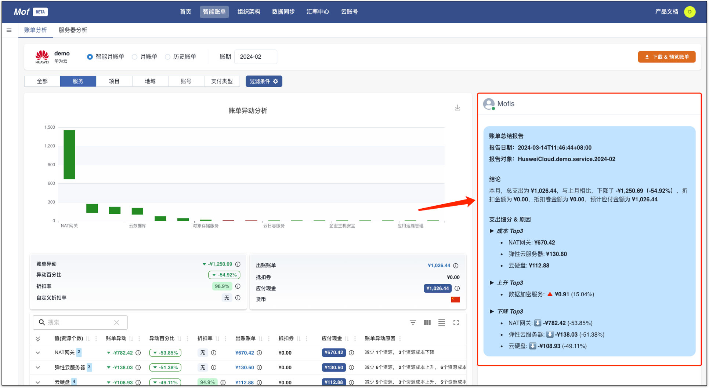
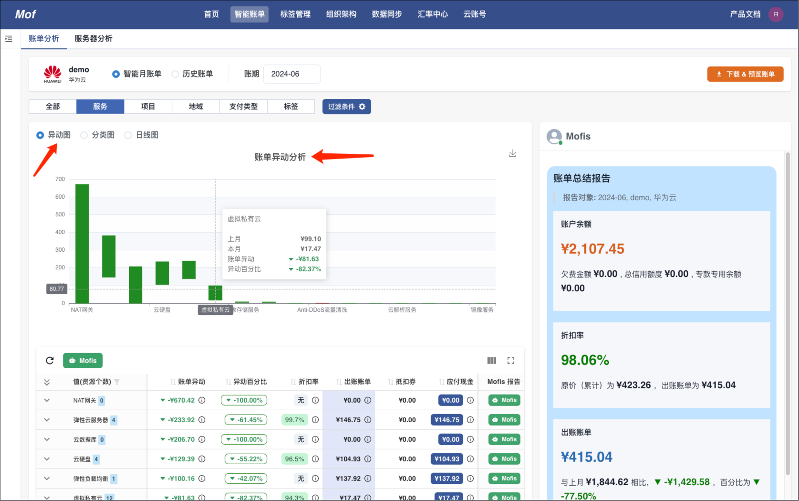
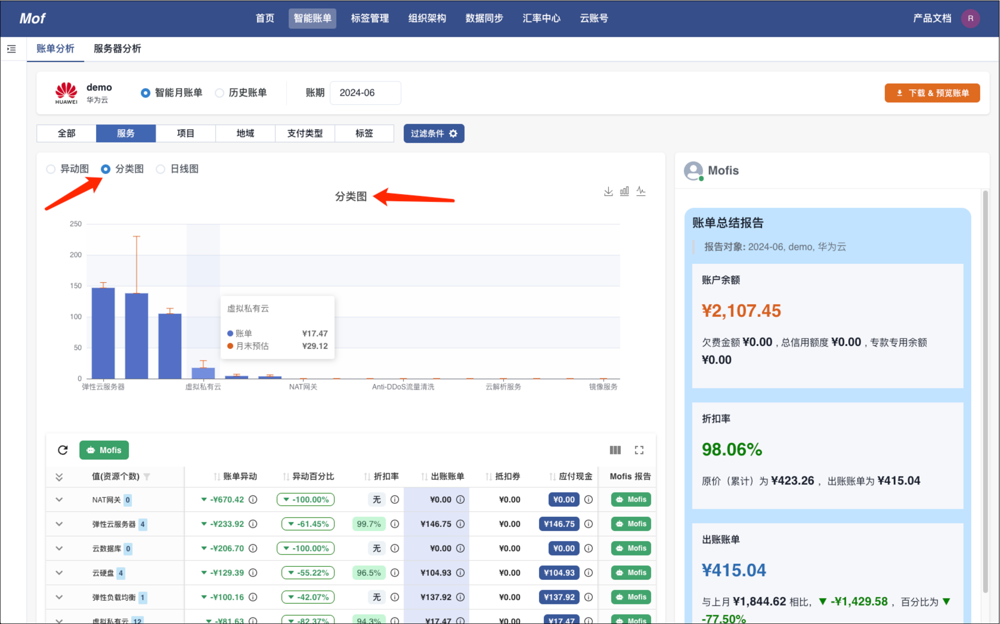
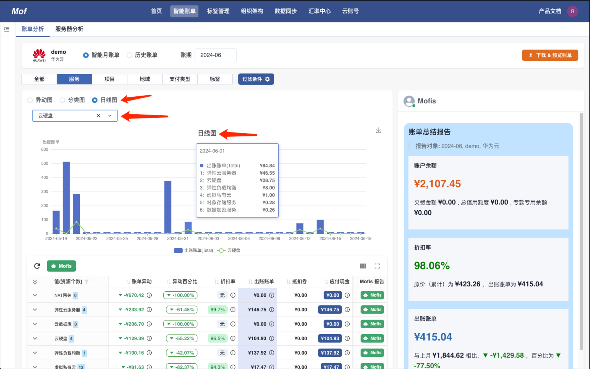
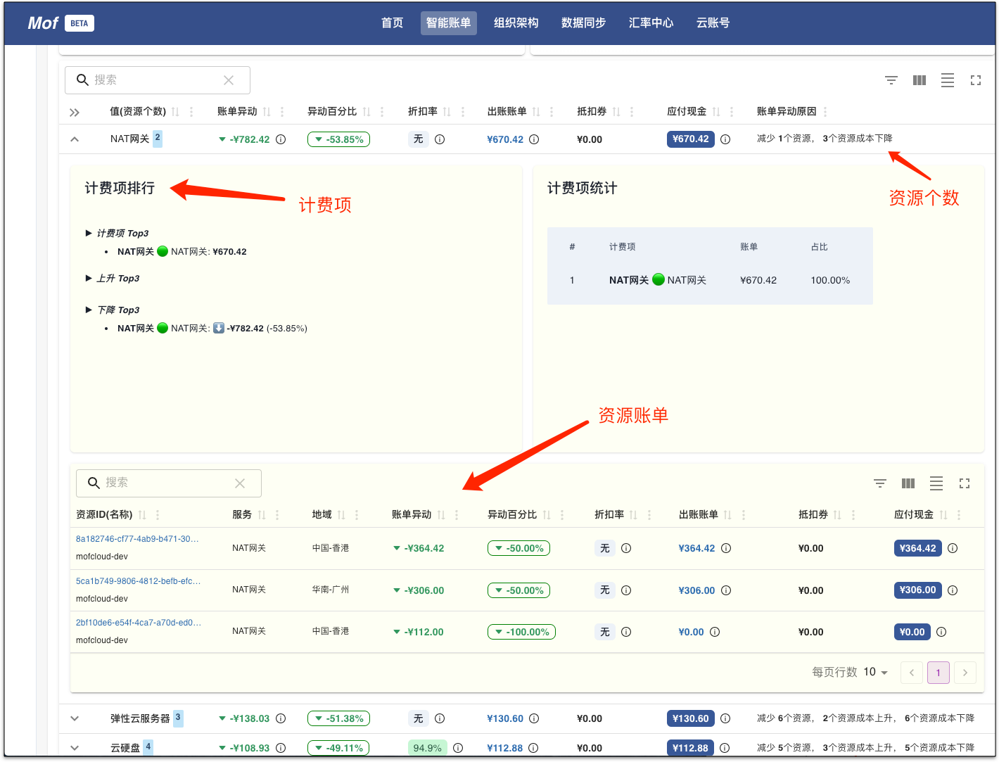
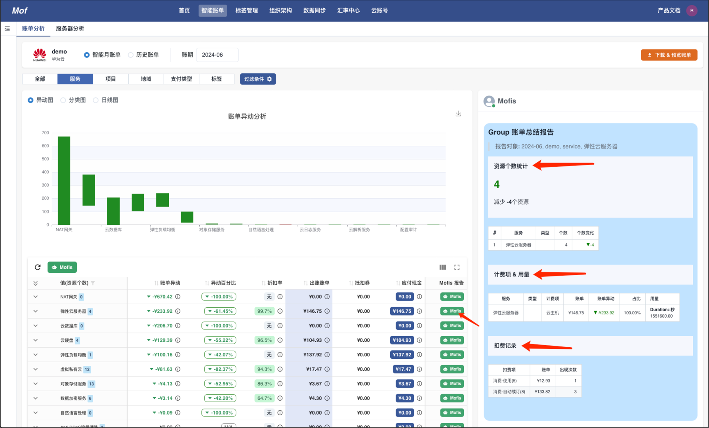
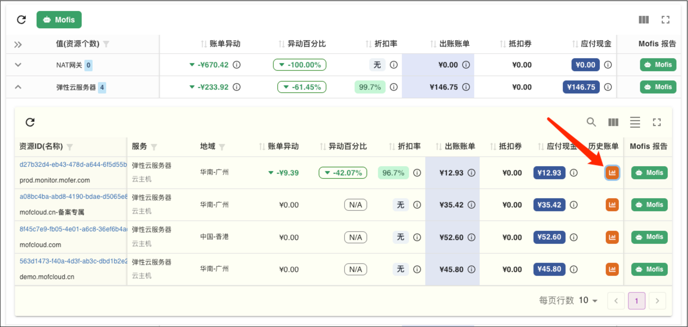
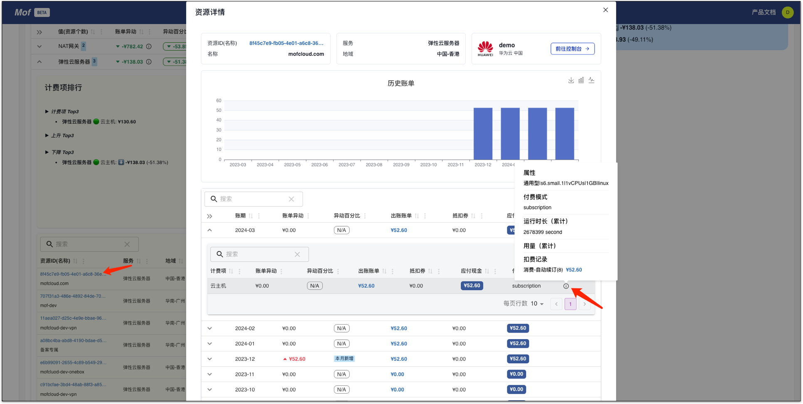

!!! tip "通过智能月账单，可以回答用户如下的问题："
    - 本月总成本？
        - Mofis 报告
        - 成本浏览器
    - 有什么异动？
        - 异动图
        - 分类账单
    - 本月预估？
        - 分类图
    - 按日账单？
        - 日线图
    - 为什么？
        - 账单详情
        - Mofis 报告
    - 该怎么做？
        - 资源账单详情

账单颗粒度：

## 本月总成本？
=== "Mofis 报告"

    !!! example "Mofis 成熟度"
        初级，后续，Mofis 引入更智能的 AI 算法，对账单进行更专业的总结

    

=== "成本浏览器"
    

## 有什么异动?
=== "异动图"
    
    !!! example "怎么理解异动图？"
        异动图采用类似**股票蜡烛图**的形式展示，绿色为下降，红色为上升。

    

=== "分类图"

    !!! example "怎么理解分类图？"
        分类图按照用户选择的类型，对账单进行分类，并提供**月末预测**数据。

    

=== "日线图"

    !!! example "怎么理解日线图？"
        日线图为用户提供按日的账单数据，数据为云厂商实际扣款日期。

    

## 为什么?
=== "账单详情"

    !!! example "如何判断异动原因？"
        1. 哪些**资源**有异动？
        2. 资源有哪些**计费项**，**用量异动**?

    

=== "Mofis 报告"

    !!! example "Mofis 报告包含什么？"
        1. 哪些**计费项**有异动？
        2. **用量**如何？
        3. **资源个数**有什么变化？

    

## 该怎么做?
=== "资源账单详情"

    !!! example "如何理解资源账单？"
        在后续的迭代中，系统会集成计费项 & 监控指标 & 价格，进行分析。

        - 资源历史账单：是否存在历史遗留问题？
        - 计费项：哪些计费项有异动？
        - 用量：用量是否有增长？

    
    
