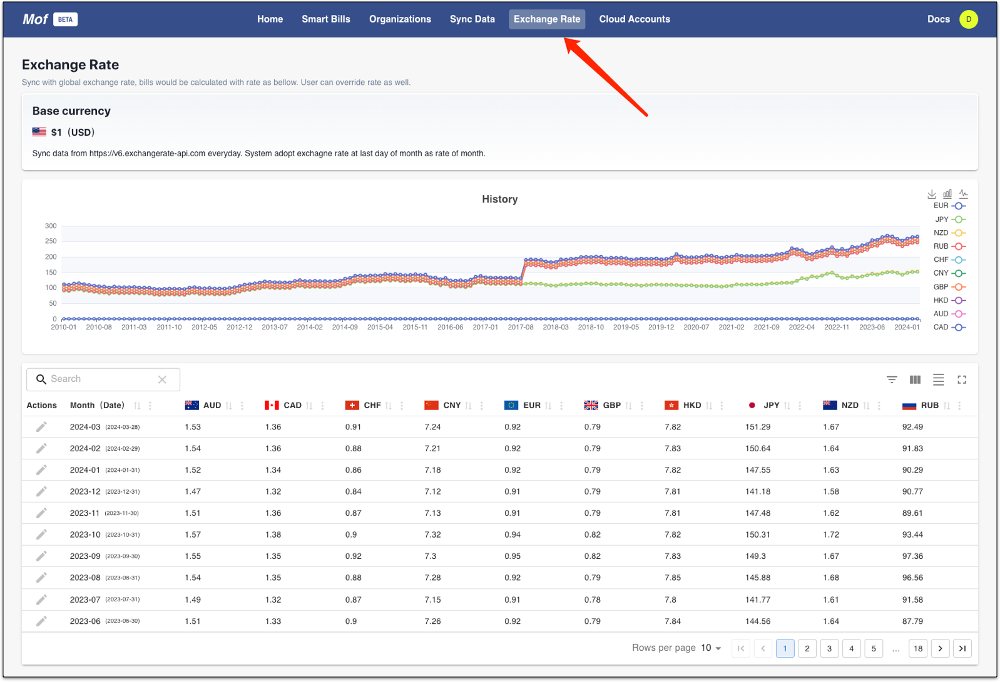
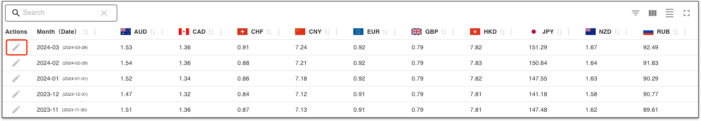
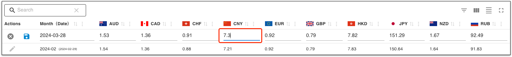
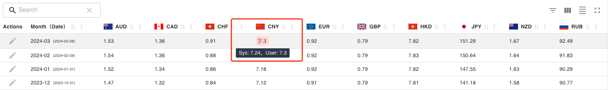
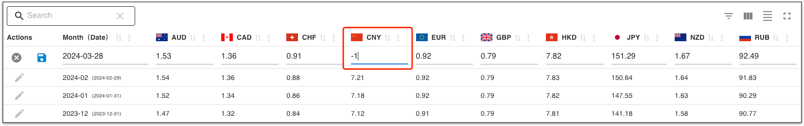
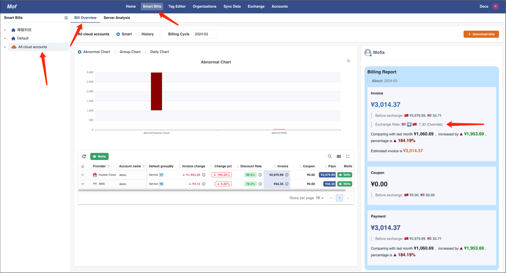

Mof support real time exchange rate service which will apply to user bills.

Please move to **Exchange Rate** to view exchange rates. **USD** will be base currency.

## Exchange rate
Mof will pull exchange rate data every day. By default, Mof will use monthly exchange rate with rate of last day of month.

## Override
=== "1.Click edit"
    

=== "2.Enter your value"
    

=== "3.Check user & sys rate"
    

## Reset
Enter **-1** to reset to system exchange rate.

## Change user currency
Update user currency at [User settings](../user/index.md).

## Effect

