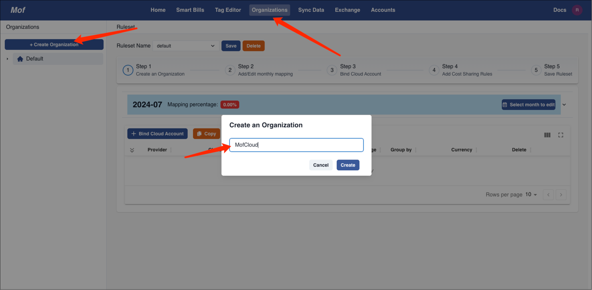
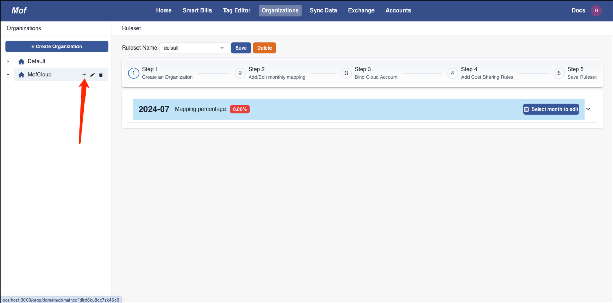
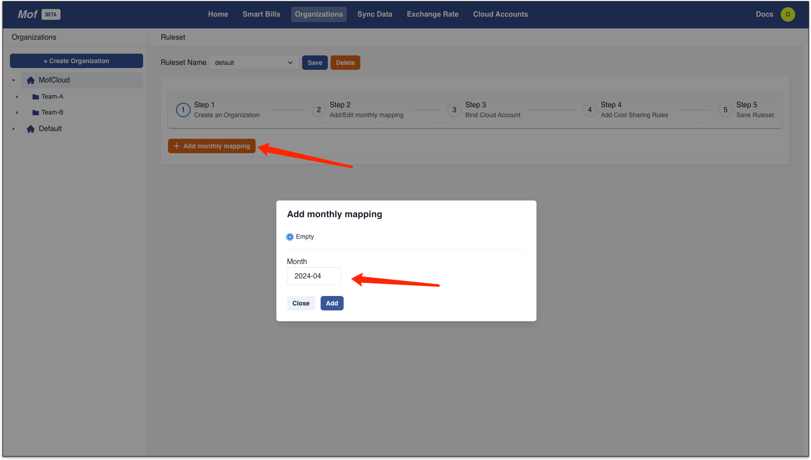
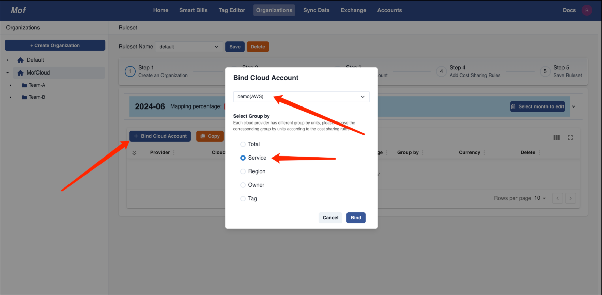
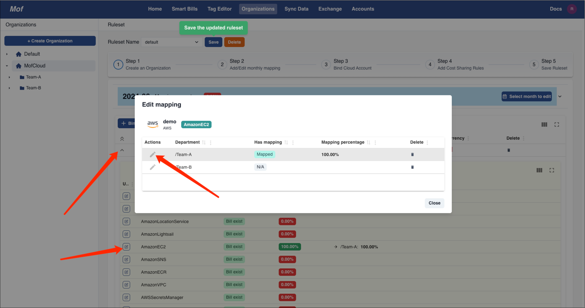
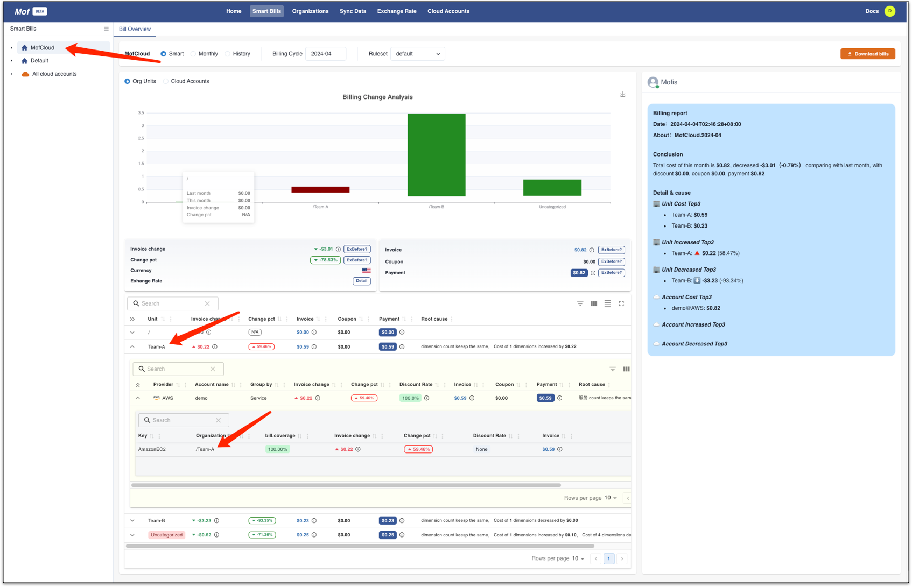

## Concept
In order to map bills from cloud account to organizations, mof brings mapping concept which can assign bill groups to orgs.

| Concept      | Description                                                                        | 
|--------------|------------------------------------------------------------------------------------|
| Organization | Similar to file system                                                             |
| Ruleset      | The mappings from cloud account group bills to organization with version supported |

## Example
=== "1.Create org"
    Multiple organizations are supported

    

=== "2.Create department"
    Name of department can be duplicated, but not recommended.

    

=== "3.Add monthly mapping"
    We need **mappings** for every month.

    

=== "4.Binding Cloud Account"
    > ⚠️ Caution！
    > Please make sure to save mappings!

    User can select multiple cloud accounts with one group by.

    

=== "5.Add Mapping"
    In this example, we will map as bellow.

    - 【AmazonEC2】to【Team-A】
    - 【AmazonLightsail】to【Team-B】
    - Save

    

=== "6.Check bills"
    Check **Smart Bills** of organization

    

