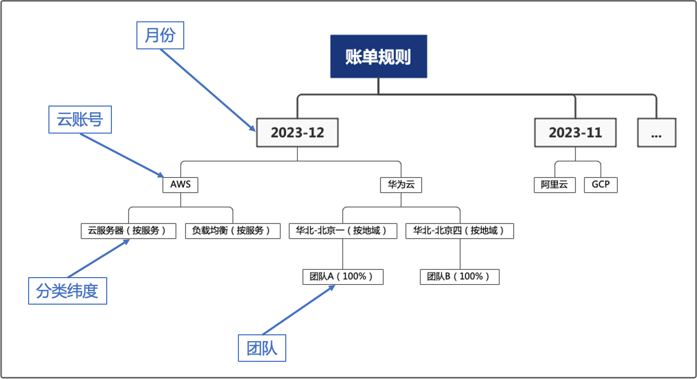
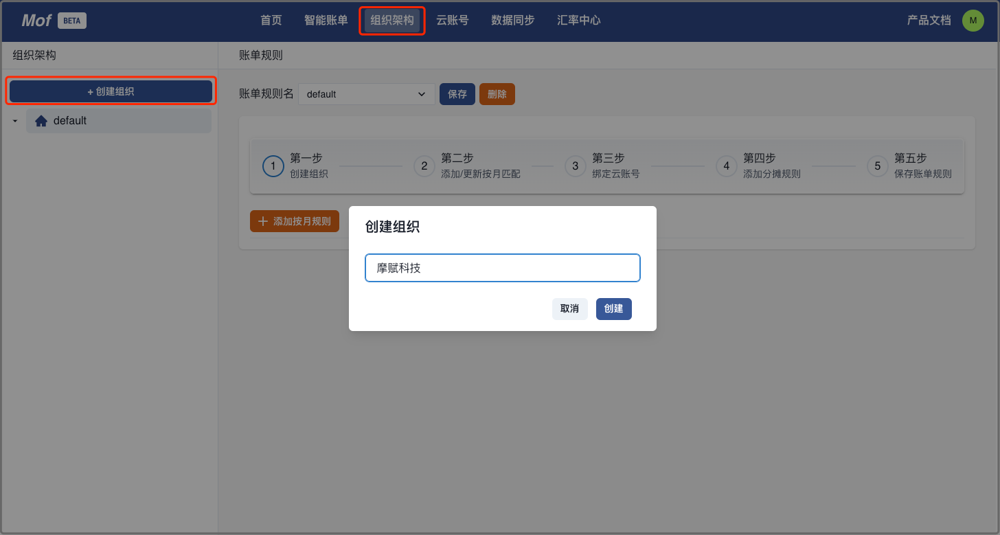
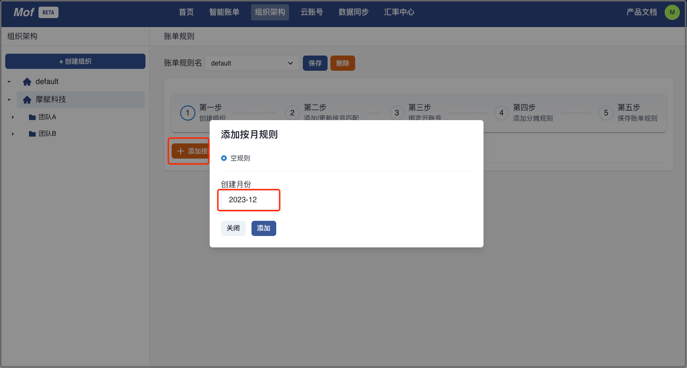
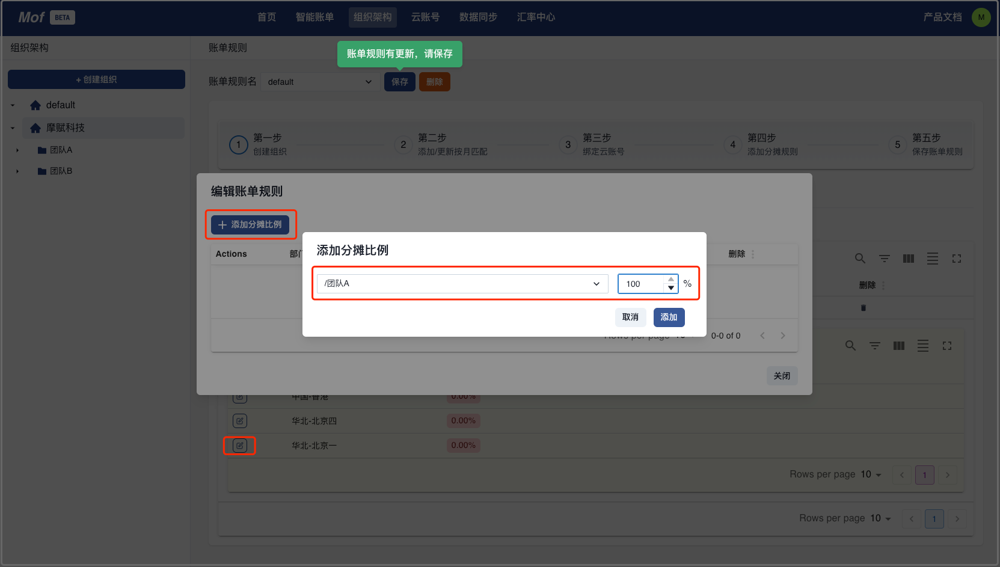
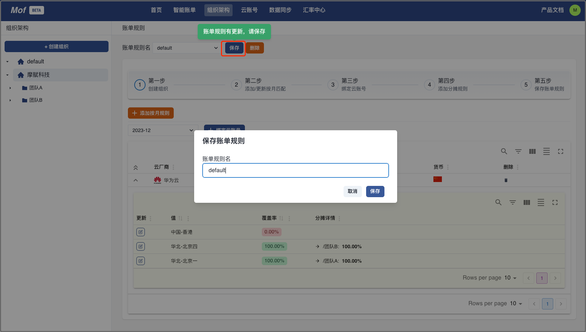
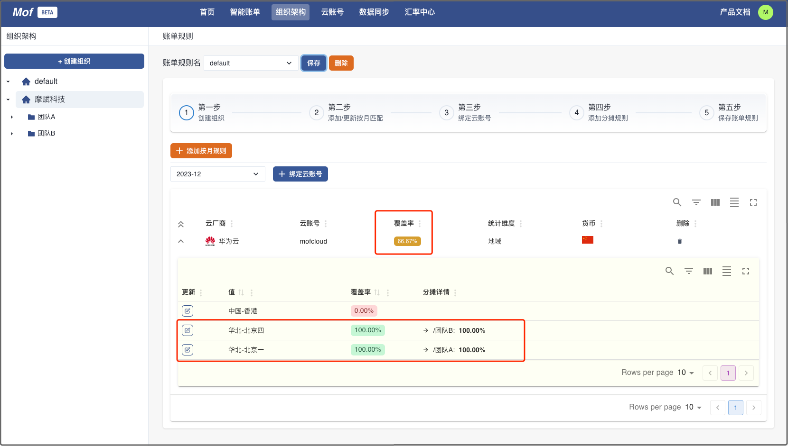

用户更关心**团队**的云成本分析，因此，Mof 引入了组织架构的概念，用户可以把云账号账单**按照比例分摊**到组织架构中。

## 概念

| 概念 | 描述                    | 
| --- |-----------------------|
| 组织架构 | 类似文件夹结构，用户可以自定义       |
| 账单规则 | 多个不同版本，从云账单到组织架构的映射文件 |

## 最佳实践
云账单下，每个月的服务数量，共享方式都可能不同，所以，账单规则里引入了版本概念，我们推荐按照月份创建账单规则，进行匹配。

## 创建组织
用户可以创建多个组织架构。

## 创建部门
用户可以创建多个嵌套的部门，可以重名，但是不建议。

## 添加月份

## 绑定云账号
> ⚠️ 请注意！
> 绑定 & 编辑之后，请点击保存，否则会失去编辑的内容！

用户可以绑定多个云账号，并且选择一个分摊纬度。

## 分摊到部门
这个例子中，我们按照地域分类，然后把两个地域分别分摊到**团队A**和**团队B**中。

- 华北-北京一 分摊到团队A

- 华北-北京四 分摊到团队B

- 保存账单规则

## 查看未分配
保存之后，我们可以看到未匹配的纬度 & 百分比。

## 查看账单
**智能账单**页面中，可以查看组织架构纬度账单

