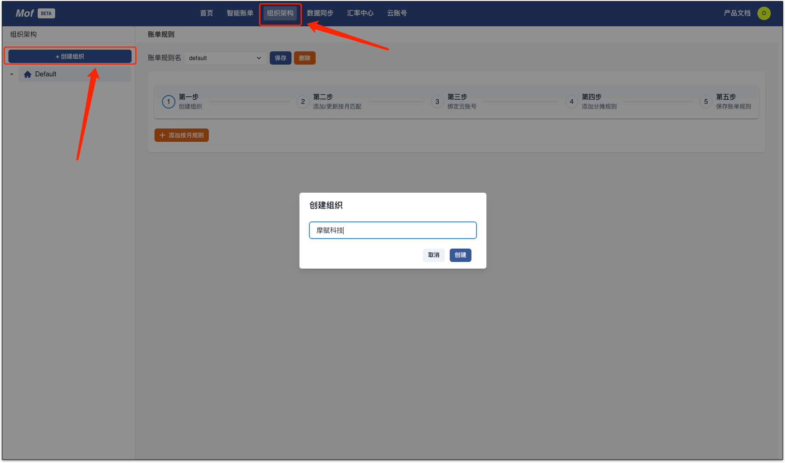
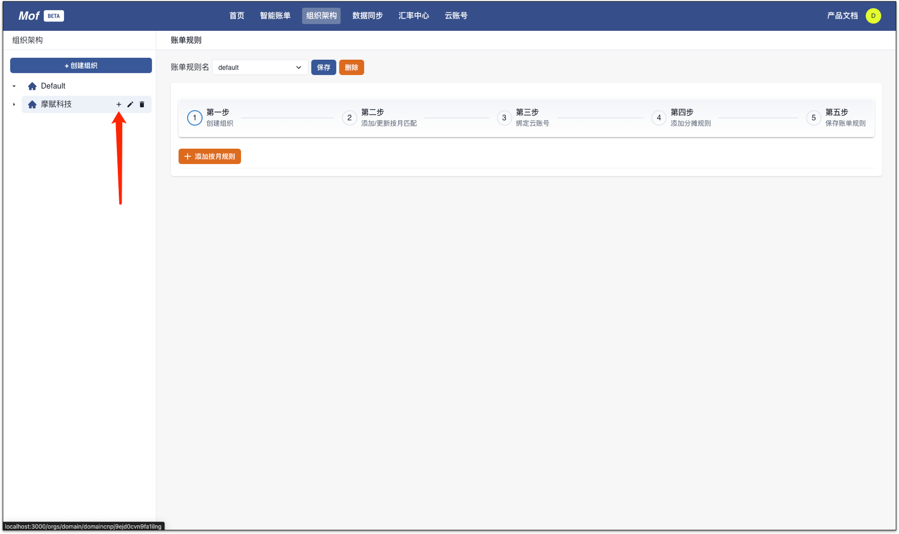
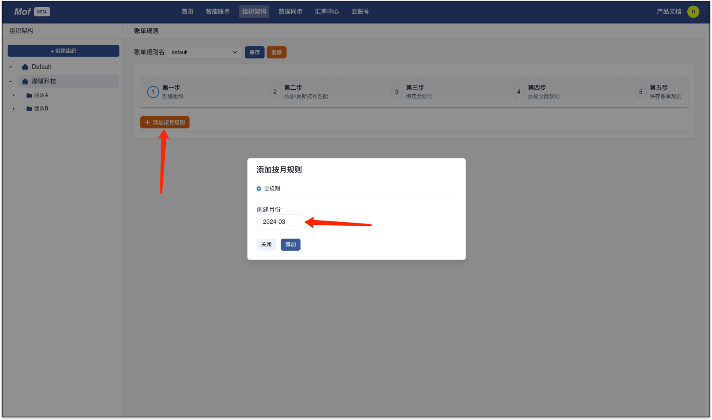
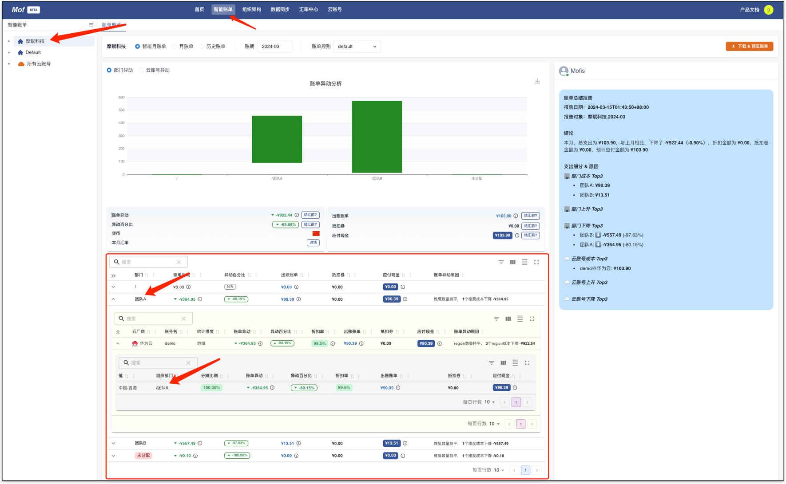

## 概念
针对**团队**视角下的账单，Mof 引入了组织架构的概念，用户可以把云账单**按照比例分摊**到组织架构中。

| 概念 | 描述                    | 
| --- |-----------------------|
| 组织架构 | 类似文件夹结构，用户可以自定义       |
| 账单规则 | 多个不同版本，从云账单到组织架构的映射文件 |

## 例子
=== "1.创建组织"
    用户可以创建多个组织架构。

    

=== "2.创建部门"
    用户可以创建多个嵌套的部门，可以重名，但是不建议。

    

=== "3.添加月份"
    每个月份，都需要相应的【匹配规则】

    

=== "4.绑定云账号"
    > ⚠️ 请注意！
    > 绑定 & 编辑之后，请点击保存，否则会失去编辑的内容！

    用户可以绑定多个云账号，并且选择一个分摊纬度。

    

=== "5.分摊"
    这个例子中，我们按照地域分类，然后把两个地域分别分摊到**团队A**和**团队B**中。

    - 【中国-香港】分摊到【团队A】
    - 【华南-广州】分摊到【团队B】
    - 保存账单规则

    

=== "6.查看账单"
    **智能账单**页面中，可以查看组织架构纬度账单

    

