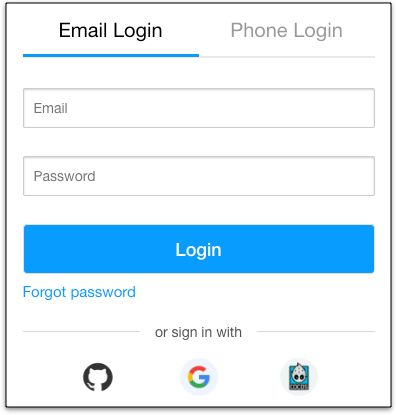
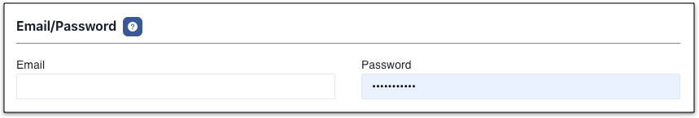

Mof will use [chormedp](https://github.com/chromedp/chromedp) to select billing data from cosole.

---

## Partial support
> Bill groups are not supported yet

## Add account
=== "1.Basic info"
    !!! example "Explanation"
        Account name can be updated later. **Modifiable**

=== "2.Region"
    !!! example "Explanation"
        Please choose your region based on account

        - [x] China
        - [ ] Global

=== "3.Email/Password"
    !!! example "Explanation"
        Please enter [Agora console](https://sso.shengwang.cn/cn/v5/login) login email and password

        

        

=== "4.Permission"
    !!! example "Explanation"
        Only billing data will be collected. Mof won't do any **write** operation.

=== "5.Default group by"
    !!! example "Explanation"
        For grouping bill data which is based on Cloud Provider's raw data.

## Update cloud account
=== "1.Basic info"
    !!! example "Explanation"
        Modifiable.

=== "2.Extension"
    !!! example "Explanation"
        Modifiable. Once updated, Mof will sync from new bill report.

=== "3.Credential"
    !!! example "Explanation"
        Unmodifiable.

## Auto sync
!!! example "Explanation"
    Mof will run cron job based on configuration

    

## Tag management
!!! example "Explanation"
    Mof will list all available tags in billing data. In order to group bills in **Smart bills** by tag, user needs to select keys here.

    

## Discount list
!!! example "Explanation"
    In some case, if bills from cloud account does not contain special discount, user can apply discount on bill data.

    

## Lock Account and Bills
!!! example "Explanation"
    There are two types of locks which can lead to no updates on bills while syncing data.

    - **Account lock**：Not pulling billing data anymore
    - **Bill lock**：Not pulling billing data on specific month

    

## Billing Data Override
!!! example "Explanation"
    Used to override **payment** data.

    

    

## Delete account
All related data will be deleted permanently.
