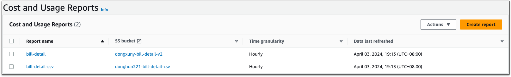
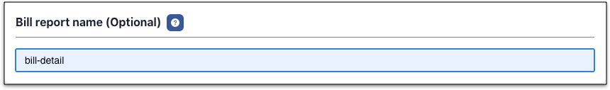

## Bill types
We suggest use **Bill report** to collect AWS billing data which will store at S3 by AWS. It is cheaper and more detail.

The cost of Cost Explorer is expensive.

| Type          | AWS Charging ? | Desc                           |
|---------------|----------------|--------------------------------|
| Cost Explorer | ✅              | Charged by API call count（Expensive）            |
| Bill report   | ✅              | Resource level bill which stored in S3 bucket and charged via S3 bill.（Cheap） |

---

## Add cloud account
=== "1.Basic info"
    !!! example "Explanation"
        For represent, username could be duplicated

=== "2.Locale"
    !!! example "Explanation"
        Please select your locale based on account belongs to.

        - [x] China
        - [x] Global

=== "3.AK/SK"
    !!! example "Explanation"
        Please refer to official docs of [AK/SK](https://docs.aws.amazon.com/IAM/latest/UserGuide/id_credentials_access-keys.html#Using_CreateAccessKey)
        Mof needs **read only** permission.

        

=== "4.Permission"
    !!! example "Explanation"
        Copy bellow permission to your AK/SK.

        ```json
          {
            "Version": "2012-10-17",
            "Statement": [
                {
                    "Sid": "VisualEditor0",
                    "Effect": "Allow",
                    "Action": [
                        "sts:GetCallerIdentity",
                        "iam:ListAttachedUserPolicies",
                        "iam:GetPolicy",
                        "iam:GetPolicyVersion",
                        "ce:GetCostAndUsage",
                        "ce:GetDimensionValues",
                        "ce:GetTags",
                        "ec2:Describe*",
                        "cur:DescribeReportDefinitions",
                        "s3:ListBucket",
                        "s3:GetObject",
                        "cloudwatch:GetMetricData"
                    ],
                    "Resource": "*"
                }
            ]
        }
        ```

=== "5.Default group by"
    !!! example "Explanation"
        All billing data will be collected with all groups, it's used while grouping all cloud accounts data.

=== "6.Bill report name"
    !!! example "Explanation"
        User needs to create AWS bill report on AWS Console, please refer to [docs](https://docs.aws.amazon.com/cur/latest/userguide/cur-create.html)

        Selections while creating bill report：

        - **Include resource IDs**：Must!
        - **Split cost allocation data**：Optional
        - **Refresh automatically**：Must!
        - **Configure S3 Bucket**：Any bucket is OK
        - **S3 S3 path prefix**：Any path is OK
        - **Report data time granularity**：Hourly or Daily
        - **Report versioning**：**Overwrite existing report**
        - **Report data integration**：Optional
        - **Compression type**：Any type is OK

        

        

## Update cloud account
=== "1.Basic info"
    !!! example "Explanation"
        Modifiable.

=== "2.Extension"
    !!! example "Explanation"
        Modifiable. Once updated, Mof will sync from new bill report.

=== "3.Credential"
    !!! example "Explanation"
        Unmodifiable.

## Auto sync
!!! example "Explanation"
    Mof will run cron job based on configuration

    

## Tag management
!!! example "Explanation"
    Mof will list all available tags in billing data. In order to group bills in **Smart bills** by tag, user needs to select keys here.

    

## Discount list
!!! example "Explanation"
    In some case, if bills from cloud account does not contain special discount, user can apply discount on bill data.

    

## Lock Account and Bills
!!! example "Explanation"
    There are two types of locks which can lead to no updates on bills while syncing data.

    - **Account lock**：Not pulling billing data anymore
    - **Bill lock**：Not pulling billing data on specific month

    

## Billing Data Override
!!! example "Explanation"
    Used to override **payment** data.

    

    

## Delete account
All related data will be deleted permanently.
