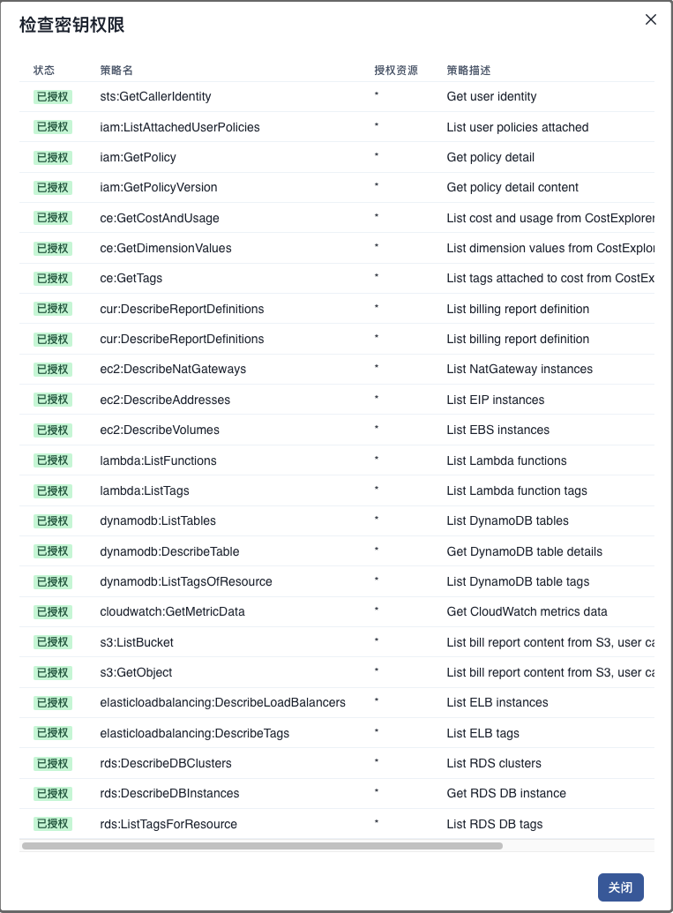
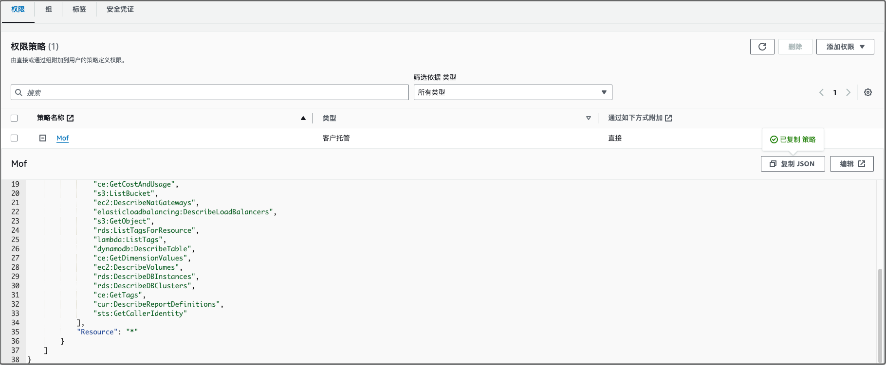
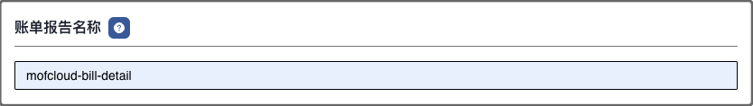
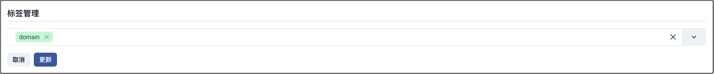
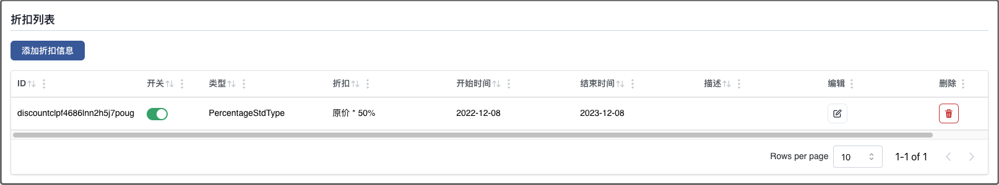
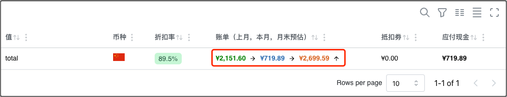
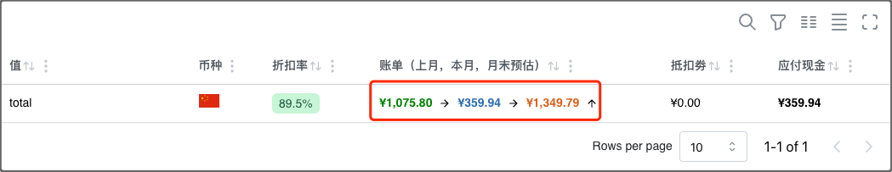

## AWS 账单类型
AWS 提供 3中方式查看当前开销，Mof 可以从 Cost Explorer & 账单报告中采集数据。

建议使用**账单报告**采集数据，数据默认存储在 S3，价格底，数据全。

Cost Explorer 根据请求数收费，如果频繁访问，成本高。

| 类型            | Mof 支持 | AWS 是否收费 | 描述                           |
|---------------|--------|----------|------------------------------|
| PDF 账单        | 否      | 否        | 从 AWS 控制台下载                  |
| Cost Explorer | 支持     | 收费       | 用户可以从 Cost Explorer 报表中，查询开销 |
| 账单报告          | 支持     | 收费       | 用户可以结合 AWS Athena 进行查询       |

## 添加账号

### 基本信息（可修改）
账号名称用于展示，可以重名，建议使用不同的名称

### 地域（不可修改）
请跟据 AWS 账号归属，选择相应的地域

### 访问密钥（不可修改）
请参考官方文档获取[访问密钥](https://docs.aws.amazon.com/zh_cn/IAM/latest/UserGuide/id_credentials_access-keys.html#Using_CreateAccessKey)
Mof 只需要可读权限，如果权限不全，会导致数据收集不全，可以选择**测试账号权限**查询权限。


Mof 需要如下的**可读权限**


### 密钥权限
复制如下策略为 AWS 用户赋予权限。



```json
{
    "Version": "2012-10-17",
    "Statement": [
        {
            "Sid": "VisualEditor0",
            "Effect": "Allow",
            "Action": [
                "sts:GetCallerIdentity",
                "iam:ListAttachedUserPolicies",
                "iam:GetPolicy",
                "iam:GetPolicyVersion",
                "ec2:DescribeInstances",
                "ec2:DescribeAddresses",
                "lambda:ListFunctions",
                "dynamodb:ListTables",
                "cloudwatch:GetMetricData",
                "elasticloadbalancing:DescribeTags",
                "dynamodb:ListTagsOfResource",
                "ce:GetCostAndUsage",
                "s3:ListBucket",
                "ec2:DescribeNatGateways",
                "elasticloadbalancing:DescribeLoadBalancers",
                "s3:GetObject",
                "rds:ListTagsForResource",
                "lambda:ListTags",
                "dynamodb:DescribeTable",
                "ce:GetDimensionValues",
                "ec2:DescribeVolumes",
                "rds:DescribeDBInstances",
                "rds:DescribeDBClusters",
                "ce:GetTags",
                "cur:DescribeReportDefinitions",
                "sts:GetCallerIdentity"
            ],
            "Resource": "*"
        }
    ]
}
```

### 默认统计维度（可修改）
系统收集所有纬度的数据，默认纬度用于统计所有云厂商的成本，不影响数据准确性

### 账单报告名称（可选项）
AWS 默认不开启账单报告，请参考[AWS 创建成本和使用情况报告](https://docs.aws.amazon.com/zh_cn/cur/latest/userguide/cur-create.html)，Mof 只需要报告名称。

选项对 Mof 的影响：

- **包括资源 ID**：请选择，否则无法查看资源级别账单
- **拆分成本分配数据**：无影响
- **自动刷新**：请选择，让 Mof 每次获取最新数据
- **配置 S3存储桶**：无影响
- **S3 路径前缀**：无影响
- **时间粒度**：请选择**每天**或者**每小时**，Mof 存储按月，按日数据
- **报告版本控制**：请选择**覆盖现有报告**
- **报告数据集成**：无影响
- **压缩类型**：无影响




## 更新账号
请在 **供应商账号** 先选择相应的账号。

### 基本信息
可修改，不影响数据分析。

### 扩展信息
可修改，如果修改了账单报告名称，Mof 在下一次同步数据的时候，会从新的报告同步。

### 访问密钥
不可修改

### 定时数据同步
如果开启，Mof 会按照配置，自动同步数据


### 标签管理
Mof 在同步账单之后，会列出所有可用的标签，如果想要在**智能账单**中按照标签分类，需要在这里配置。

之所以有这配置，是因为标签可能会非常多（包括系统标签），会影响用户体验。



### 折扣列表
如果用户与 AWS 有线下的折扣合约，并且不展示在账单数据中时，用户可以在此配置，折扣会影响到**智能账单**中的数据中。



**开启前**


**开启后**



## 删除供应商账号
删除供应商账号时，会删除所有成本 & 资源数据。