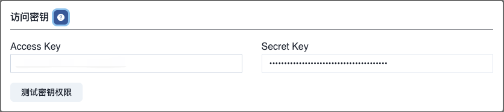
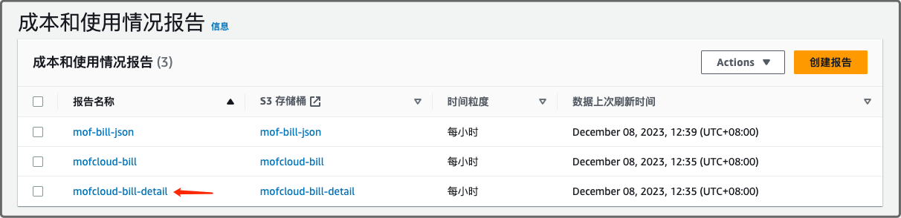
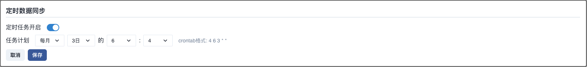
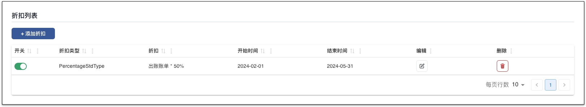
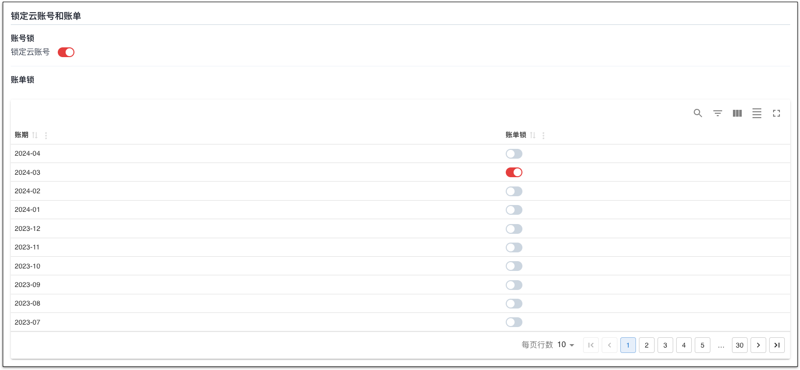
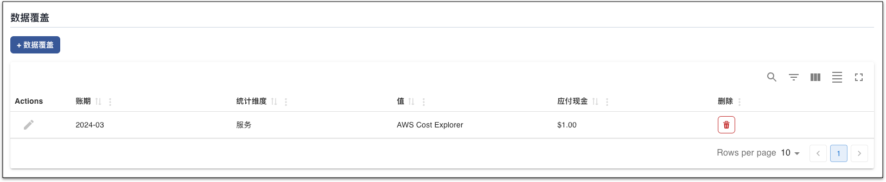
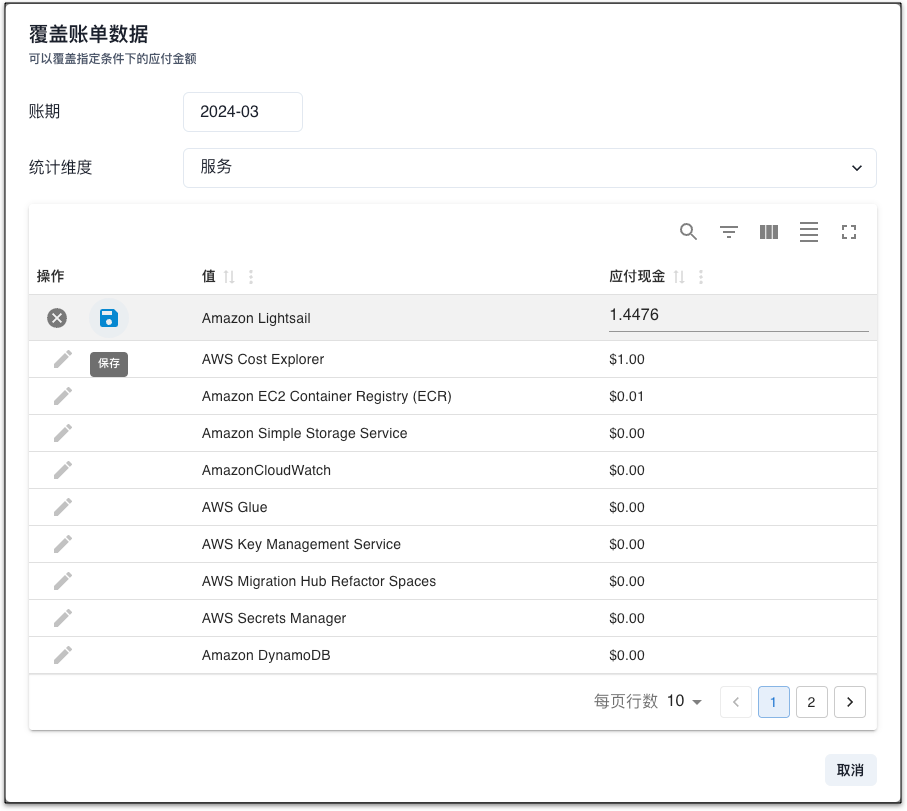

## 账单类型
建议使用**账单报告**采集数据，数据默认存储在 S3，价格低廉，数据全。

Cost Explorer 根据请求数收费，如果频繁访问，成本高。

| 类型             | AWS 是否收费 ? | 描述                           |
|---------------|------------|------------------------------|
| Cost Explorer |  ✅          | AWS 按 API 调用次数收费（贵） |
| 账单报告          | ✅         | 支持资源账单，账单存储在 S3，收取 S3 相关费用（便宜）       |

---

## 添加账号
=== "1.基本信息"
    !!! example "解释"
        账号名称用于展示，可以重名，建议使用不同的名称。 **可修改**

=== "2.地域"
    !!! example "解释"
        请跟据 AWS 账号归属，选择相应的地域。**可修改**

        - [x] 中国站
        - [x] 全球站

=== "3.访问密钥"
    !!! example "解释"
        请参考官方文档获取[访问密钥](https://docs.aws.amazon.com/zh_cn/IAM/latest/UserGuide/id_credentials_access-keys.html#Using_CreateAccessKey)
        Mof 只需要可读权限，如果权限不全，会导致数据收集不全，可以选择**测试账号权限**查询权限。

        

=== "4.密钥权限"
    !!! example "解释"
        复制如下策略为 AWS 用户赋予权限。

        ```json
          {
            "Version": "2012-10-17",
            "Statement": [
                {
                    "Sid": "VisualEditor0",
                    "Effect": "Allow",
                    "Action": [
                        "sts:GetCallerIdentity",
                        "iam:ListAttachedUserPolicies",
                        "iam:GetPolicy",
                        "iam:GetPolicyVersion",
                        "ce:GetCostAndUsage",
                        "ce:GetDimensionValues",
                        "ce:GetTags",
                        "ec2:Describe*",
                        "cur:DescribeReportDefinitions",
                        "s3:ListBucket",
                        "s3:GetObject",
                        "cloudwatch:GetMetricData"
                        "tag:GetResources",
                        "tag:TagResources",
                        "tag:UntagResources"
                    ],
                    "Resource": "*"
                }
            ]
        }
        ```

=== "5.统计维度"
    !!! example "解释"
        系统收集所有纬度的数据，默认纬度用于统计所有云厂商的成本，不影响数据准确性

=== "6.账单报告"
    !!! example "解释"
        AWS 默认不开启账单报告，请参考[AWS 创建成本和使用情况报告](https://docs.aws.amazon.com/zh_cn/cur/latest/userguide/cur-create.html)，Mof 只需要报告名称，刚刚开启账单报告的话，AWS 需要几个小时才可以开始同步，请耐心等待。

        选项对 Mof 的影响：

        - **包括资源 ID**：请选择，否则无法查看资源级别账单
        - **拆分成本分配数据**：无影响
        - **自动刷新**：请选择，让 Mof 每次获取最新数据
        - **配置 S3存储桶**：无影响
        - **S3 路径前缀**：无影响
        - **时间粒度**：请选择**每天**或者**每小时**，Mof 存储按月，按日数据
        - **报告版本控制**：请选择**覆盖现有报告**
        - **报告数据集成**：无影响
        - **压缩类型**：无影响

        

        

## 更新账号
=== "1.基本信息"
    !!! example "解释"
        可修改，不影响数据分析。

=== "2.扩展信息"
    !!! example "解释"
        可修改，如果修改了账单报告名称，Mof 在下一次同步数据的时候，会从新的报告同步。

=== "3.访问密钥"
    !!! example "解释"
        不可修改

## 定时数据同步
!!! example "解释"
    如果开启，Mof 会按照配置，自动同步数据

    

## 标签管理
!!! example "解释"
    Mof 在同步账单之后，会列出所有可用的标签，如果想要在**智能账单**中按照标签分类，需要在这里配置。

    之所以有这配置，是因为标签可能会非常多（包括系统标签），会影响用户体验。

    

## 折扣列表
!!! example "解释"
    如果用户有线下的折扣合约，并且不展示在账单数据中时，用户可以在此配置，折扣会影响到**智能账单**中的数据中。

    

## 锁定云账号和账单
!!! example "解释"
    为了防止重复拉取账单数据时，因为某些因素的改变，如标签等，导致账单过往账单可能会被更新，引入了两个锁。
    
    - **账号锁**：不再拉取新的数据
    - **账单锁**：不更新指定月份的账单

    

## 数据覆盖
!!! example "解释"
    用于覆盖某月，某个 Group 下的【应付金额】。

    

    

## 删除云账号
删除云账号时，会删除所有成本 & 资源数据。