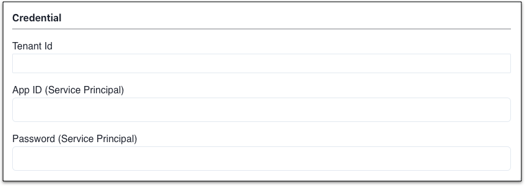

Mof will use **service principal** to read data from Azure

---

## Prerequisites
!!! example "Install Azure CLI (Ignore if already has a service pricipal)"
    Please create a service principal with bellow stepsService principal can be created on Azure portial either.

=== "1.Create Azure Service Principal"
    !!! example "Explanation"
        Run bellow command

        Record appId, tenant, password, mof will use these credential

        ```shell
        az ad sp create-for-rbac -n "mofcloud"
        ```

=== "2.Add permissions"
    !!! example "Explanation"
        READ permission of Billing Account or Management Group can be assigned to Service Principal.

        Run bellow command (ID of billing account or management group can be retrieved from Azure Portial)

        ```shell
        az role assignment create --assignee <SERVICE_PRINCIPAL_APP_ID> --role Reader --scope "/providers/Microsoft.Management/managementGroups/<MANAGEMENT_GROUP_ID>"
        ```

        OR

        ```shell
        az role assignment create --assignee <SERVICE_PRINCIPAL_APP_ID> --role Reader --scope "/providers/Microsoft.Management/managementGroups/<MANAGEMENT_GROUP_ID>"
        ```

## Add account
=== "1.Basic info"
    !!! example "Explanation"
        For represent, username could be duplicated

=== "2.Locale"
    !!! example "Explanation"
        Please select your locale based on account belongs to.

        - [x] Global

=== "3.Credential"
    !!! example "Explanation"

        

=== "5.Default group by"
    !!! example "Explanation"
        All billing data will be collected with all groups, it's used while grouping all cloud accounts data.

## Update cloud account
=== "1.Basic info"
    !!! example "Explanation"
        Modifiable.

=== "2.Extension"
    !!! example "Explanation"
        Modifiable. Once updated, Mof will sync from new bill report.

=== "3.Credential"
    !!! example "Explanation"
        Unmodifiable.

## Auto sync
!!! example "Explanation"
    Mof will run cron job based on configuration

    

## Tag management
!!! example "Explanation"
    Mof will list all available tags in billing data. In order to group bills in **Smart bills** by tag, user needs to select keys here.

    

## Discount list
!!! example "Explanation"
    In some case, if bills from cloud account does not contain special discount, user can apply discount on bill data.

    

## Lock Account and Bills
!!! example "Explanation"
    There are two types of locks which can lead to no updates on bills while syncing data.

    - **Account lock**：Not pulling billing data anymore
    - **Bill lock**：Not pulling billing data on specific month

    

## Billing Data Override
!!! example "Explanation"
    Used to override **payment** data.

    

    

## Delete account
All related data will be deleted permanently.
