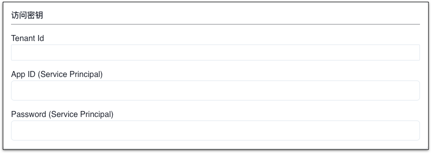

Mof 会通过 service principal 读取账单相关数据。

---

## 准备工作
!!! example "安装 Azure CLI（如果已经有 service principal，请忽略）"
    如果没有创建 service principal，请根据如下的步骤，进行创建。用户也可以在 Azure 控制台中创建，步骤请参考官方文档。

=== "1.创建 Azure Service Principal"
    !!! example "解释"
        运行如下命令

        请将 appId, tenant, password 记录下来，Mof 将会使用此密钥。

        ```shell
            az ad sp create-for-rbac -n "mofcloud"
        ```

=== "2.添加权限"
    !!! example "解释"
        您可以把 Billing account 或者 Management Group 的 READ 权限赋予 service principal。

        运行如下命令（Billing account 或者 Management Group ID 请在控制台中获取）

        ```shell
            az role assignment create --assignee <SERVICE_PRINCIPAL_APP_ID> --role Reader --scope "/providers/Microsoft.Management/managementGroups/<MANAGEMENT_GROUP_ID>"
        ```

        OR

        ```shell
            az role assignment create --assignee <SERVICE_PRINCIPAL_APP_ID> --role Reader --scope "/providers/Microsoft.Management/managementGroups/<MANAGEMENT_GROUP_ID>"
        ```

## 添加账号
=== "1.基本信息"
    !!! example "解释"
        账号名称用于展示，可以重名，建议使用不同的名称。 **可修改**

=== "2.地域"
    !!! example "解释"
        请跟据 Azure 账号归属，选择相应的地域。**可修改**

        - [ ] 中国站
        - [x] 全球站

=== "3.访问密钥"
    !!! example "解释"

        

=== "4.统计维度"
    !!! example "解释"
        系统收集所有纬度的数据，默认纬度用于统计所有云厂商的成本，不影响数据准确性

## 更新账号
=== "1.基本信息"
    !!! example "解释"
        可修改，不影响数据分析。

=== "2.扩展信息"
    !!! example "解释"
        可修改，如果修改了账单报告名称，Mof 在下一次同步数据的时候，会从新的报告同步。

=== "3.访问密钥"
    !!! example "解释"
        不可修改

## 定时数据同步
!!! example "解释"
    如果开启，Mof 会按照配置，自动同步数据

    

## 标签管理
!!! example "解释"
    Mof 在同步账单之后，会列出所有可用的标签，如果想要在**智能账单**中按照标签分类，需要在这里配置。

    之所以有这配置，是因为标签可能会非常多（包括系统标签），会影响用户体验。

    

## 折扣列表
!!! example "解释"
    如果用户有线下的折扣合约，并且不展示在账单数据中时，用户可以在此配置，折扣会影响到**智能账单**中的数据中。

    

## 锁定云账号和账单
!!! example "解释"
    为了防止重复拉取账单数据时，因为某些因素的改变，如标签等，导致账单过往账单可能会被更新，引入了两个锁。

    - **账号锁**：不再拉取新的数据
    - **账单锁**：不更新指定月份的账单

    

## 数据覆盖
!!! example "解释"
    用于覆盖某月，某个 Group 下的【应付金额】。

    

    

## 删除云账号
删除云账号时，会删除所有成本 & 资源数据。