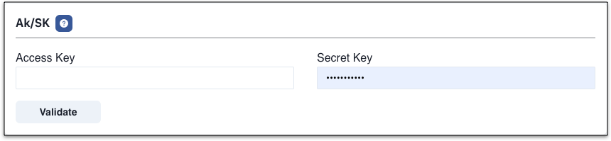
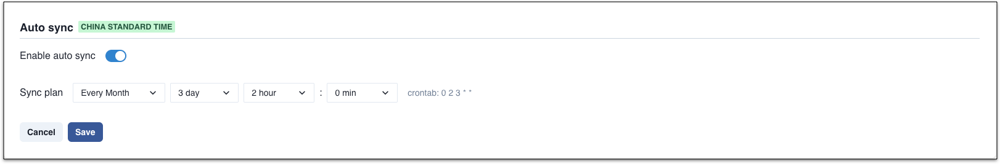
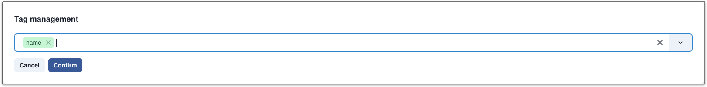
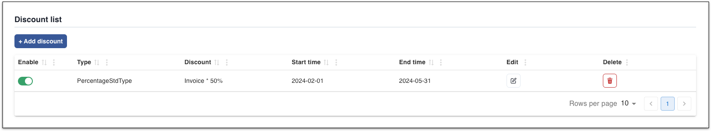
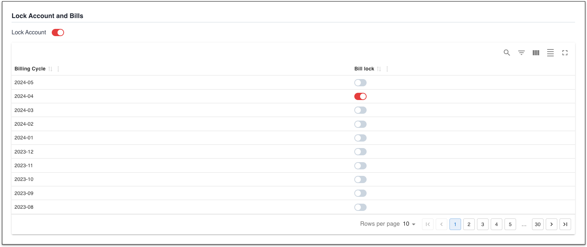
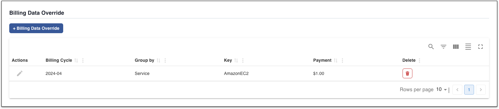
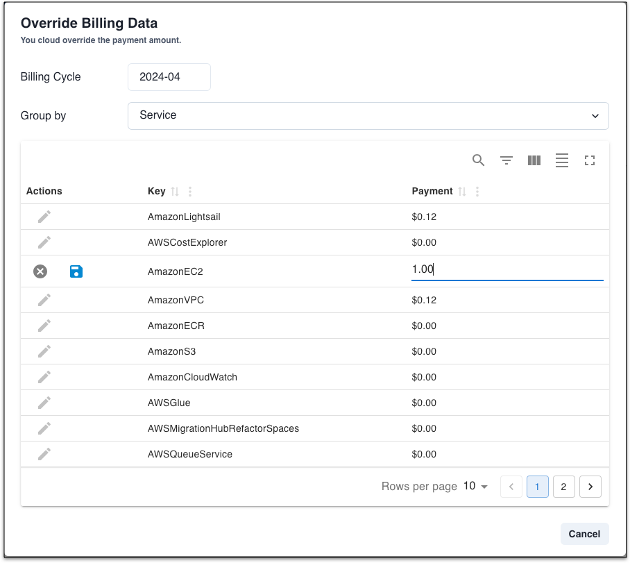

Mof use [ResourceBillList](https://cloud.baidu.com/doc/Finance/s/cjxedqyml) API to pull billing data.

---

## Add account
=== "1.Basic info"
    !!! example "Explanation"
        For represent, username could be duplicated

=== "2.Locale"
    !!! example "Explanation"
        Please select your locale based on account belongs to.

        - [x] China
        - [ ] Global

=== "3.AK/SK"
    !!! example "Explanation"
        Please refer to official docs of [AK/SK](https://cloud.baidu.com/doc/IAM/s/njwvyc2zd)
        Mof needs **read only** permission.

        

=== "4.Permission"
    !!! example "Explanation"
        Copy bellow permission to AK/SK

        ```json
        {
          "id": "policy_8867055700254b158bb6fea8093ed5d3",
          "version": "v1",
          "accessControlList": [
            {
              "service": "bce:billing",
              "region": "*",
              "resource": [
                "*"
              ],
              "effect": "Allow",
              "permission": [
                "READ"
              ]
            },
            {
              "service": "bce:iam",
              "region": "*",
              "resource": [
                "*"
              ],
              "effect": "Allow",
              "permission": [
                "READ"
              ]
            },
            {
              "service": "bce:bcc",
              "region": "*",
              "resource": [
                "*"
              ],
              "effect": "Allow",
              "permission": [
                "VM_READ"
              ],
              "eid": "bcc_vm_read"
            },
            {
              "service": "bce:bcc",
              "region": "*",
              "resource": [
                "*"
              ],
              "effect": "Allow",
              "permission": [
                "SNAPSHOT_READ",
                "SECURITYGROUP_READ",
                "IMAGE_READ"
              ],
              "eid": "bcc_read"
            },
            {
              "service": "bce:bcm",
              "region": "*",
              "resource": [
                "*"
              ],
              "effect": "Allow",
              "permission": [
                "READ"
              ]
            }
          ]
        }
        ```

=== "5.Default group by"
    !!! example "Explanation"
        All billing data will be collected with all groups, it's used while grouping all cloud accounts data.

## Update cloud account
=== "1.Basic info"
    !!! example "Explanation"
        Modifiable.

=== "2.Extension"
    !!! example "Explanation"
        Modifiable. Once updated, Mof will sync from new bill report.

=== "3.Credential"
    !!! example "Explanation"
        Unmodifiable.

## Auto sync
!!! example "Explanation"
    Mof will run cron job based on configuration

    

## Tag management
!!! example "Explanation"
    Mof will list all available tags in billing data. In order to group bills in **Smart bills** by tag, user needs to select keys here.

    

## Discount list
!!! example "Explanation"
    In some case, if bills from cloud account does not contain special discount, user can apply discount on bill data.

    

## Lock Account and Bills
!!! example "Explanation"
    There are two types of locks which can lead to no updates on bills while syncing data.

    - **Account lock**：Not pulling billing data anymore
    - **Bill lock**：Not pulling billing data on specific month

    

## Billing Data Override
!!! example "Explanation"
    Used to override **payment** data.

    

    

## Delete account
All related data will be deleted permanently.
