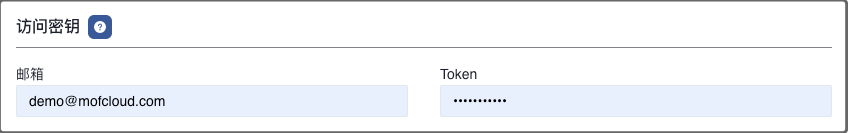
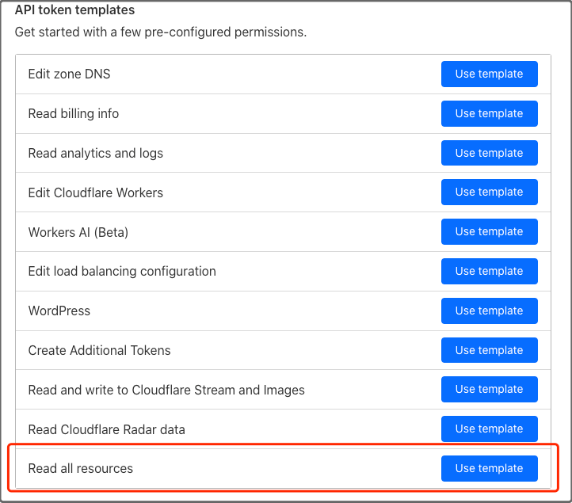

目前，Mof 使用 Cloudflare GraphQL 获取 CDN 用量数据，用户需要配置与 Cloudflare 签署的 CDN 价格信息，以便计算账单数据。

---

## 部分支持
> Cloudflare 目前只支持 **CDN** 成本分析。

## 添加账号
=== "1.基本信息"
    !!! example "解释"
        账号名称用于展示，可以重名，建议使用不同的名称。 **可修改**

=== "2.地域"
    !!! example "解释"
        请跟据账号归属，选择相应的地域。**可修改**

        - [ ] 中国站
        - [x] 全球站

=== "3.访问密钥"
    !!! example "解释"
        请参考官方文档获取[访问密钥](https://developers.cloudflare.com/fundamentals/api/get-started/create-token/)

        

=== "4.密钥权限"
    !!! example "解释"
        Mof 目前会使用 ListZone & Analytics and Logs 权限，考虑到后续迭代的时候，会逐步拓展分析粒度，我们建议赋予 API **Read all resources 权限**
        
        

=== "5.统计维度"
    !!! example "解释"
        系统收集所有纬度的数据，默认纬度用于统计所有云厂商的成本，不影响数据准确性

=== "6.拓展信息"
    !!! example "解释"
        如果填写了保底流量 & 保底费用，Mof 会首先判断用量是否在保底区域内，如果溢出，会使用 CDN 单价计算成本。

        如果没有填写保底流量 & 保底费用，Mof 会使用 CDN 单价计算成本。

        | 选项            | 使用场景                                  |
        |---------------|---------------------------------------|
        | CDN 单价(美元/GB) | CDN 流量单价，如果填写了保底流量 & 保底单价，此价格将会是溢出单价。 |
        | CDN保底流量(GB)   | 如果与 Cloudflare 签署了保底，请填写保底流量，否则填写 0。  |
        | CDN保底费用(美元)   | 如果与 Cloudflare 签署了保底，请填写保底费用，否则填写 0。  |
        | 价格开始月份        | 合约开始日期                                |
        | 价格结束月份        | 合约结束日期                                |

## 更新账号
=== "1.基本信息"
    !!! example "解释"
        可修改，不影响数据分析。

=== "2.扩展信息"
    !!! example "解释"
        可修改。

=== "3.访问密钥"
    !!! example "解释"
        不可修改

## 定时数据同步
!!! example "解释"
    如果开启，Mof 会按照配置，自动同步数据

    

## 标签管理
!!! example "解释"
    Mof 在同步账单之后，会列出所有可用的标签，如果想要在**智能账单**中按照标签分类，需要在这里配置。

    之所以有这配置，是因为标签可能会非常多（包括系统标签），会影响用户体验。

    

## 折扣列表
!!! example "解释"
    如果用户有线下的折扣合约，并且不展示在账单数据中时，用户可以在此配置，折扣会影响到**智能账单**中的数据中。

    

## 锁定云账号和账单
!!! example "解释"
    为了防止重复拉取账单数据时，因为某些因素的改变，如标签等，导致账单过往账单可能会被更新，引入了两个锁。

    - **账号锁**：不再拉取新的数据
    - **账单锁**：不更新指定月份的账单

    

## 数据覆盖
!!! example "解释"
    用于覆盖某月，某个 Group 下的【应付金额】。

    

    

## 删除云账号
删除云账号时，会删除所有成本 & 资源数据。
