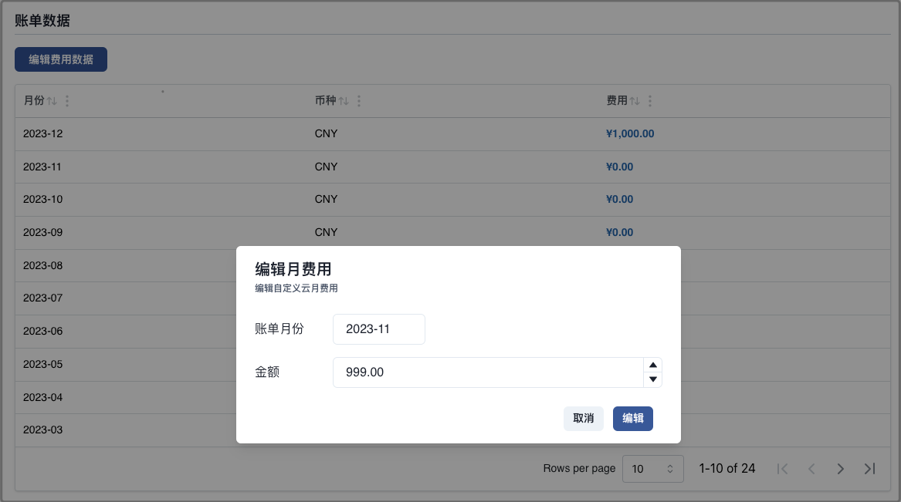

自定义云厂商，当用户使用 Mof 不支持的云厂商时，可适应自定义云厂商手动输入每月账单数据。

账单数据可以在创建成功之后，在云账号页面中进行编辑。

## 优化方案
目前，不支持优化方案，Mof 团队会陆续添加优化方案。

## 添加账号

### 基本信息（可修改）
账号名称用于展示，可以重名，建议使用不同的名称

### 地域（不可修改）
确认货币属性。

- 中国（CNY）
- 全球（USD）

### 默认统计维度（可修改）
系统收集所有纬度的数据，默认纬度用于统计所有云厂商的成本，不影响数据准确性

## 更新账号
请在 **云账号** 先选择相应的账号。

### 基本信息
可修改，不影响数据分析。

### 账单数据
编辑月账单数据。

### 折扣列表
如果用户与自定义云有线下的折扣合约，并且不展示在账单数据中时，用户可以在此配置，折扣会影响到**智能账单**中的数据中。

**开启前**

**开启后**

## 删除云账号
删除云账号时，会删除所有成本 & 资源数据。