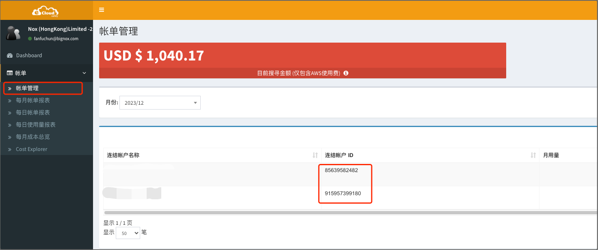

> **AWS 代理商**，仅在私有化版本中支持。

目前，Mof 使用 [chormedp](https://github.com/chromedp/chromedp) 登陆控制台获取账单数据。

## 添加账号

### 基本信息（可修改）
账号名称用于展示，可以重名，建议使用不同的名称

### 地域（不可修改）
请跟据 EcloudValley 账号归属，选择相应的地域

- [x] 全球站

### 访问密钥（不可修改）
请输入[EcloudValley 控制台](https://service.ecloudvalley.com/bill_login.php)账号密码 & AWS 账户 ID。

### 密钥权限
账单数据，不会采取任何**写操作**，请放心使用。

### 默认统计维度（可修改）
系统收集所有纬度的数据，默认纬度用于统计所有云厂商的成本，不影响数据准确性

## 更新账号
请在 **云账号** 先选择相应的账号。

### 基本信息
可修改，不影响数据分析。

### 访问密钥
不可修改

### 定时数据同步
如果开启，Mof 会按照配置，自动同步数据

### 折扣列表
如果用户与 EcloudValley 有线下的折扣合约，并且不展示在账单数据中时，用户可以在此配置，折扣会影响到**智能账单**中的数据中。

**开启前**

**开启后**

## 删除云账号
删除云账号时，会删除所有成本 & 资源数据。