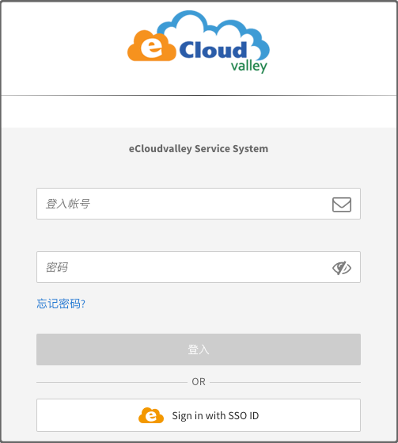
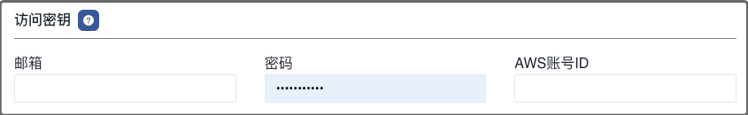

**AWS 代理商**，仅在私有化版本中支持。

目前，Mof 使用 [chormedp](https://github.com/chromedp/chromedp) 登陆控制台获取账单数据。

---

## 添加账号
=== "1.基本信息"
    !!! example "解释"
        账号名称用于展示，可以重名，建议使用不同的名称。 **可修改**

=== "2.地域"
    !!! example "解释"
        请跟据 EcloudValley 账号归属，选择相应的地域

        - [x] 全球站

=== "3.访问密钥"
    !!! example "解释"
        请输入[EcloudValley 控制台](https://service.ecloudvalley.com/bill_login.php)账号密码 & AWS 账户 ID。

        

        

        

=== "4.密钥权限"
    !!! example "解释"
        账单数据，不会采取任何**写操作**，请放心使用。

=== "5.统计维度"
    !!! example "解释"
        系统收集所有纬度的数据，默认纬度用于统计所有云厂商的成本，不影响数据准确性

## 更新账号
=== "1.基本信息"
    !!! example "解释"
        可修改，不影响数据分析。

=== "2.扩展信息"
    !!! example "解释"
        可修改。

=== "3.访问密钥"
    !!! example "解释"
        不可修改

## 定时数据同步
!!! example "解释"
    如果开启，Mof 会按照配置，自动同步数据

    

## 标签管理
!!! example "解释"
    Mof 在同步账单之后，会列出所有可用的标签，如果想要在**智能账单**中按照标签分类，需要在这里配置。

    之所以有这配置，是因为标签可能会非常多（包括系统标签），会影响用户体验。

    

## 折扣列表
!!! example "解释"
    如果用户有线下的折扣合约，并且不展示在账单数据中时，用户可以在此配置，折扣会影响到**智能账单**中的数据中。

    

## 锁定云账号和账单
!!! example "解释"
    为了防止重复拉取账单数据时，因为某些因素的改变，如标签等，导致账单过往账单可能会被更新，引入了两个锁。

    - **账号锁**：不再拉取新的数据
    - **账单锁**：不更新指定月份的账单

    

## 数据覆盖
!!! example "解释"
    用于覆盖某月，某个 Group 下的【应付金额】。

    

    

## 删除云账号
删除云账号时，会删除所有成本 & 资源数据。
