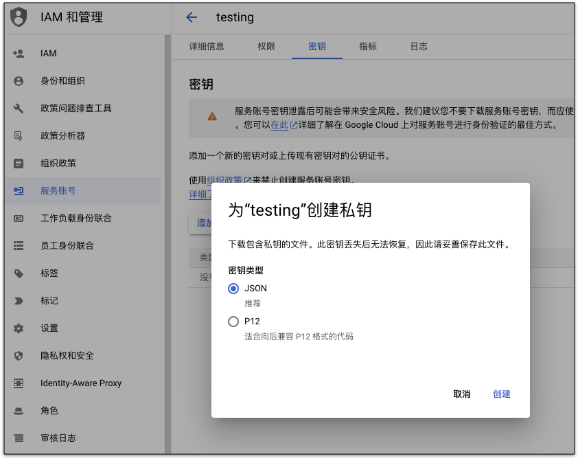
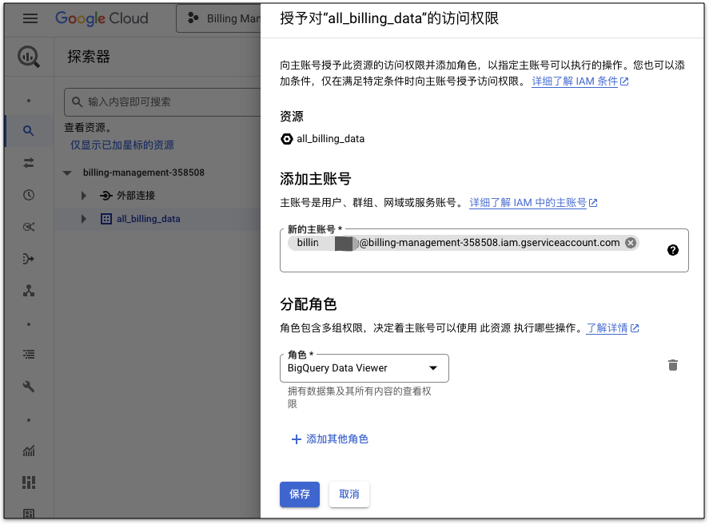
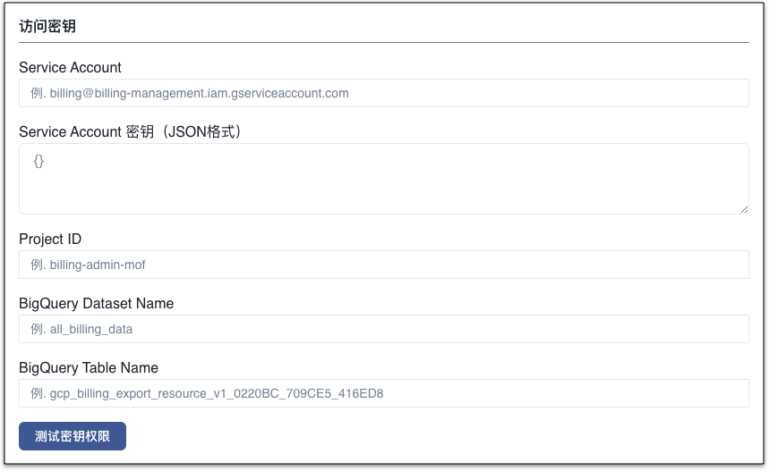

Mof 会通过 service account 读取谷歌云账单相关数据。

---

## 准备工作
!!! example "需要将 Cloud Billing 数据导出到 BigQuery"
    如果您尚未将 Cloud Billing 数据导出到 BigQuery。请按照以下步骤操作：
    
    1. 创建一个新的项目，用于托管 Cloud Billing 导出数据
    2. 创建一个 BigQuery 数据集，用于存储 Cloud Billing 导出数据。
    3. 启用 Cloud Billing 导出，将数据导出到您创建的 BigQuery 数据集。

    详细步骤请查看[Google Cloud 官方文档 - 将 Cloud Billing 数据导出到 BigQuery](https://cloud.google.com/billing/docs/how-to/export-data-bigquery?hl=zh-cn)。

    > Mof 建议您创建一个专用项目来托管 Cloud Billing 数据，以便更好地管理您的账单数据。

=== "1.创建 Service Account"
    !!! example "解释"
        在托管 Cloud Billing 数据的项目中创建 service account。
  
        创建时给新建 service account 授予对项目的 **“BigQuery Job User”** 角色和 **”Cloud Asset Viewer“** 角色。

        创建 service account 完成后，请生成 json 格式的密钥，用于后续的配置。

        

=== "2.添加 BigQuery 权限"
    !!! example "解释"
        导航到 BigQuery。确保您位于托管 Cloud Billing 的项目中。

        在“探索器”面板中，找到 Cloud Billing 数据集，单击名称旁边垂直的三个点(⋮)，然后单击“共享”。 在右侧，单击“+ 添加主账号”。 
        
        添写上面创建的 service account。 

        分配 **“BigQuery Data Viewer”** 角色，并保存。

        

=== "3.开启 Cloud Asset API"
    !!! example "解释"
        如果您没有开启 Cloud Asset API。
        
        请导航到 API 和服务，点击“+启用 API 和服务”。

        搜索“Cloud Asset API”，进入 API 的详情页面，点击开启。

## 添加账号
=== "1.基本信息"
    !!! example "解释"
        账号名称用于展示，可以重名，建议使用不同的名称。 **可修改**

=== "2.地域"
    !!! example "解释"
        请跟据账号归属，选择相应的地域。**可修改**

        - [ ] 中国站
        - [x] 全球站

=== "3.访问密钥"
    !!! example "解释"
        Mof 只需要可读权限，如果权限不全，会导致数据收集不全，可以选择**测试账号权限**查询权限。

        
      
        #### 访问密钥参数说明

        - **Service Account**

          输入准备工作中创建的 service account 电子邮件地址。例，billing@billing-management.iam.gserviceaccount.com

        - **Service Account 密钥（JSON 格式）**

          输入 service account 的 JSON 格式密钥。
          

        - **Project ID**

          输入 Cloud Billing BigQuery Dataset 所在的 Project ID。

        - **BigQuery Dataset Name**

          输入 Cloud Billing 数据所在 BigQuery Dataset 的名称。

        - **BigQuery Dataset Table Name**

          输入 Cloud Billing 数据所在 BigQuery Dataset Table 的名称。

        - **如何获取 ProjectID，Datset Name 和 Table Name？**

          BigQuery 数据集表 ID 是由三个部分组成的，用点号分隔。第一部分是项目 ID，它是你在 GCP 上创建的项目的唯一标识符。第二部分是数据集名，它是你在项目中存储表的容器。第三部分是表名，它是你在数据集中定义的表的名称。

          例如，下图中的表 ID 为 billing-management-358508.all_billing_data.gcp_billing_export_resource_v1_0120A4_123456_D7F893，其中 billing-management-358508 是 **project ID**，all_billing_data 是 **dataset name**，gcp_billing_export_resource_v1_0120A4_123456_D7F893 是 **dataset table name**。
          

=== "4.统计维度"
    !!! example "解释"
        系统收集所有纬度的数据，默认纬度用于统计所有云厂商的成本，不影响数据准确性

## 更新账号
=== "1.基本信息"
    !!! example "解释"
        可修改，不影响数据分析。

=== "2.扩展信息"
    !!! example "解释"
        可修改。

=== "3.访问密钥"
    !!! example "解释"
        不可修改

## 定时数据同步
!!! example "解释"
    如果开启，Mof 会按照配置，自动同步数据

    

## 标签管理
!!! example "解释"
    Mof 在同步账单之后，会列出所有可用的标签，如果想要在**智能账单**中按照标签分类，需要在这里配置。

    之所以有这配置，是因为标签可能会非常多（包括系统标签），会影响用户体验。

    

## 折扣列表
!!! example "解释"
    如果用户有线下的折扣合约，并且不展示在账单数据中时，用户可以在此配置，折扣会影响到**智能账单**中的数据中。

    

## 锁定云账号和账单
!!! example "解释"
    为了防止重复拉取账单数据时，因为某些因素的改变，如标签等，导致账单过往账单可能会被更新，引入了两个锁。

    - **账号锁**：不再拉取新的数据
    - **账单锁**：不更新指定月份的账单

    

## 数据覆盖
!!! example "解释"
    用于覆盖某月，某个 Group 下的【应付金额】。

    

    

## 删除云账号
删除云账号时，会删除所有成本 & 资源数据。