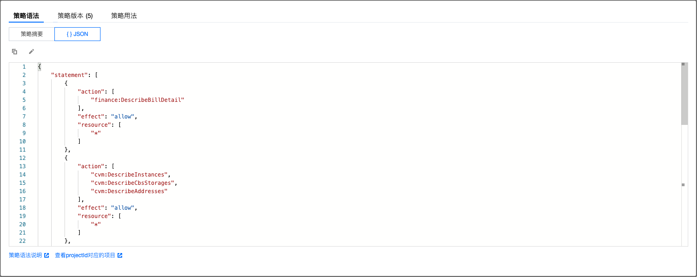

Mof 使用腾讯云账单 API [DescribeBillDetail](https://cloud.tencent.com/document/product/555/19182) 获取账单数据。

## 添加账号

### 基本信息（可修改）
账号名称用于展示，可以重名，建议使用不同的名称

### 地域（不可修改）
请跟据腾讯云账号归属，选择相应的地域

- [x] 中国站
- [ ] 国际站(即将支持)

### 访问密钥（不可修改）
请参考官方文档获取[访问密钥](https://support.huaweicloud.com/usermanual-iam/iam_02_0003.html)
Mof 只需要可读权限，如果权限不全，会导致数据收集不全，可以选择**测试账号权限**查询权限。


### 密钥权限
复制如下策略为腾讯云用户赋予权限。



```json
{
  "statement": [
    {
      "action": [
        "finance:DescribeBillDetail"
      ],
      "effect": "allow",
      "resource": [
        "*"
      ]
    },
    {
      "action": [
        "cvm:DescribeInstances",
        "cvm:DescribeCbsStorages",
        "cvm:DescribeAddresses"
      ],
      "effect": "allow",
      "resource": [
        "*"
      ]
    },
    {
      "action": [
        "monitor:GetMonitorData"
      ],
      "effect": "allow",
      "resource": [
        "*"
      ]
    },
    {
      "action": [
        "cam:GetPolicy",
        "cam:ListPoliciesGrantingServiceAccess"
      ],
      "effect": "allow",
      "resource": [
        "*"
      ]
    }
  ],
  "version": "2.0"
}
```

### 默认统计维度（可修改）
系统收集所有纬度的数据，默认纬度用于统计所有云厂商的成本，不影响数据准确性

## 更新账号
请在 **云账号** 先选择相应的账号。

### 基本信息
可修改，不影响数据分析。

### 扩展信息
可修改，如果修改了账单报告名称，Mof 在下一次同步数据的时候，会从新的报告同步。

### 访问密钥
不可修改

### 定时数据同步
如果开启，Mof 会按照配置，自动同步数据


### 标签管理
> 标签在数据同步之后，才会展示

Mof 在同步账单之后，会列出所有可用的标签，如果想要在**智能账单**中按照标签分类，需要在这里配置。

之所以有这配置，是因为标签可能会非常多（包括系统标签），会影响用户体验。


### 折扣列表
如果用户与腾讯云有线下的折扣合约，并且不展示在账单数据中时，用户可以在此配置，折扣会影响到**智能账单**中的数据中。


**开启前**


**开启后**


## 删除云账号
删除云账号时，会删除所有成本 & 资源数据。