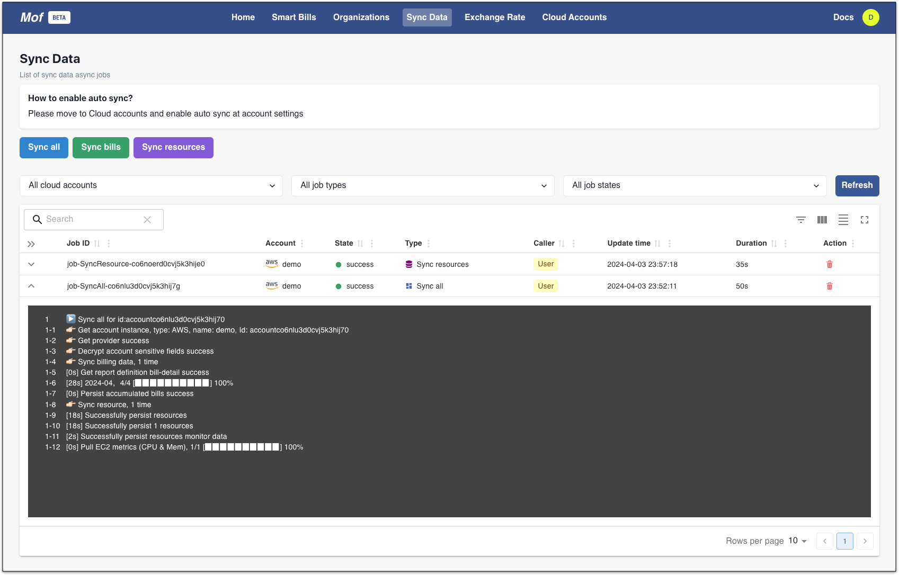
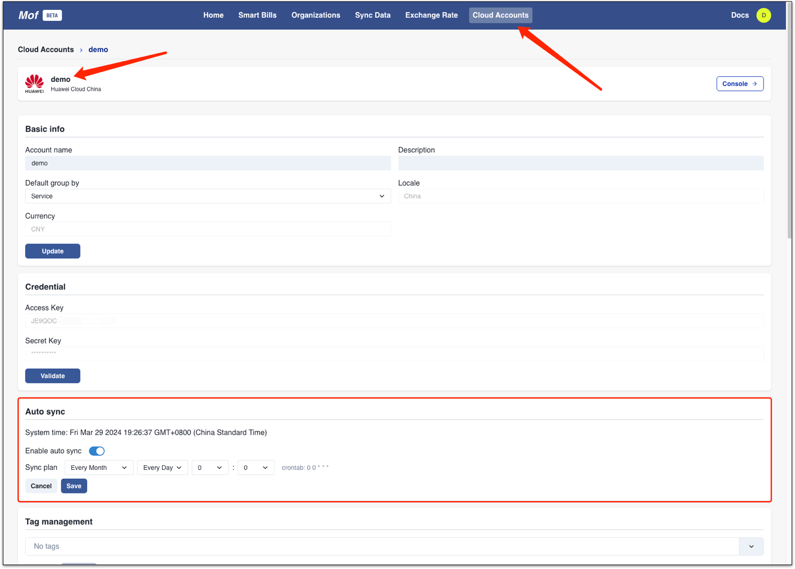
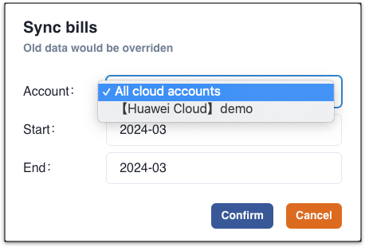
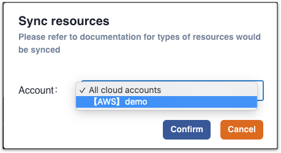

## Types

| types          | Args                    | Description                                                                      |
|----------------|-------------------------|----------------------------------------------------------------------------------|
| Sync all       | N/A                     | Sync bills(3 months before) & resources(current month) across all cloud accounts |
| Sync bills     | Cloud account，Timestamp | Sync bills of selected cloud account with timestamp                              |
| Sync resources | Cloud account                     | Sync resources of selected cloud account                         |

## Auto sync
Please move to **Cloud Accounts** -> **Auto sync** to enable auto synchronization.

## Sync manually
=== "Sync all"
    Sync bills(3 months before) & resources(current month) across all cloud accounts
    
    

=== "Sync bills"
    Sync bills of selected cloud account with timestamp
    
    !!! tip "Timestmap"
        System will sync 3 months historical bills while cloud account created. User can pull older data with this.

    

=== "Sync resources"
    Sync resources of selected cloud account
    
    !!! tip "Iteration"
        MofCloud team will keeps on working with optimizations.

    

