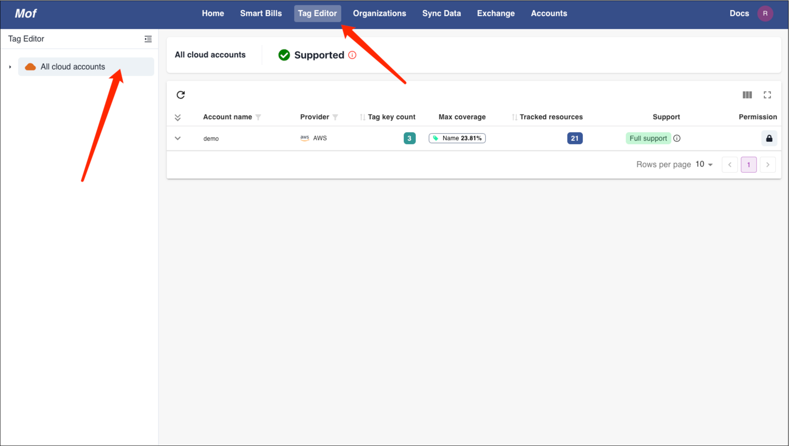
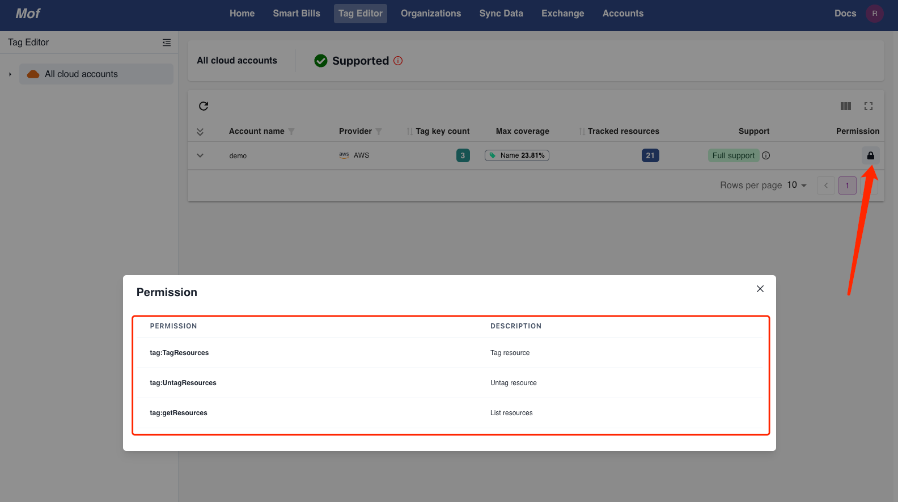
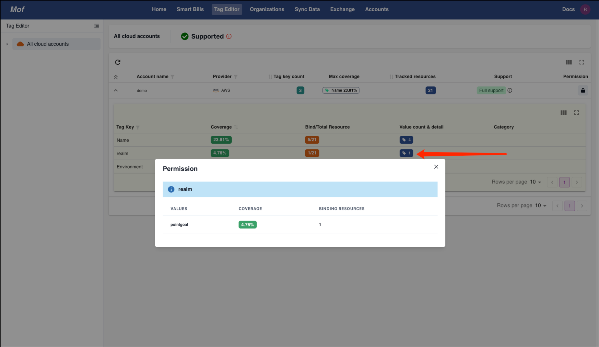
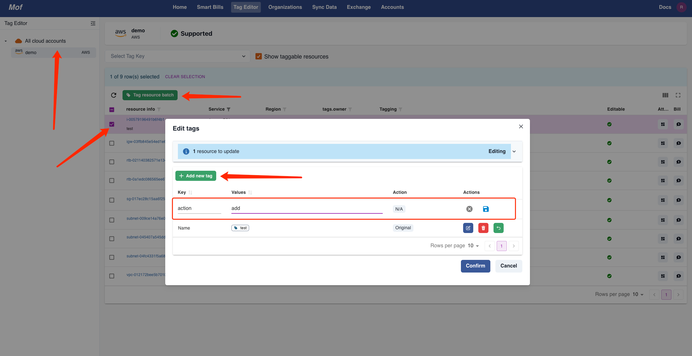
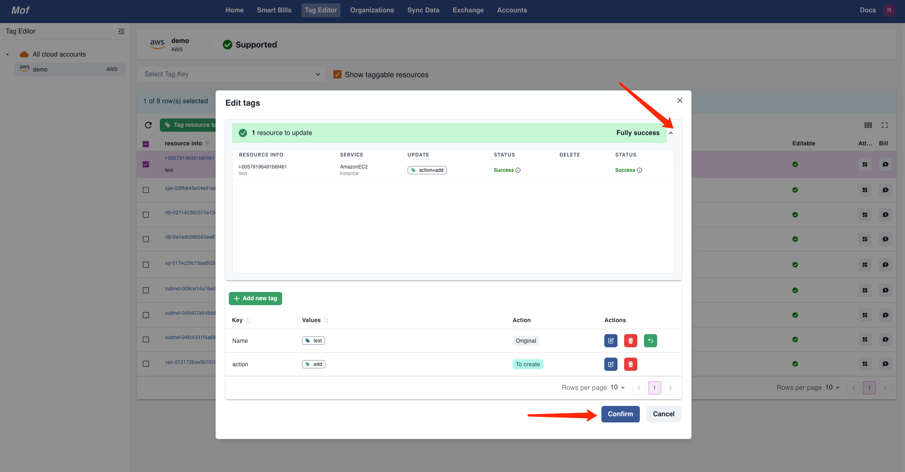
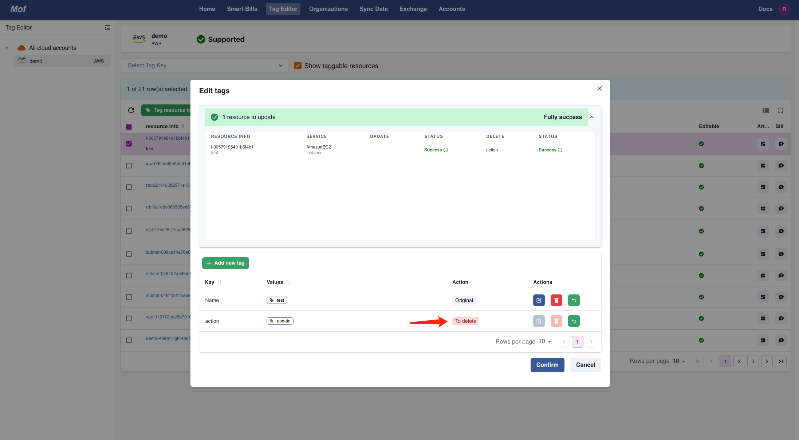

## Tag management

Mof provider uniq user interface for different providers。Tags will be synced to providers. 

User may need permissions for account based of cloud providers. Please refer to **Provider** page for details

## View
=== "Basic"
    Tag key count, coverage, resource count

    

=== "Permission"
    Account may need particular permissions for editing tags

    !!! tip "⚠️"
        Permissions are different based on different providers, mof will keeps on tracking them

    

=== "Detail coverage"
    User can check detail coverage of each tag key

    

## Edit
Mof provides uniq **Edit** user interface.

=== "Add"

    

    Success
    
    
    
    If fails, user can check errors, it may contains permission detail.
    
    

=== "Update"

    

=== "Delete"

    