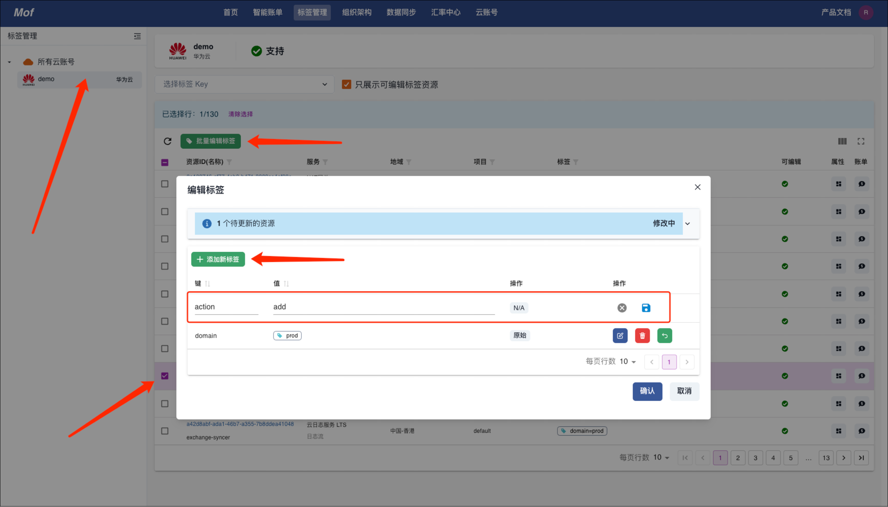
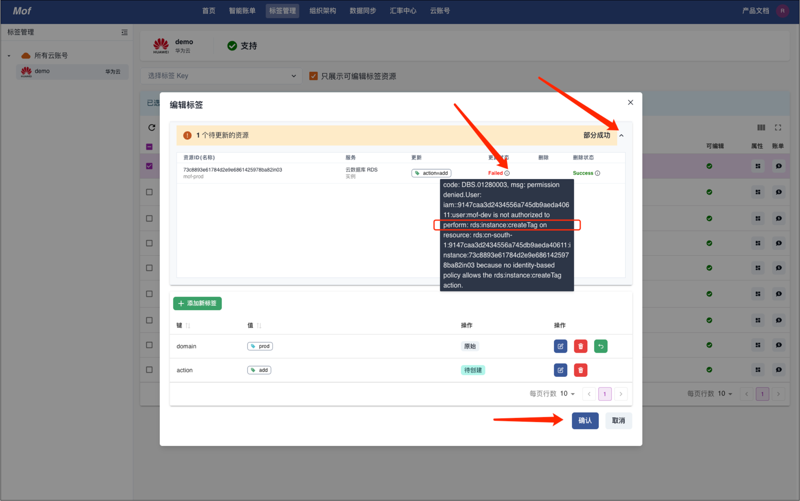

## 标签管理

Mof 提供的标签管理功能，会把用户的标签信息，同步到云商场。用户需要相应的密钥权限。请参考**云厂商**页面文档页面。

## 查看
=== "基本信息"
    标签个数，覆盖率，资源个数。

    

=== "权限"
    编辑标签，需要云账号的特定权限。

    !!! tip "注意⚠️"
        有些云厂商，需要对不同的云服务，授予标签写权限。

    

=== "详细覆盖率"
    用户可以查看 Tag Key 的详细覆盖率

    

## 编辑
Mof 提供了统一的**编辑**页面。

=== "添加"

    

    成功
    
    
    
    如果失败，可查询错误信息，是否因为没有授权！
    
    

=== "修改"

    

=== "删除"

    